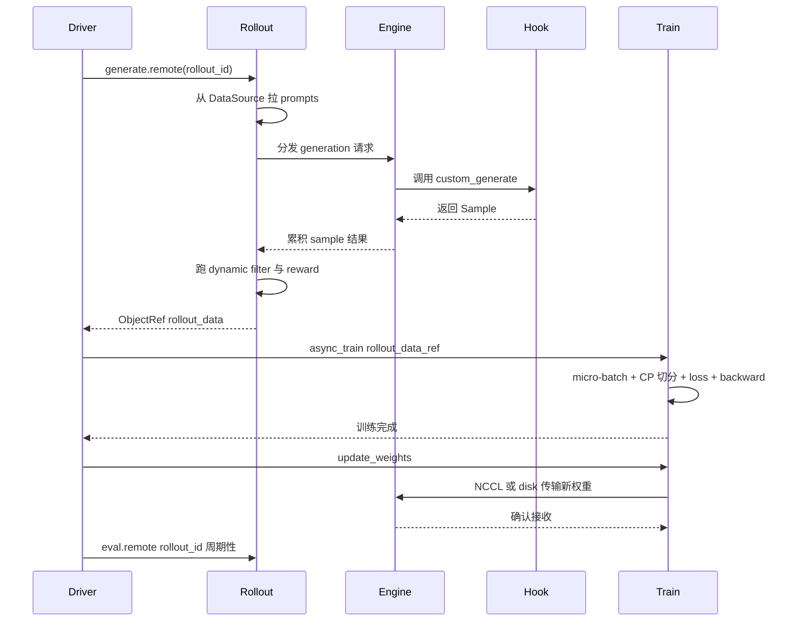

# 第 1 章：100 行的主循环

## 一个不寻常的数字

当你第一次打开 slime 的源码，最自然的反应是去找主循环。RL 训练框架
的故事都在主循环里——什么时候 rollout、什么时候 train、什么时候
sync、什么时候 eval——它的形状决定了整个系统的形状。

slime 的主循环在哪里？仓库根目录的 `train.py`。多长？**103 行**。
异步版本 `train_async.py` 更短，**80 行**。

这是一个赌注成功的最直接证据。slime 是 GLM-4.5 到 GLM-5.2
（744B 参数的 MoE）背后的 RL post-training 框架——那不是孤立的
example，是完整的 SOTA 级训练闭环。一个能撑起这种规模的 RL 框架，
主循环居然能压到 100 行，这件事本身就是论点。

整本书剩下的 12 章，要回答的核心问题是：**那剩下的复杂度去哪了？**

答案不是"被偷偷藏到了别的文件里"——你打开 `slime/ray/rollout.py`
会看到 1485 行，`slime/utils/arguments.py` 是 2010 行的 argparse，
`slime/backends/megatron_utils/` 下有 50 多个文件。复杂度确实在那里。
但 slime 做的事情是把这些复杂度**整理成了正交的层**，主循环只需要
按顺序调用这几层暴露的接口，本身不需要任何控制流来"协调"它们。

本章不深入任何一层。我们只做一件事：把 `train.py` 的 103 行拆成
五个阶段，让你在合上这一章的时候，能在脑子里指认出 `placement`、
`rollout_manager`、`actor_model`、`update_weights`、`save`、`eval`
这几个角色的关系；并且对后续 12 章哪一章在放大这 100 行的哪一段
有一个清晰的预期。

把这一章当作导览。后面所有章节都会回头指向这里的某个位置。

## 1.1 五个阶段

`train.py` 的骨架可以压缩成下面这个伪代码视图（变量名与原文一致，
方便你打开源码对照）：

```python
# train.py 的结构骨架（103 行原文的概念视图）
def train(args):
    # 阶段 1：分配 GPU
    pgs = create_placement_groups(args)
    init_tracking(args)

    # 阶段 2：起 rollout
    rollout_manager, num_rollout_per_epoch = create_rollout_manager(
        args, pgs["rollout"]
    )

    # 阶段 3：起 train
    actor_model, critic_model = create_training_models(
        args, pgs, rollout_manager
    )

    # 阶段 4：第一次同步（把训练侧的初始权重推到 rollout 侧）
    actor_model.update_weights()

    # 阶段 5：主循环
    for rollout_id in range(args.start_rollout_id, args.num_rollout):
        rollout_data_ref = rollout_manager.generate.remote(rollout_id)
        actor_model.async_train(rollout_id, rollout_data_ref)
        if should_save: save(rollout_id)
        actor_model.update_weights()
        if should_eval: rollout_manager.eval.remote(rollout_id)
```

读这段代码时有几点值得停下来观察：

**所有跨进程通信都被 `.remote()` 标了出来**。`rollout_manager` 是
Ray actor，`generate` 是它的方法，`.remote(rollout_id)` 返回的是
一个 `ObjectRef`——你可以把它当作"对一份还在生成中的数据的引用"。
`actor_model.async_train` 也是 async 调用，但它的协议更复杂，第 4
章会展开。

**主循环里没有 if/else 分支去判断"现在该用 SGLang 还是 vLLM"**，
也没有"如果是 multi-turn 走这条路径，单 turn 走那条"。rollout 的
所有形态——同步、流式、long-tail 异步、SFT、on-policy distillation、
sleep——都被压到了同一个 `generate.remote()` 调用之后；选哪种形态
靠的是配置层（`--rollout-function-path` 这个 customization hook，
第 10 章）和 rollout manager 内部状态机（第 5 章），不需要主循环
知道。

**`update_weights()` 出现两次**。一次在 for 之前（阶段 4），一次
在 for 内（阶段 5 末尾）。这不是冗余——它是 slime 把"启动"和
"步进"故意分开的痕迹：第一次同步是"训练侧的初始权重要让 rollout
侧也有一份"，循环内的同步是"训练完一步后把新权重推过去"。两次的
代码路径完全一样，差异只在调用的时机。

**`pgs` 是个 dict**，键值是 `"actor"`、`"rollout"`、可能还有
`"critic"` 和 `"ref"`。它把"角色"和"GPU 分组"做了 1:1 绑定——
actor 就是 GPU 上的训练角色，rollout 就是 GPU 上的推理角色。第 3
章会讲清这套绑定背后是 Ray 的 `PlacementGroup`，以及"colocate"
（训练与推理共用同一组 GPU 轮流跑）是怎么通过偏移量切片实现的。

下面这张 gantt 图把五个阶段在时间线上摆出来——阶段 1-4 是顺序的
启动序列，阶段 5 才是真正的 for-loop。

```mermaid
gantt
    title train.py 的时间线
    dateFormat X
    axisFormat %s

    section 启动序列
    阶段 1 placement 分配          :a1, 0, 1
    阶段 2 rollout manager 初始化  :a2, after a1, 2
    阶段 3 training models 初始化  :a3, after a2, 2
    阶段 4 第一次 weight push      :a4, after a3, 1

    section 主循环（每次迭代）
    rollout generate              :b1, after a4, 3
    async train                   :b2, after b1, 2
    save （周期性）                 :b3, after b2, 1
    update weights                :b4, after b2, 1
    eval （周期性）                 :b5, after b4, 2
```



启动序列只发生一次，主循环按 `num_rollout` 次数迭代。前后总共
103 行代码。

## 1.2 一次 rollout step 端到端

主循环每跑一次，背后会触发一长串跨角色的调用。把这串调用画出来，
你能看到这本书后续每一章在哪里"接管"。



图中 5 个参与者的身份依次是：

- **Driver**：`train.py` 主循环本身
- **Rollout**：`RolloutManager`——CPU sidecar，0 GPU
- **Engine**：`SGLang Engine`——持有 GPU 的 Ray actor
- **Hook**：用户配置的 `custom_generate` 函数（如果有）
- **Train**：`TrainActor`——Megatron 训练侧

这张图把整本书的结构摊开了。每一段调用对应至少一个章节：

- `create_placement_groups` 在 `train.py` 第一行就发生，但内部是
  Ray placement strategy 的复杂决策。**第 3 章**会展开。
- `RolloutManager` 是个 Ray actor，**它没有 GPU**——它是 0 GPU 的
  CPU sidecar，承担了 1485 行 Python 的协调工作。**第 5 章**讲它
  为什么这么设计。
- `SGLang Engine` 是另一个 Ray actor，它持有 GPU，但实际推理工作
  跑在它 `multiprocessing.fork` 出的子进程里，actor 本身只是个 HTTP
  客户端。**第 3 章**。
- `custom_generate` 是 18 个 customization hook 之一，是 slime
  让 agentic RL 不变成"另一个 framework"的关键。**第 10 章**。
- `async_train` 触发的是 Megatron 这一侧的完整训练 step：
  rollout data → micro-batch → context parallel 切分 → loss →
  backward → optimizer step。**第 4 章**。
- `update_weights()` 在 4 条传输路径中选一条（NCCL 直传、增量
  NCCL、中间张量、共享文件系统）。**第 7 章**讲为什么需要 4 条而
  不是 1 条。

这张图你应该记住三件事：

1. **主循环只发起调用，不持有状态**。所有数据（rollout_data、
   weights、samples）都被各个 Ray actor 持有，主循环拿到的只是引用
   （`ObjectRef`）或者协调点（`actor_model`、`rollout_manager`）。
2. **CPU sidecar 是状态收拢点**。`RolloutManager` 不抢 GPU，但所有
   跨 rollout 的状态（采样统计、reward 归一化、health 监测、router
   handle）都在它身上。这是个反直觉的设计——名字叫 "manager"，
   行为是 "状态总线"。第 3、5 章会反复回来谈这点。
3. **hook 是数据生成的一部分，不是另一条代码路径**。`custom_generate`
   被 SGLang engine 调用，它返回的是 `Sample` 或 `list[Sample]`，
   走的是和默认 rollout 完全一样的下游。slime 的 agentic RL 哲学
   就藏在这一点里：第 9、10 章会展开。

## 1.3 这 100 行不告诉你的事

把主循环压到 103 行，意味着大量复杂度被推到了别的位置。把这些
"被推走"的复杂度列出来，你会得到这本书的章节地图。

| 这 100 行里看不到的事 | 它在哪里 | 哪一章讲 |
|---|---|---|
| 2010 行的 argparse 与三层参数透传（Megatron / `--sglang-` / slime） | `slime/utils/arguments.py` | 第 2 章 |
| Ray placement、actor 角色、引擎初始化 | `slime/ray/`、`slime/backends/` | 第 3 章 |
| Megatron 侧的 loss / CP / micro-batch 调度 / 4 处梯度放缩 | `slime/backends/megatron_utils/` | 第 4 章 |
| 1485 行的 RolloutManager + 6 种 rollout 形态 | `slime/ray/rollout.py`、`slime/rollout/` | 第 5 章 |
| Data Buffer（"概念中心、实现接口"）的 prompt 生命周期 | `slime/rollout/data_source.py` 等 | 第 6 章 |
| 4 条 weight 传输路径与 10 个模型转换器 | `slime/backends/megatron_utils/update_weight/` | 第 7 章 |
| SGLang config / PD 解耦 / external engines / router | `slime/backends/sglang_utils/` | 第 8 章 |
| `slime/agent/` 下的 trajectory / sandbox / 真实的 claude_code 与 codex 集成 | `slime/agent/` | 第 9 章 |
| 18 个 customization hook 与 plugin 契约测试 | `slime/utils/arguments.py` + `tests/plugin_contracts/` | 第 10 章 |
| trace / metric / health / CI / reproducibility / fault tolerance | `slime/utils/` + `tests/ci/` | 第 11 章 |
| BF16+FP8 混合精度、CP 不变量、loss 不变量 | 全栈横切 | 第 12 章 |

读这张表的方式不是从上到下背下来，而是带着一个问题翻：**主循环为
什么有底气把这些都推走？**

答案是 slime 在赌五件事，每一件都被这本书的某一群章节验证：

**赌注 1：一条数据路径**。所有看起来像"独立子系统"的东西
（trainer、rollout service、agent framework）都被收束进同一条
`training ↔ rollout ↔ Data Buffer` 路径。主循环里之所以没有 agent
框架的影子，是因为 agent 执行最终是 `custom_generate` 返回 `Sample`，
和默认 rollout 走完全一样的下游。**第 5、6、9、10 章**反复展开这点。

**赌注 2：native engine 透传**。slime 不在 Megatron 和 SGLang 之上
叠抽象层——Megatron 的所有参数你都可以直接传，SGLang 的所有参数
加 `--sglang-` 前缀就能用。这意味着主循环没有"backend abstraction"
要协调，初始化阶段（第 3、4、5 章）也省了一大笔抽象代价。**第 2 章**
讲为什么这个赌注是架构原则而不是偷懒。

**赌注 3：单一 SGLang backend**。多 backend 框架要在多个推理引擎
的公共能力子集上做抽象，结果会遮住每个 backend 最强的特性。slime
深度绑定 SGLang，让 RL workload 可以直接使用 SGLang-specific 的
serving / routing / caching / disaggregation / weight-sync 能力。
**第 5、8 章**讲这个赌注的具体收益。

**赌注 4：customization 取代 fork**。multi-turn、tool use、sandbox、
verifier、multi-agent——这些"agentic 框架"通常会做的事，slime 用
18 个函数路径参数（`--xxx-path`）暴露出来，让用户的代码不需要
import slime 的任何 ABC 或 decorator 就能接入。代价是契约只在运行时
校验，但 `tests/plugin_contracts/` 把"用户实现"和"内置实现"放在
同一测试 harness 下用环境变量切换路径校验。**第 10 章**详细讲。

**赌注 5：显式 dataflow + CI 一等公民**。RL 的 bug 经常不报错——
loss 看起来在下降，metric 看起来在涨，但模型其实没在学。slime 把
trace、metric、health、reproducibility、fault tolerance 都做成
一等基础设施；CI 矩阵覆盖 CPU 单元测试 + GPU 端到端测试 + plugin
契约测试，连"CPU 上跑真分布式"都用 `mp.spawn + gloo + 手写
megatron.core.mpu stub` 做出来了。**第 11、12 章**讲这套基础设施
为什么是 RL 项目的必需品。

读到这里你应该有这种感觉：100 行的主循环不是"够用"的产物，是
"刻意"的产物。每多一行都意味着主循环承担了本该属于子系统的协调
工作。slime 的设计哲学是把协调推给子系统接口的契约，让主循环只做
"按顺序调用"。

## 1.4 train.py vs train_async.py

> **深入剖析：两个主循环的差异**
>
> 仓库根目录除了 `train.py`（103 行）还有 `train_async.py`
> （80 行）。这两个文件对应同步 RL 与异步 RL 两种训练范式，但它们
> **不在 entry script 层面分**——也就是说，并不存在 `train.py`
> 做 PPO、`train_async.py` 做某种"高级"训练这种分工。
>
> 同步 vs 异步的差别在主循环的形状上：同步循环里，rollout 完成 →
> train 完成 → weight sync → 下一轮 rollout 开始，四个动作严格
> 串行。异步循环里，rollout 和 train 在不同 step 间重叠——当前
> step 的 rollout 还在跑，上一 step 的 train 已经在另一组 GPU 上
> 算 loss。重叠带来吞吐收益，但也带来"训练用的 rollout 数据来自
> 哪一代模型"这个 staleness 问题。
>
> 真正影响 RL 行为的差异——SFT vs PPO vs GRPO vs OPD（on-policy
> distillation）、loss 怎么算、reward 怎么打——都不在主循环里。
> SFT 走的是 `slime/rollout/sft_rollout.py` 内部分支；OPD 走的是
> `slime/rollout/on_policy_distillation.py`；自定义 loss 是
> `--custom-loss-function-path` 的事。`train.py` 和 `train_async.py`
> 只决定"主循环的形状是同步还是异步"，至于跑什么任务，全靠 4 个
> customization 参数复用同一个 `train_async.py`：
>
> - `--rollout-function-path`（rollout 形态）
> - `--loss-type`（loss 类型）
> - `--disable-compute-advantages-and-returns`（advantage 计算开关）
> - `--debug-train-only`（只跑训练侧）
>
> 这是 slime 的"赌注 1"（一条数据路径）在入口层的具体落点：**任务
> 类型不是文件名的事，是参数的事**。

## 1.5 旁路与开关

103 行里还有一些细节值得快速指认，它们是后续章节常被提到的"特殊
情况"：

- **eval-only 旁路**：`if args.num_rollout == 0 and args.eval_interval`
  这一段允许跳过整个训练循环，只跑 eval。这是 slime 把 eval 和
  train 当作同一接口处理的具体表现——`rollout_manager.eval.remote()`
  和 `rollout_manager.generate.remote()` 走的是同一组 Ray actor，
  只是配置不同（不同的 prompt、不同的 sampling 策略、不同的 hook）。
- **`offload_rollout` 与 `offload_train`**：colocate 部署下，训练
  和推理共用同一组 GPU 轮流跑。offload 控制权重和 KV cache 的
  GPU/CPU 搬迁。`onload_weights` 和 `onload_kv` 在 `update_weights`
  前后被精确调用。第 3、7 章讲这套搬迁的实现。
- **`check_weight_update_equal`**：调试模式，做完一次 weight push
  后比对训练侧和 rollout 侧的权重是否 bit-exact。看似多余，但 RL
  里这种 silent corruption 真的会发生——loss 在降但模型在学错的
  权重——所以这种自检被做成了一等参数。第 11 章会讲它属于 slime
  "RL bug 不报错"工程哲学的一部分。
- **`use_critic`**：actor-critic 训练时（PPO 经典形态），critic
  和 actor 各自走一份 `async_train`。`num_critic_only_steps` 控制
  开头几步只训 critic。

这些旁路加起来只占主循环 20-30 行，但它们覆盖了 slime 在生产环境
要应对的几乎所有特殊形态：colocate、debug、PPO with critic、
eval-only。把这些塞进主循环而不是"特性开关"或"模式选择"，是 slime
设计上"宁可主循环显式 if-串联也不引入抽象层"态度的体现。

## Apply This

5 条可迁移到自己 RL（或非 RL）系统的设计模式：

**1. 主循环作为系统契约**

把整个系统的"骨架"压到一个能一眼看完的文件（100-200 行）。这个
文件不应该有任何 if/else 在判断"模式"——所有模式差异都应该被推
到它调用的接口背后。如果你的主循环需要 if 来判断"现在该走 A 路径
还是 B 路径"，说明你的子系统接口设计漏了一层。

**怎么改造适配**：用主循环的行数当尺子量你的架构。每加一行 if，
问一句"这个判断能不能推到下游接口的契约里去？"。

**陷阱**：不要把主循环压得太短到失去可读性。slime 的 103 行里
有 4-5 行注释、有 `should_save / should_eval` 这种命名良好的辅助
判断函数——可读性的下界比行数更重要。

**2. CPU sidecar 收拢跨进程状态**

让一个无 GPU 的协调者持有所有跨 GPU actor 共享的状态。slime 的
`RolloutManager` 是 1485 行的 Python，但它一片 GPU 都不占——它
持有 SGLang engine handle、router 进程、Lock actor、HealthMonitor、
样本组装逻辑、reward 归一化。GPU actor 只做计算，状态全在 sidecar。

**怎么改造适配**：你的系统里有哪些状态是"所有 worker 都需要看到
但不需要计算"的？把它们集中到一个 CPU actor，让 worker 只做无
状态计算。

**陷阱**：sidecar 自己不能成为瓶颈。Python 单线程是个硬约束——
所有 worker 调 sidecar 时如果 sidecar 在做 GIL-bound 工作，整个
系统会卡。slime 用 `aiohttp_threaded`（独立 daemon 线程开 event
loop）专门解决这个问题，第 9 章会讲。

**3. 角色就是 GPU 分组**

不要把"逻辑角色"（actor / rollout / ref / critic）和"物理资源"
（GPU 分组）分开建模，让它们 1:1 绑定。slime 的 `placement_group`
返回的 dict 就用角色名做 key——`pgs["actor"]` 直接是 actor 拿到
的 GPU 子集。

**怎么改造适配**：如果你在做多角色训练（actor-critic、有 ref
model 的 RLHF），让你的 placement API 用角色名当 key，而不是
"GPU index list"。后者会让 colocate 这种"共享 GPU 轮流跑"的实现
变得反直觉。

**陷阱**：colocate 部署下，多个角色用同一组 GPU，你需要在 placement
层支持"角色共享但调度独立"——slime 用 `num_gpus=0.2` 这种 fractional
GPU 声明 + `PACK` strategy 实现，需要你的资源框架支持。

**4. 第一次同步与循环内的同步走同一条路径**

slime 的 `actor_model.update_weights()` 在 for 之前调一次、for 内
每步调一次。两次调用的代码路径完全一样，差异只在调用时机。这种
设计的好处是：循环内的同步路径在系统启动后就立刻被验证一遍（如果
第一次 push 就出错，问题立刻暴露），不用等到第一次训练完才发现。

**怎么改造适配**：你的系统里有"启动只做一次"的初始化吗？看看它
能不能和循环内的某个动作复用同一段代码。如果可以，把启动当作
"循环的第 0 次迭代"。

**陷阱**：复用不是简单 copy。第一次同步可能要传完整权重，循环内
同步可能只传 delta——slime 在 update_weights 内部用 4 条不同传输
路径解决（第 7 章），主循环只看到统一接口。

**5. eval 是同一接口的特例**

`rollout_manager.eval.remote()` 和 `rollout_manager.generate.remote()`
走的是同一组 Ray actor，只是配置不同。slime 没有"eval engine"或
"eval service"这种东西——eval 就是 rollout 的一个变体。

**怎么改造适配**：你的系统里有 train / eval / dev / test 这种多套
近似流程吗？看看它们能不能合并成一个接口的不同参数化。如果不能
合并，说明你的接口抽象层级不对——eval 和 train 共享的应该是"生成
样本"这个动作，而不是"训练模型"。

**陷阱**：eval 在数据维度有一些 train 不需要的需求（确定性采样、
不同的 metric、不同的 reward 计算）。这些差异应该通过参数表达，
不是通过分支。slime 用 `--eval-function-path` 让 eval 也能复用
customization hook 体系，是这个原则的延伸。

---

## 下一站

下一章我们打开 `slime/utils/arguments.py`——2010 行的 argparse。这
个文件是 slime "native engine 透传"赌注的实现现场。你会看到
`--sglang-` 前缀是怎么用一个 monkey-patch 实现的，Megatron 的参数
是怎么寄生在 slime 的 parser 里的，以及一个 RL 框架的 2010 行 argparse
为什么是设计而不是技术债。
