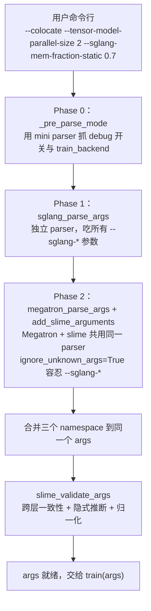

# 第 2 章：配置面——把参数透传当作架构原则

## 一个对照

上一章我们看到 `train.py` 只有 103 行。如果你顺手打开
`slime/utils/arguments.py`，会看到一个相反的数字：**2010 行**。
仓库里几乎没有第二个文件这么长。

更让人困惑的是，这 2010 行**还不够**——slime 同时还直接透传 Megatron
所有原生参数（数百个），以及 SGLang 当前安装版本 `ServerArgs` 暴露
的全部参数（一个完整的 dataclass，每升级一次 SGLang 就可能多几十个）。
加起来，一个 `bash scripts/run-qwen3-4B.sh` 命令行能传的合法参数有
**几百到上千个**。

任何一个看到这个数字的工程师，第一反应都是"这是技术债"。配置太多
意味着用户搞不清，团队维护痛苦，bug 容易藏在跨参数依赖里。常见的
应对是抽一层："给我们的训练框架定义一组干净的 schema，把 Megatron
和 SGLang 包起来。"

slime 没这么做。这一章要回答的就是为什么——以及它**怎样**让 2010
行 argparse 加几百个透传参数变成可控的而不是失控的。

如果第 1 章的关键词是"主循环作为契约"，这一章的关键词是"**透传
胜过封装**"。它是 slime 五条核心赌注里的第二条（"native engine
透传"），也是这五条里最有具体技术内容的一条——透传不是态度，是
一套有具体实现的技术决策，包含两个技巧（拦截 argparse 与寄生 parser）
和一个集中点（260 行的 validation）。

## 2.1 三层参数的格局

`bash scripts/run-qwen3-4B.sh` 传到 `python train.py` 的命令行长这样
（节选）：

```bash
python3 train.py \
   --actor-num-nodes 1 \
   --actor-num-gpus-per-node 8 \
   --colocate \
   --hf-checkpoint /root/Qwen3-4B \
   --rm-type deepscaler \
   --rollout-batch-size 32 \
   --tensor-model-parallel-size 2 \
   --sequence-parallel \
   --use-dynamic-batch-size \
   --advantage-estimator grpo \
   --rollout-num-gpus-per-engine 2 \
   --sglang-mem-fraction-static 0.7 \
   --attention-backend flash
```

参数来自三个不同的"宇宙"，按命名规则你可以一眼分出来：

| 层 | 例子 | 来源 |
|---|---|---|
| **slime 自身** | `--actor-num-nodes`、`--colocate`、`--rm-type`、`--rollout-batch-size`、`--advantage-estimator` | `slime/utils/arguments.py`，2010 行 argparse |
| **Megatron 原生** | `--tensor-model-parallel-size`、`--sequence-parallel`、`--micro-batch-size` | Megatron 上游 `megatron.training.arguments` |
| **SGLang 透传** | `--sglang-mem-fraction-static`、`--sglang-kv-cache-dtype` | SGLang 上游 `ServerArgs`，统一加 `--sglang-` 前缀 |

这三层在 `slime/utils/arguments.py:1525` 的 `parse_args` 里被三个
**独立的解析阶段**消费，最后合并到同一个 `argparse.Namespace`：



这套流水线最值得注意的点是**它没有任何"协议层"**——slime 没有定义
一个"统一参数 schema"再把 Megatron / SGLang 翻译进去；它就让 Megatron
的 parser、SGLang 的 parser、和自己的 parser **各自存在**，只在最后
把它们的产物（`Namespace`）平铺到一起。

这听起来朴素，但实际上每一层都有自己的技术细节支撑它——三个 parser
要协调"谁先解析"、"unknown args 怎么处理"、"参数名字怎么避免冲突"、
"validation 在哪一层做"。下面三节分别讲这三层。

## 2.2 SGLang 透传：拦截 argparse

SGLang 上游用 `dataclass` 描述服务器参数。它的 `ServerArgs` 类有几十
个字段（mem_fraction_static、kv_cache_dtype、attention_backend、
schedule_policy 等等），并且提供一个 `add_cli_args(parser)` 方法把
所有字段注册到 argparse parser 上。

slime 想要的效果是：

- 用户能写 `--sglang-mem-fraction-static 0.7`，自动加 `--sglang-` 前缀
- SGLang 上游加新字段，slime 当天就能透传，不用改 slime 代码
- 启动 SGLang engine 时这些参数能被还原成 `ServerArgs` 实例

第一条和第三条听起来矛盾——要加前缀又要还原回原名。slime 的解法
是个有点 hack 但很优雅的"两端配合"：

**注入端**：在调 `ServerArgs.add_cli_args(parser)` 之前，临时把
`parser.add_argument` 换成一个 wrapper，让上游每次注册参数时都被
自动加前缀。`slime/backends/sglang_utils/arguments.py:43-115` 是
这套技巧的核心：

```python
# 伪代码 —— illustrative
def add_sglang_arguments(parser):
    old_add_argument = parser.add_argument
    skipped = ["tp_size", "port", "nnodes", ...]  # slime 自己算的不透传

    def wrapped_add_argument(*flags, **kwargs):
        canonical = derive_dest_name(flags, kwargs)
        if canonical in skipped:
            return  # 这个字段 slime 接管，丢弃上游注册
        # 把 --foo-bar 改成 --sglang-foo-bar，dest 改成 sglang_foo_bar
        new_flags = [f"--sglang-{f.lstrip('-')}" if f.startswith("-")
                     else f for f in flags]
        if "dest" in kwargs:
            kwargs["dest"] = f"sglang_{kwargs['dest']}"
        old_add_argument(*new_flags, **kwargs)

    parser.add_argument = wrapped_add_argument
    ServerArgs.add_cli_args(parser)  # 上游不知道自己被前缀化了
    parser.add_argument = old_add_argument
```

**回填端**：启动 SGLang engine 时，反向操作——遍历 `ServerArgs` 的
所有字段，从带前缀的 `args.sglang_xxx` 里取值组装回去：

```python
# 伪代码 —— illustrative
import dataclasses
def args_to_server_args(args):
    kwargs = {}
    for field in dataclasses.fields(ServerArgs):
        prefixed = f"sglang_{field.name}"
        if hasattr(args, prefixed):
            kwargs[field.name] = getattr(args, prefixed)
    return ServerArgs(**kwargs)
```

这套两端配合的效果是 SGLang **加一个新字段，slime 零修改**。新字段
自动被 monkey-patched `add_argument` 注册成带前缀的 CLI 参数，又
自动被 `dataclasses.fields` 遍历到，回填给 engine。

如果你看过那种"每次上游升级都要在自家框架里手动 mirror 一遍参数"
的项目，就会理解这是什么级别的解耦。slime 跟随 SGLang 升级的边际
成本接近零——这是它能在 SGLang 还在快速迭代的窗口期保持"native"
的关键。

`skipped_args`（`tp_size`、`port`、`nnodes`、`nccl_port` 等）是 slime
明确接管的字段。这些参数不让用户传，由 slime 根据 `--rollout-num-gpus-per-engine`、
`--actor-num-nodes` 等高层配置算出来。这几个的共同点是它们的值都
**依赖 slime 自己的并行拓扑或 Ray 分配**——`tp_size` 由
`--rollout-num-gpus-per-engine` 推出来，`port` / `nccl_port` 由
Ray 决定；让用户传反而会和 slime 的 placement 冲突。这条"slime
接管，不透传"的白名单是这一层抽象的边界——**能让用户传的全透传，
slime 自己算的不透传**。

## 2.3 Megatron 透传：寄生策略

Megatron 不能用 SGLang 那套技巧。原因是 Megatron 的 `parse_args` 是
个**顶层入口函数**，它自己创建 parser、自己注册参数、自己调
`parser.parse_args()`，slime 没机会在中间塞 wrapper。

slime 把自己的 ~150 个参数寄生到 Megatron parser 里靠**三招**：
`extra_args_provider` 注入参数、`reset_arg` 改默认值、
`ignore_unknown_args=True` 容忍 `--sglang-*`。下面依次看。

**第一招**：让 slime 的参数注册作为 Megatron 的
`extra_args_provider`，钻进 Megatron 的 parser 里：

```python
# 伪代码 —— illustrative
# slime/utils/arguments.py:1546
args = megatron_parse_args(
    extra_args_provider=add_slime_arguments,
    skip_hf_validate=pre.debug_rollout_only,
)
```

`add_slime_arguments` 是一个闭包，里面调 16 个 `add_*_arguments`
子函数（cluster、rollout、buffer、checkpoint、eval、optimizer 等），
把 slime 自己的 ~150 个参数全部注入到 Megatron 已经创建好的 parser
上。这样 Megatron 原生的几百个参数和 slime 自己的 150 个参数**共用
一个 parser，共用一个 Namespace**，命令行上无前缀差异，用户写
`--tensor-model-parallel-size` 和 `--rollout-batch-size` 看起来是同
一套体系。

**第二招**：slime 经常想要的不是"加新参数"，而是**改 Megatron 已有
参数的默认值**——
比如 slime 默认希望 `--seed` 是某个值、`--clip-grad` 是 1.0、
`--micro-batch-size` 不再是 Megatron 那个不合理的默认。直接 `add_argument`
会冲突报错；slime 用一个叫 `reset_arg` 的小工具原地改默认值
（`slime/utils/arguments.py:20-33`）：

```python
# 伪代码 —— illustrative, 完整源码见 slime/utils/arguments.py
def override_default(parser, flag, new_default):
    # 原地遍历 argparse 的私有 _actions 列表
    for existing in parser._actions:
        if flag in existing.option_strings:
            existing.default = new_default
            return
    # 找不到就当成新参数注册
    parser.add_argument(flag, default=new_default)
```

这个函数在 `arguments.py` 里被调用了 14 次左右，专门用来把 Megatron
的默认值改成"适合 RL post-training 的默认"。它访问的是 argparse 的
`_actions` 私有 API——这是 Python 标准库里不保证稳定的接口，但
argparse 本身十年没动过这块结构，所以这种 hack 在实践中很稳。

**第三招**是 Megatron parser 的 `ignore_unknown_args=True`——这让
Megatron 在解析时遇到 `--sglang-mem-fraction-static 0.7` 这种自己
不认识的参数时**不报错**，留给已经在 Phase 1 解析完的 sglang_ns 兜底。
没有这一条，Phase 2 的 Megatron parser 看到 `--sglang-*` 会直接 panic。

三招合起来看，slime 在 Megatron 升级时几乎不用改自己的参数代码——Megatron
新加参数，slime 不感知（除非那个参数有 slime 关心的默认值需要 reset）；
Megatron 重命名参数，slime 的 `reset_arg` 会因为找不到旧名字而触发
`else` 分支去新增——这个时候你才需要回来更新 slime 代码。

这种"上游升级我不动，除非升级动了我关心的具体语义"的耦合粒度，是
slime 配置层最被低估的工程价值。

## 2.4 2010 行的 argparse：故意不拆

slime 自己的参数有 ~150 个，加上每个参数的 `help` 字段（很多 6-10
行的详细说明）、`choices`、`type`、`default`，以及 16 个分组里的注释
和默认值表达式，凑出了 2010 行。

最常见的批评是"这文件太长了，应该拆"。但拆开之后会带来两个具体问题：

1. **失去单点参数手册的能力**。slime 团队的实际工作流是：用户问
   "这个参数到底是干嘛的"，回答是 "看 `slime/utils/arguments.py`"。
   这个文件就是 slime 的事实参数手册——每个 `help=` 字段通常详细到
   能直接当文档读。拆成 10 个文件之后，搜参数还得知道它在哪个分组。
2. **失去 cross-arg validation 的局部性**。slime 的 validation 不是
   "每个参数单独检查"，而是大量的跨参数约束——比如 `--colocate` 时
   `--rollout-num-gpus` 必须等于 `--actor-num-gpus-per-node *
   --actor-num-nodes`，比如 `--use-critic` 时 `--critic-num-nodes`
   不能为 0，比如 `--advantage-estimator grpo` 时 `--n-samples-per-prompt`
   必须 >= 2。这些约束都在 `slime_validate_args`（同文件 1748-2008 行，
   260 行）里集中。把参数定义拆开但 validation 还集中，会让 validation
   和参数定义脱节。

所以 slime 选了"参数定义和 validation **都集中**"的方案。`arguments.py`
就是 slime 关于"什么是合法配置"这件事的完整定义。

`slime_validate_args` 这 260 行不只是断言。它实际上做了**三件事**：

**断言**：检测非法组合。比如 `--use-opd` 不能和 `--use-critic` 同时
开（OPD 是 on-policy distillation，本身就有 teacher，再加 critic 没
意义）。

**归一化**：把"用户友好的写法"展开成"内部一致的形式"。比如用户写
`--offload`，validate 会把它炸成 `offload_train=True` 和
`offload_rollout=True` 两个独立字段后 `del args.offload`——后面所有
代码只看 `offload_train` 和 `offload_rollout`，不存在歧义。

**派生**：从一些参数推出其他参数。比如 `--advantage-estimator ppo`
会让 `args.use_critic = True`（PPO 必须有 critic），用户不需要单独
写 `--use-critic`。再比如 `--dump-details <dir>` 会自动展开成两个
路径模板（rollout dump path、debug dump path），用户不用分别配置。

这三件事都做完之后，下游代码（`train.py`、`train_actor`、
`rollout_manager`）拿到的 `args` 是一个**自洽且无歧义**的对象。
所有"如果用户传了 A 就该 B"的隐含规则都已经被显式化了。

这种"validation = 断言 + 归一化 + 派生"的设计是 slime 配置面能撑住
透传策略的关键。透传让参数总量爆炸（slime + Megatron + SGLang），
但 validation 把"几百个参数的真实状态空间"压缩成"`args` 这一个对象
的几十个一致字段"，下游代码只面对后者。

> **深入剖析：CLI 被切成两 phase 的代价**
>
> 透传不是免费的。slime 的 SGLang 透传方案有一个用户能直接感受到的
> 代价：`python train.py --help` **看不到 SGLang 参数**。原因是 SGLang
> 参数走的是独立的 Phase 1 parser，`--help` 信息只能从 Megatron+slime
> 的 Phase 2 parser 里看到。
>
> 你想知道 `--sglang-mem-fraction-static` 是什么意思，得去 SGLang 源码
> 翻 `ServerArgs`。slime 没有把这个 help 文本搬过来，因为搬了就违背了
> "透传" 的承诺——意味着 SGLang 改了字段说明，slime 也要跟着改。
>
> 这个代价是显式的。`docs/zh/get_started/usage.md` 明确告诉用户
> "SGLang 参数请参考 SGLang 文档"。slime 用"代价显式化"换"上游升级
> 零成本"。如果你做类似的设计，要清楚这个 tradeoff——透传的好处是
> 维护成本，付出的是 discoverability。

## 2.5 启动脚本作为参数 recipe

参数面的最后一块是启动脚本。`scripts/run-*.sh` 不是教程也不是
boilerplate，它是 slime 团队推荐的**参数 recipe**——每个生产支持
的模型对应一个脚本，把那个模型在生产环境跑过的参数组合固化下来。

打开 `scripts/run-qwen3-4B.sh` 你看到的是一个标准模板：

```bash
# 伪代码 —— illustrative，省略大量细节
source scripts/models/qwen3-4B.sh   # MODEL_ARGS=(--num-layers 36 ...)

CKPT_ARGS=(--hf-checkpoint /root/Qwen3-4B --save-interval 20 ...)
ROLLOUT_ARGS=(--prompt-data ... --rm-type deepscaler --num-rollout 3000 ...)
EVAL_ARGS=(--eval-interval 20 --eval-prompt-data aime ...)
PERF_ARGS=(--tensor-model-parallel-size 2 --use-dynamic-batch-size ...)
GRPO_ARGS=(--advantage-estimator grpo --use-kl-loss ...)
OPTIMIZER_ARGS=(--optimizer adam --lr 1e-6 ...)
SGLANG_ARGS=(--rollout-num-gpus-per-engine 2 --sglang-mem-fraction-static 0.7)

ray job submit -- python3 train.py \
   --actor-num-nodes 1 --colocate \
   ${MODEL_ARGS[@]} ${CKPT_ARGS[@]} ${ROLLOUT_ARGS[@]} \
   ${PERF_ARGS[@]} ${GRPO_ARGS[@]} ${OPTIMIZER_ARGS[@]} \
   ${SGLANG_ARGS[@]} ${EVAL_ARGS[@]}
```

这种"参数数组按主题分组 + 拼接"的写法看起来朴素，但它解决了几个
具体问题：

- **可扫读**：换一个模型只看 `MODEL_ARGS` 与 `SGLANG_ARGS`，不用读
  完整脚本
- **可复用**：`source scripts/models/qwen3-4B.sh` 把模型本身的参数
  剥离成独立文件，跨脚本复用（SFT 脚本、RL 脚本、reproducibility
  脚本都能 source 同一个模型定义）
- **可对比 diff**：`run-qwen3-4B.sh` 与 `run-glm4.7-30B-A3B.sh` 的 diff
  恰好是 "dense 转 MoE 时哪些参数变了"——这就是 recipe

注意一件事：这套启动脚本里**没有"训练模式"的开关**。SFT、RL with
GRPO、RL with PPO、on-policy distillation——这些"任务类型"的差异
全在参数里，不在脚本里。你打开 `scripts/run-qwen3-4B-base-sft.sh`
和 `scripts/run-qwen3-4B.sh` 对比，会发现 SFT 脚本只是多了 4 个参数：

```bash
# SFT 与 RL 的差异（节选）
--rollout-function-path slime.rollout.sft_rollout.generate_rollout
--loss-type sft_loss
--disable-compute-advantages-and-returns
--debug-train-only
```

这 4 个参数对应第 1 章提过的"SFT 不在 entry script 层面分"。SFT 是
RL 主循环的一个特化：用一个特别的 rollout function（其实就是读
SFT 数据集，不做 generation），用一个特别的 loss（cross entropy 而
不是 PPO），关掉 advantage 计算，并且只跑训练侧。**这些都是参数能表
达的事，不需要一个独立的 `train_sft.py`**。

同样的设计也覆盖 sync vs async（`train.py` vs `train_async.py` 这两
个 80-100 行的入口）、actor-only vs actor-critic（`--use-critic`）、
single-turn vs multi-turn agentic（`--custom-generate-function-path`）。
slime 把所有这些"看起来该是不同 mode 的形态"压到同一套配置接口下，
让"任务定义 = 参数组合"成为整个框架的核心契约。

## Apply This

5 条可迁移到自己框架（不限于 RL）的设计模式：

**1. 在 argparse 之外做参数 schema 之前，先量一下成本**

slime 用了三层 parser + 透传策略，没有引入"统一参数 schema"或者
"配置文件 DSL"。如果你的框架包了多个上游工具（推理引擎、训练引擎、
数据库、调度器），先量一下"如果我自己定义一套 schema 包住它们，
上游升级时我要改多少行"。slime 选透传是因为这个成本太高；如果你
的上游是冻结的、稳定的、几年不动的，自定义 schema 反而合理。

**怎么改造适配**：每次想加一层"配置抽象"时问自己——这层抽象的存在
是因为我要做什么？如果只是"想统一接口"，可能不值得；如果是"想隐藏
上游不稳定"，先评估上游真的不稳定到哪种程度。

**陷阱**：透传策略要求用户能直接接触上游参数（比如知道
`--sglang-mem-fraction-static` 是什么），这意味着你的用户**得是
半懂上游的人**。如果你的目标用户完全不懂上游，透传策略会让他们
迷失，统一 schema 更友好。

**2. 把"拦截 argparse"作为透传的实现技巧**

如果上游用 argparse 注册参数（Python 生态里这非常普遍），slime 那套
"临时替换 `parser.add_argument`" 的 monkey-patch 是个直接可抄的模式。
它能让你给上游所有参数自动加前缀，零侵入上游。

**怎么改造适配**：找一个上游有 `add_cli_args(parser)` 或类似 hook
的库，包一层 wrapper，按你的命名规则改 dest 与 flags。这套技巧对
基于 `dataclass + add_cli_args` 的库（SGLang、HuggingFace
TrainingArguments 等）特别契合，因为反向解包也是 `dataclasses.fields`
就够了。

**陷阱**：`parser._actions` 这种私有 API 用法在 Python 标准库里十年
没变过，但 argparse 改版本仍然要测一下。`reset_arg` 这种"原地改默认
值"的工具应该有单元测试守住。

**3. 把 validation 当 normalization 用**

slime 的 `slime_validate_args` 不只是断言，还做归一化（`--offload`
→ `offload_train + offload_rollout`）和派生（`--advantage-estimator
ppo` → `use_critic=True`）。这把"用户可以怎么写"和"代码可以怎么读"
解耦——用户写最方便的形式，validation 后下游代码读最一致的形式。

**怎么改造适配**：在你的配置入口加一层 normalization。每次发现下游
代码里有 `if config.X is None: config.X = derive_from(config.Y)`
这种逻辑，就把它上移到 validation。下游代码应该假设 config 是已经
归一化的。

**陷阱**：normalization 要让用户**能看到结果**。slime 会在
validation 时 logger.warning 输出"我把你的 `--offload` 展开成了
`--offload-train --offload-rollout`"，避免用户后期对照 args 时困惑。

**4. 把任务类型放到参数里，不放到入口脚本里**

slime 没有 `train_sft.py` / `train_rl.py` / `train_ppo.py`。这些
"模式"全部是参数组合，复用同一个 `train_async.py`。这种设计让"加
新模式"等同于"加新参数"，而不是"新文件 + 新 wiring + 新 if-else"。

**怎么改造适配**：如果你的框架有 `--mode <kind>` 这种开关，看看能
不能把 mode 拆成"它实际控制了哪几个独立选项"，然后让用户传那几个
独立选项。少一个 if-else，多一些可组合性。

**陷阱**：完全没有 mode 也不好——`--use-critic` 这种**二阶选项**
（开 critic 就意味着多套 actor 配置都要变）如果完全平铺，用户很难
正确组合。slime 的折中是：高频组合给 default（GRPO 默认配置在
`scripts/` 里），低频组合显式让用户传。

**5. 启动脚本是 recipe 不是 boilerplate**

`scripts/run-*.sh` 是生产 recipe 的具象。每个支持的模型一个脚本，
脚本之间的 diff 就是 "为这个模型该改什么参数"。这种结构让用户能
快速对比 dense vs MoE、不同模型规模的参数差异。

**怎么改造适配**：在你的项目里建一个 `recipes/` 或 `scripts/`，
每个生产环境验证过的配置一个文件。新用户的第一推荐路径是 "找到
最接近你场景的 recipe，复制它，改参数"，而不是 "读完所有文档"。

**陷阱**：recipe 要随着 slime 升级保持可跑。如果某个 recipe 半年
没人跑了，参数可能已经废弃。slime 在 CI 里跑 smoke recipe
（`run-qwen2.5-0.5B-gb10-smoke.sh`）守住这点——recipe 不只是文档，
也是测试。

---

## 下一站

参数解析完之后，`train.py` 的下一行就是 `pgs = create_placement_groups(args)`。
这一行触发的是 slime 把 args 翻译成 Ray placement bundles + 启动
Megatron 与 SGLang 引擎的整套启动序列。下一章会看到 colocate 部署
下 actor 和 rollout 怎么共享同一组 GPU 而不打架——答案是
`_get_placement_group_layout` 里 **`offset = 0`** 这一行。整章会
打开 `slime/ray/` 和 `slime/backends/`，看 slime 怎么把 args 里
的几十个参数变成数百个进程在数十张 GPU 上各就各位。
