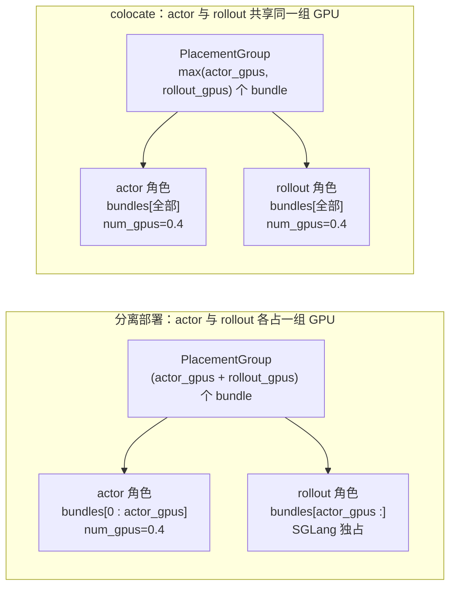

# 第 3 章：运行时基础——Ray placement 与引擎初始化

## 从一行到几百个进程

上一章末尾，`parse_args` 把命令行变成了一个自洽的 `args` 对象。
`train.py` 的下一行是：

```python
pgs = create_placement_groups(args)
```

这一行触发的是 slime 整套启动序列里最不显眼但最关键的一段。在它
返回之前，slime 已经在你的集群上做完了下面这些事：

- 把 `--actor-num-nodes 1 --actor-num-gpus-per-node 8` 这种逻辑配置
  翻译成 Ray 的 PlacementGroup 与 bundle 索引
- 决定 actor、rollout、critic、ref 各自占哪几张 GPU——以及它们是
  共享 GPU（colocate）还是分开
- 起 InfoActor 探测每个 bundle 实际落在哪个节点的哪张卡上
- 按 IP + GPU id 给 bundle 排序，让训练角色的拓扑稳定

这一行之后，`create_rollout_manager` 会再起一个 0 GPU 的 CPU actor
（RolloutManager），它内部会调起 SGLang engine（每个 engine 又是一个
Ray actor，并且会 fork 出自己的 multiprocessing 子进程跑模型）。再
之后，`create_training_models` 会在每张训练 GPU 上起一个
Megatron actor，每个 actor 内部初始化 Megatron 的并行通信、optimizer、
模型 provider。

从外面看，是几行 Python；里面发生的事是**几十个进程在几张到上百张
GPU 上各就各位**。

这一章拆这套序列。不是教你"每个 API 怎么调"，而是讲三个设计决策：

1. **角色与 GPU 怎么绑定**——这是 colocate 能优雅工作的关键
2. **RolloutManager 为什么是 0 GPU 的 CPU sidecar**——这是 Ch 1 提过
   的 CPU sidecar 模式的具体落点
3. **Megatron 与 SGLang 怎么在同一个 Ray 集群里共存**——而不互相
   干涉对方的进程模型

读完这一章，你应该能画出 slime 启动后的进程拓扑图——哪些是 Ray
actor、哪些是它们 fork 出的子进程、哪个角色占哪张卡——并且知道
后续讲核心循环（第 4、5 章）和 weight sync（第 7 章）时，"在哪个
进程里发生"这件事。

## 3.1 PlacementGroup：同一个 pg，两个 slice

`create_placement_groups` 的核心逻辑只有十几行，但它表达了 slime
整套部署形态的关键约定。简化的视图是：

```python
# 伪代码 —— illustrative，省略 InfoActor 探测与排序
def create_placement_groups(args):
    num_gpus, rollout_offset = _get_placement_group_layout(args)
    pg, bundle_indices, gpu_ids = _create_placement_group(num_gpus)

    return {
        "actor":   (pg, bundle_indices,                gpu_ids),
        "rollout": (pg, bundle_indices[rollout_offset:], gpu_ids[rollout_offset:]),
        "critic":  ...,
    }
```

这段代码值得停下来看两件事。

**第一**，返回的 dict 用**角色名**做 key——`"actor"` 直接是 actor
角色拿到的 (pg, indices, gpu_ids) 三元组。这避免了 "我把 GPU id 列
表传下去，下游再决定哪几个是 actor 的" 这种把抽象层级揉错的设计。
角色和资源在 placement 层就 1:1 绑定，下游代码不需要重新分配。

**第二**——这是更微妙的点——`"actor"` 和 `"rollout"` 引用的是
**同一个 `pg` 对象**，只是 indices 通过 `[rollout_offset:]` 切片
错开。这一个细节决定了 colocate 和分离部署的差异完全可以在
`_get_placement_group_layout` 这一个函数里表达：

```python
# 伪代码 —— illustrative
def _get_placement_group_layout(args):
    actor_num_gpus = args.actor_num_nodes * args.actor_num_gpus_per_node

    if args.colocate:
        return max(actor_num_gpus, args.rollout_num_gpus), 0   # rollout_offset = 0
    return actor_num_gpus + args.rollout_num_gpus, actor_num_gpus
```

colocate 时 offset = 0，actor 和 rollout 拿到的是同一份 indices；
分离部署时 actor 拿 `[0:N]`、rollout 拿 `[N:]`。整套 colocate 与
分离的拓扑就用一个 offset 表达完了——下游代码看到的接口
（`pgs["actor"]` 与 `pgs["rollout"]`）一模一样，只是底层有没有
"实际重叠"是 placement 层决定的。



colocate 能"工作"的关键是 Ray 的 fractional GPU 声明：actor 用
`num_gpus_per_actor=0.4` 占一张卡的 40%，rollout 也用类似的分数占用
另一部分。这让 Ray 调度器把两个角色调到同一个物理 bundle 上而不冲突。
实际运行时，actor 和 rollout 不是真的同时用 GPU——它们靠 `offload`
机制轮流把权重和 KV cache 搬上 GPU（这点在第 7 章 weight sync 章
会展开）。

如果你打开 `tests/test_placement_group.py`，会看到 10 个参数化用例
专门守住这套布局——`(actor_num_nodes, actor_num_gpus_per_node,
rollout_num_gpus, colocate)` 的不同组合应该产生什么样的 bundle 数
与 offset。改 `_get_placement_group_layout` 不跑这个测试，整个 slime
的部署拓扑都会跑偏。

## 3.2 RayTrainGroup：把 N 个 actor 当 1 个用

PlacementGroup 决定了 GPU 怎么分。接下来 `create_training_models`
要在每张分配给 actor 的 GPU 上起一个 train actor 进程。这里的关键
抽象是 `RayTrainGroup`（`slime/ray/actor_group.py`）——它把 N 个
Ray actor 封装成"看起来像 1 个 actor"的对象，让主循环里的
`actor_model.async_train(...)` 实际上一次性触发 N 个 actor 的同步
调用。

`allocate_train_group` 是创建入口：

```python
# 伪代码 —— illustrative
def allocate_train_group(args, num_nodes, num_gpus_per_node, pg, role):
    return RayTrainGroup(
        args=args,
        num_nodes=num_nodes,
        num_gpus_per_node=num_gpus_per_node,
        pg=pg,
        num_gpus_per_actor=0.4,   # fractional GPU，让 colocate 自然
        role=role,
    )
```

`RayTrainGroup` 内部做的事情其实就两类。

**第一**，按 bundle 索引创建 N 个 Ray actor，每个 actor 绑定到一个
bundle 上。这是把"逻辑 dp_rank"和"物理 bundle index"绑定的关键——
后续 weight sync 时，rank 0 应该对应哪张 GPU 上的权重，在 placement
层就决定了。

**第二**，在 actor 创建之前，把所有必须的环境变量通过
`runtime_env.env_vars` 注入：

```python
# 伪代码 —— illustrative
runtime_env = {
    "env_vars": {
        "RAY_USE_UVLOOP": "0",            # 踩过的坑，源码里有注释
        "LD_PRELOAD": custom_libs,         # 必须在 ray.remote 创建前
        # ...其他 Megatron / SGLang 需要的环境变量
    }
}
actor = ActorCls.options(
    num_gpus=0.4,
    scheduling_strategy=PlacementGroupSchedulingStrategy(pg, bundle_index=i),
    runtime_env=runtime_env,
).remote()
```

`RAY_USE_UVLOOP=0` 这一条是 slime 源码注释里**明说踩过的坑**——
Ray 默认用 uvloop 替换 asyncio 的 event loop，在某些 SGLang 异步
代码路径下会触发奇怪的并发 bug，关掉就好。这种"必须在 actor 启动
前注入"的环境变量不能在 actor 起来之后再设置，因为 Python 解释器
启动时就已经选好了 event loop 实现。`LD_PRELOAD` 同理，它影响动态
链接，必须在进程启动时就在。

这一层抽象的价值是**让主循环不知道有多少个 actor 在跑**。`train.py`
里的 `actor_model.async_train(rollout_id, rollout_data_ref)` 看起来
是单个对象的方法调用；底层是 N 个 Ray actor 在同时调
`train(rollout_id, rollout_data_ref)`，`RayTrainGroup.async_train`
把 N 个 `ObjectRef` 聚合成一个返回值。主循环只需要 `ray.get(...)`
就能等它们都结束。

## 3.3 RolloutManager：0 GPU 的 CPU sidecar

`create_rollout_manager` 起的 actor 长这样：

```python
# 伪代码 —— illustrative
rollout_manager = RolloutManager.options(
    num_cpus=1,
    num_gpus=0,                                    # 显式声明 0 GPU
    runtime_env={"env_vars": add_default_ray_env_vars()},
).remote(args, pg)
```

这一行非常重要：`num_gpus=0`。`RolloutManager` 是 slime 里最大的
Python 文件之一（1485 行），但它**一片 GPU 都不占**。它是上一章 Ch 1
里提过的"CPU sidecar"模式的具体落点。

为什么这么设计？因为 RolloutManager 做的工作其实有两类：

- **协调**：持有 SGLang engine 的 Ray actor handle、router 子进程、
  Lock actor、HealthMonitor，分发 generation 请求，收集结果
- **全局视角的计算**：样本组装、reward 归一化、dp 切分（把一批样本
  分给 N 个 dp_rank）、跨 rollout 的 metric 聚合

两类工作都是 CPU-bound（甚至 IO-bound），没有 GPU 计算的需要。但它
们都**需要"看到全部 rollout"**——比如 reward 归一化要拿到整批样本
才能算 mean/std，dp 切分要拿到所有样本才能均衡分配。

如果让 dp_size 个 train actor 各自重复做这套全局工作，每个 actor
都要等齐全部样本、各自跑同样的聚合逻辑——既浪费 GPU 时间，又难
保证结果一致。把它甩给一个 0 GPU 的 sidecar 就解决了：每个 train
actor 只做自己那份本地训练，sidecar 做一次全局工作然后 dispatch
给每个 actor。

这就是 Ch 1 里那张 sequence 图里 RolloutManager 的位置——它不是
"另一个角色"，它是把所有 GPU actor 串起来的状态总线。

实际启动序列里，`create_rollout_manager` 还会做几件辅助的事：

```python
# 伪代码 —— illustrative
rollout_manager = RolloutManager.options(...).remote(args, pg)

# 从 dataset 算出 num_rollout_per_epoch
if args.num_rollout is None:
    num_rollout_per_epoch = ray.get(rollout_manager.get_num_rollout_per_epoch.remote())
    args.num_rollout = num_rollout_per_epoch * args.num_epoch

# debug 模式：snapshot 一份权重快照用来后续 bit-exact 比对
if args.check_weight_update_equal:
    ray.get(rollout_manager.check_weights.remote(action="snapshot"))

# colocate 模式：rollout 启动后立刻 offload，把 GPU 让给 train
if args.offload_rollout:
    ray.get(rollout_manager.offload.remote())
```

这几件事都不在主循环里——它们是 "for-loop 开始之前必须就位的状态"。
slime 把这种**一次性的协调动作**放在 placement 与训练 actor 创建
之间的窗口里执行，是它能让主循环保持 100 行的关键之一。

## 3.4 引擎初始化：各自的进程模型

到这一步，placement、RolloutManager、train actor 三件事都就绪了。
最后一块是**两个上游引擎（Megatron 与 SGLang）的实际初始化**——
这是 slime 最克制的一段代码。

**Megatron 侧**。`create_training_models` 后，每个 train actor 进程
内部会调 `slime/backends/megatron_utils/initialize.py`，它进而调
Megatron 原生的初始化流程（parallel state 设置、model provider、
optimizer、distributed checkpoint）。slime 在这里几乎不重写——它
**寄生**在 Megatron 自己的启动序列里，只在一个地方打补丁：
`megatron_patch/megatron_chunked_grad_coalesce_patch.py`。

这个补丁解决的是一个具体的性能问题（grad coalesce 在某些 chunk size
下不正确），但它的写法值得一看：

```python
# 伪代码 —— illustrative
def patch():
    import inspect
    target = megatron.core.distributed.param_and_grad_buffer
    sig = inspect.signature(target._coalesce_chunked_grad_buffers)

    if "some_new_param" in sig.parameters:
        # mcore v0.15rc7 的签名
        target._coalesce_chunked_grad_buffers = patched_v015
    else:
        # mcore v0.13 的签名
        target._coalesce_chunked_grad_buffers = patched_v013
```

`inspect.signature` 让 slime 在运行时检测 Megatron 是哪个版本，**不用
条件 import 或 try/except**。slime 同时兼容 mcore v0.13 和 v0.15rc7
两条上游分支——一个仓库覆盖了一个跨越多个 Megatron 主版本的窗口。
这是 slime "native engine 透传"赌注在 Megatron 侧的具体维护策略：
**只打必要的补丁，且用反射兼容多版本**。

**SGLang 侧**。情况看起来类似，但有个反直觉的细节。`SGLangEngine`
是个 Ray actor，被 RolloutManager 持有；但**模型并不在这个 actor
进程里跑**。actor 进程里只起了一个 HTTP 客户端，模型实际跑在它
`multiprocessing.fork` 出来的子进程里：

```python
# 伪代码 —— illustrative
class SGLangEngine:
    def __init__(self, args, ...):
        # 不在这个进程里 load 模型！
        self.process = multiprocessing.Process(
            target=launch_sglang_server,   # 在子进程里启动 SGLang
            args=(server_args,),
        )
        self.process.start()
        self.http_client = HttpClient(f"http://localhost:{port}")

    async def generate(self, prompt):
        return await self.http_client.post("/generate", json={"prompt": prompt})
```

为什么？因为 SGLang 自己有一套完整的多进程 serving 架构（worker
processes、scheduler、cache controller）。如果 slime 把 SGLang 的
推理逻辑塞进自己的 Ray actor 进程里跑，就要去理解和管理 SGLang 的
进程模型——这违背"native engine 透传"赌注。让 SGLang 在它自己的
进程模型里跑，slime 的 Ray actor 只是 HTTP 客户端，slime 不需要
care SGLang 内部怎么 fork、怎么调度、怎么 cache。weight sync 等
跨引擎操作也走 HTTP（或 SGLang 暴露的其他 RPC），不走 Ray object
store——这意味着 slime 升级 Ray 时不影响 weight sync。

两个引擎都按自己的方式独立运行；它们之间的硬耦合点只有**一个**：
`slime/backends/megatron_utils/sglang.py`，整个文件 **44 行**——把
Megatron 侧用到的所有 SGLang 符号集中 import + 版本兼容兜异常。
这是 slime 给自己设的边界——任何想从 Megatron 侧调 SGLang 的代码
都必须从这 44 行过，避免硬耦合在仓库里到处蔓延。

## 3.5 两套 model bridge 的并存

模型加载这件事 slime 有**两套** bridge 系统，初看像技术债，仔细
看是稳定性设计。

- **`slime_plugins/mbridge/`**：覆盖 9 个模型（Qwen3-Next、Qwen3.5、
  GLM-4、GLM-4-MoE、GLM-4-MoE-Lite、DeepSeek-V3.2、MiniMax-M2、MiMo、
  GPT-OSS）。走 slime 默认的 model_provider 与 weight sync 路径
- **`slime_plugins/megatron_bridge/`**：只覆盖 1 个模型（GLM-4.6V）。
  通过 NVIDIA 的 `AutoBridge` 把 HF checkpoint 直接加载进 Megatron

由 `--megatron-to-hf-mode raw/bridge` 这个参数选择走哪条路径。两个
系统并存的理由是：weight sync 的核心 codepath（mbridge 那条）已经
被生产环境验证过、对 10 个模型稳定支持。AutoBridge 是 NVIDIA 上游
的活跃项目，演进可能引入 breaking change。**把两条路径分开**意味
着 AutoBridge 升级时只影响 GLM-4.6V 一个模型，不会扰动其他 9 个
生产模型的 weight sync。

这是 slime 对"统一抽象"的拒绝——当两条路径有不同的稳定性预期时，
强行统一反而风险更大。让它们并存，每条路径都简单地做一件事。

> **深入剖析：router 为什么不是 Ray actor**
>
> RolloutManager 内部会启动 `sgl-router`（SGLang 上游的负载均衡器），
> 把多个 SGLang engine 串成一个 endpoint。直觉上 router 应该是个
> Ray actor——和 SGLangEngine 一样在 Ray 调度框架下管理。但 slime
> 实际用的是 `multiprocessing.Process(daemon=True) + sleep(3) +
> assert is_alive()`：
>
> ```python
> # 伪代码 —— illustrative
> self.router_process = multiprocessing.Process(
>     target=launch_router,
>     daemon=True,
> )
> self.router_process.start()
> time.sleep(3)
> assert self.router_process.is_alive(), "router failed to start"
> ```
>
> 为什么不用 Ray actor？两个原因：
>
> 1. router 是个 stateless 转发器，重启代价低（只要重新指向同样的
>    engines 即可），不需要 Ray 的 actor lifecycle 管理
> 2. router 的故障域应该和 RolloutManager 绑定——RolloutManager
>    挂了，router 也应该挂；用 daemon process 自动满足这点
>
> 这是个微小但能省事的决策。Lock actor（用于 colocate 下 actor 与
> rollout 互斥占用 GPU）也类似：它的 `acquire` 是非阻塞轮询而不是
> blocking wait，因为 actor 单线程 event loop 阻塞会卡住整个 manager。
> 这些"为什么这里用 X 而不用 Y"的小决策散在 RolloutManager 里，每
> 个都是踩过坑后的妥协。

## Apply This

5 条可迁移到自己分布式系统的设计模式：

**1. 角色与资源在分配层 1:1 绑定**

slime 的 `pgs` dict 用角色名做 key，每个角色直接拿到自己的 (pg,
indices, gpu_ids) 三元组。不要把 "GPU id 列表传下去再让下游决定
哪几个属于谁"——那种设计会让"colocate 时多角色共享 GPU"变成需要
特殊处理的边界情况。

**怎么改造适配**：你的资源分配 API 返回一个 `Dict[Role, Resource]`，
让 colocate 表达为"多个 Role 引用同一个 Resource 对象"（slice 不
同的部分）。这样下游代码不需要知道"是否 colocate"。

**陷阱**：要在 placement 层用 fractional resource 声明（slime 是
`num_gpus=0.4`）来让调度器允许多角色共享。否则即使你的逻辑想 colocate，
调度器会拒绝。

**2. CPU sidecar 收拢"全局视角"工作**

任何需要"看到所有 worker 的输出后才能继续"的工作——聚合、归一化、
切分、调度——都应该交给一个无 GPU 的 sidecar 集中做，而不是让每
个 GPU worker 重复算。slime 的 RolloutManager 是 1485 行 Python，
0 GPU——这看起来奇怪，实际节省的是 N-1 次重复计算与一致性风险。

**怎么改造适配**：识别你的系统里哪些操作"逻辑上是全局的但物理上
被复制了"——比如每个 rank 都在算同样的 metric 聚合、每个 worker
都在做同样的负载均衡决策。把它们抽到一个 sidecar，让 worker 只
做本地工作。

**陷阱**：sidecar 自己不能成为单线程瓶颈。slime 在 RolloutManager
里大量用 `aiohttp_threaded`（独立 daemon 线程开 event loop）专门
绕开 Python 单线程瓶颈，第 9 章会展开。

**3. 环境变量必须在进程启动前注入**

`LD_PRELOAD`、`RAY_USE_UVLOOP=0`、Python event loop 实现的选择——
这些都是进程启动时就锁定的状态，没法 actor 起来之后再设置。slime
把所有这种环境变量统一放在 `runtime_env.env_vars` 里，作为
`ray.remote(...)` 的参数传入，确保 actor 进程一启动就在正确的环境
变量下。

**怎么改造适配**：在你的分布式框架里建立一个"必须 pre-launch 注入"
的环境变量清单，集中在一个地方维护。每发现一个新的踩坑就加进去，
并加上注释说明它为什么必须 pre-launch。

**陷阱**：环境变量的 scope 容易搞错——传给 ray driver 的环境变量
不会自动传到 actor 进程；传给某个 actor 的不会传给它 fork 出的子
进程。要每一层都显式传。

**4. 上游引擎在自己的进程模型里跑，你只做 thin wrapper**

slime 的 SGLangEngine actor 不在自己的进程里跑模型，而是 fork 出
SGLang 自己的多进程 serving 架构。Megatron 也是——slime 寄生在
Megatron 的初始化序列里，不重写。这种"让上游用它自己的方式跑"的
克制是"透传"赌注在进程模型层的延伸。

**怎么改造适配**：每次想"把上游 X 集成进我的进程模型"时，问一句
"X 自己有进程模型吗？如果有，我能不能只做 HTTP / RPC 客户端，让 X
用自己的方式跑？"答案通常是能。

**陷阱**：HTTP / RPC 客户端要处理上游崩溃、超时、连接断开。slime
的 SGLangEngine 有相当篇幅在做 health check 与 recovery，第 11 章
讲工程基础设施时会回到这。

**5. 双轨制 bridge 当稳定性边界，不强求统一**

slime 同时有 `mbridge`（9 模型，稳定）和 `megatron_bridge`（1 模型，
跟着 NVIDIA AutoBridge 演进）。两套并存的理由是稳定性预期不同——
不要把活跃演进的代码路径和稳定的生产代码路径强行统一。

**怎么改造适配**：当你有"老的稳定路径"和"新的实验路径"时，让它
们并存，用一个开关（slime 是 `--megatron-to-hf-mode raw/bridge`）
切换。等新路径稳定到所有用户都迁过去，再考虑废弃老路径。

**陷阱**：双轨制要明确"什么时候哪条路径"——slime 的开关写在 CLI
参数里，启动时就决定，避免运行时混用。不要让两条路径在同一次运行
里都被触发。

---

## 下一站

到这里 placement 就绪、train actor 就绪、rollout manager 就绪、
SGLang engine 就绪。`train.py` 进入它的主循环。下两章我们分别打开
两个核心循环——第 4 章看 Megatron 这一侧的训练 step 怎么走，第 5
章看 SGLang 这一侧的 rollout manager 在 1485 行里到底做了什么。
