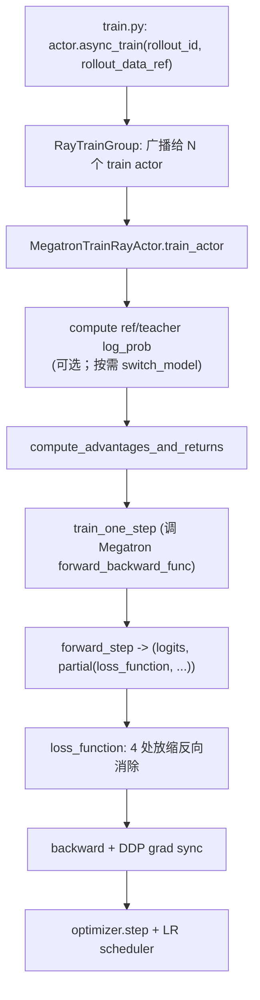
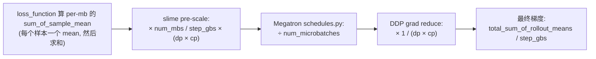
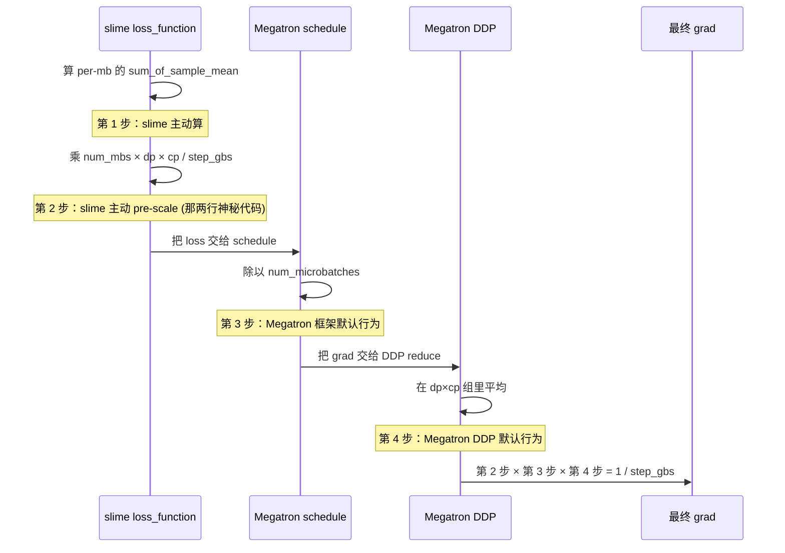

# 第 4 章：training loop——Megatron 这一侧

## 一个克制的训练循环

上一章把 placement、引擎初始化、RolloutManager 都就绪了。`train.py`
进入主循环，第一次调到的训练侧接口是这一行：

```python
actor_model.async_train(rollout_id, rollout_data_ref)
```

这一章的任务是打开这一行——`async_train` 触发的是 Megatron 这一侧的
完整训练 step：rollout data → micro-batch 切分 → forward → loss →
backward → optimizer step。

训练 step 是 RL 框架里最容易"看似 supervised"但其实暗藏分布式
数值陷阱的地方。Megatron 这一侧的故事——也是本章的核心论点——
可以一句话总结：**slime 几乎不重写 Megatron 的训练 step**。它的
工作集中在四个夹缝里：loss 函数、micro-batch 调度、ref/teacher/
old_actor 切换、checkpoint 输出。但这四个夹缝里藏着分布式 RL 训练
里最容易被忽略也最容易出问题的细节——尤其是 loss 那条线上的
**4 处梯度放缩**。

这一章会花最大的篇幅讲那 4 处放缩。它是 slime 整个 training 子系统
里最"反直觉但必须正面讲清"的设计；如果你以后要做自己的 RL 框架，
理解这件事会避免你踩一类很难调试的 bug——那种"loss 看起来在降，
模型其实没在学正确的梯度"的 bug。

## 4.1 四层架构

training 子系统从上到下有四层，每一层的职责被严格隔离：

| 层 | 文件 | 知道什么 / 不知道什么 |
|---|---|---|
| **主循环** | `train.py`（103 行） | 知道 rollout_id、知道 actor / critic 两个对象。不知道 Megatron、不知道 PPO/GRPO |
| **Ray 层** | `slime/ray/train_actor.py`（128 行） | 知道"每个 GPU 一个 actor"。不知道 Megatron 内部、不知道损失类型 |
| **Backend actor** | `slime/backends/megatron_utils/actor.py`（674 行） | 知道 Megatron API、知道 RL 损失种类。不知道 Ray actor 怎么调度、不知道主循环 |
| **Megatron 适配** | `model.py` / `loss.py` / `data.py` / `cp_utils.py` | 直接调 Megatron 的 `get_forward_backward_func`、`DistributedDataParallel`、`get_megatron_optimizer`。不知道 Ray、不知道主循环 |

这种分层在你跨层读代码时特别明显——`train.py` 里出现的所有标识符
（actor_model、rollout_data_ref、update_weights）都没有 Megatron 词汇；
`MegatronTrainRayActor` 里出现的所有标识符都没有 `ray.get` 或
`.remote()`。**边界很清楚**。

一个 train step 在这四层里的形状如下：



这张图从上到下，每一步的"谁负责"对应上面那张分层表。slime 在每一层
都尽量薄——它的"工程价值"集中在两个箭头之间的协议上（比如
`async_train` 怎么把 rollout_data_ref 切给不同 dp_rank、`forward_step`
怎么把 loss 函数 partial 闭包给 Megatron），而不是在某一层堆代码。

## 4.2 4 处放缩组合出"per-rollout-mean"

打开 `slime/backends/megatron_utils/loss.py` 的 1285-1293 行，你会
看到这两行看起来非常奇怪的代码：

```python
# 伪代码 —— illustrative
# loss.py:1285-1293 的核心
if not args.calculate_per_token_loss:
    loss = loss * num_microbatches / step_global_batch_size \
                * mpu.get_data_parallel_world_size(with_context_parallel=True)
else:
    loss = loss * mpu.get_context_parallel_world_size()
```

第一眼看这两行没有意义——为什么要把 loss 乘以 `num_microbatches`
再除以 `step_global_batch_size` 再乘以 `dp × cp`？这看起来像随手凑
出来的"缩放因子"。

要理解它必须**反向追溯**：先看下游（Megatron schedule、Megatron
DDP）默认会对 loss 做什么放缩，再回头看 slime 这两行在抵消什么。

**下游放缩 1（Megatron schedule）**：Megatron 的 pipeline schedule
在每个 micro-batch 跑完 forward 后，会自动把 loss `÷ num_microbatches`
——它假设 "loss 的总贡献是各 mb 的均值"。这个除法是 Megatron 给
传统训练设计的，没法关掉。

**下游放缩 2（Megatron DDP）**：grad reduce 阶段，Megatron DDP 在
`dp × cp` 组里做平均 `× 1 / (dp × cp)`——同样是默认行为。

slime 想要的最终梯度是 **per-rollout-mean**：每个 rollout 算一个
mean，所有 rollout 的 mean 加起来除以总数。如果 slime 不做任何
处理，loss 经过上面两步默认放缩后，得到的梯度会被多除一个
`num_microbatches × dp × cp` ——数值上完全不对。

所以 slime 必须在自己的 `loss_function` 里**预先反向乘上这些**：
`× num_microbatches × dp × cp`。再加上 slime 自己想要除 `step_global_batch_size`
（把 "sum" 变成 "mean per global batch"），就凑出了那两行
神秘代码 `× num_microbatches / step_global_batch_size × (dp × cp)`。

整条链路连起来看：



如果换成"谁的责任"的视角看，4 处放缩分别由谁触发更清楚——只有
第 2 步是 slime 主动写在 `loss_function` 里的代码，其余 3 步都是
框架默认行为：



把 4 步的放缩因子乘起来：
`× num_mbs / step_gbs × (dp × cp)  ÷ num_mbs  × 1 / (dp × cp)
= 1 / step_gbs`

也就是说，slime 的 pre-scale + Megatron 的 schedule 除法 + DDP 的
平均，三者合起来正好把"per-mb 的 sum_of_sample_mean"乘以 `1 /
step_gbs`，最终得到 `total_sum_of_rollout_means / step_gbs`——
这就是 per-rollout-mean 梯度。

更关键的是这套放缩**不依赖 CP**。`× (dp × cp)` 和 `× 1 / (dp × cp)`
互相抵消，意味着无论你用多少 context parallel 切分，梯度的数值
应该完全一样。

这件事必须靠测试守住。slime 写了一个非常"重"的测试：
`tests/test_loss_cp_invariance.py` 用 `mp.spawn + gloo` 在 CPU 上
拉起一个**真分布式**进程组（不是 mock，是真的 process group），
然后枚举 `(dp, cp)` 的不同因子化，跑完整的 backward，校验最终
`grad_norm` **严格相等**。这个测试不需要 GPU，能在 ubuntu-latest CI
runner 上跑——是 slime "RL bug 不报错"这条工程哲学的具体证据：

> 数值放缩这种错误**不会让训练崩**。它只会让 grad 算错一个常数倍，
> 你的 loss 看起来在降、metric 看起来在涨，但模型在按错的步长更新。
> 等到一个月后发现 reward curve 不收敛回头排查，已经烧了几千 GPU
> 小时。CI 在 5 秒内能发现这个 bug。

把放缩集中在 `loss_function` 一处而不是散布在 4 个文件里，也是有意
为之。如果某天 Megatron 改了 schedule 的除法逻辑（比如从
`/= num_microbatches` 改成 `/= num_microbatches × dp`），slime 只
需要改 `loss_function` 这一行；如果放缩分散在 `model.py`、`actor.py`、
`schedules` 各处，你要改 4 个地方且容易漏。**一处放缩的可维护性
价值远高于"为可读性把它分散开"**。

`cp_utils.reduce_train_step_metrics`（`cp_utils.py:127-168`）做同
一件事的对偶版本：metric 报告时按 `cp_factor` 反向消除 CP 引入的
重复计数——per-token-loss 模式下 `cp_factor = cp_size`，
per-rollout-mean 模式下 `cp_factor = 1`。两者放在一个文件里，逻辑
对称。

## 4.3 训练侧的"零调度"

训练 step 要做的另一件麻烦事是 micro-batch 切分。一个 rollout 的
样本要按 dp_size 切给不同 rank，每个 rank 再按 max_tokens_per_gpu
切成多个 micro-batch；切分必须均衡（避免某个 rank 拖后腿），还要
满足 Megatron pipeline parallel 的硬约束（每个 dp_rank 必须有相同
的 num_microbatches）。

这是个非平凡的调度问题。但**训练侧的 actor.py 一行调度代码都没有**。

slime 把整个调度逻辑外移到 `slime/utils/dp_schedule.py`（209 行
纯 Python），在 **rollout 侧** 调用——`build_dp_schedule(samples, ...)`
接收一批样本，吐出四元组：

```python
# 伪代码 —— illustrative
@dataclass
class DPSchedule:
    partitions: list[list[int]]            # 每个 dp_rank 该处理哪些样本
    micro_batch_indices: list[list[int]]   # 每个 dp_rank 内的 mbs 划分
    num_microbatches: int                  # 所有 rank 必须一致
    global_batch_sizes: list[int]          # 每个 dp_rank 的实际 batch size
```

这个四元组被序列化进 `rollout_data` dict，跟着 Ray object store 传
给训练侧。训练侧 `get_data_iterator` 拿到后**直接按表执行**：

```python
# 伪代码 —— illustrative，data.py:241
def get_data_iterator(rollout_data, dp_rank):
    indices = rollout_data["micro_batch_indices"][dp_rank]
    for mb_idx in indices:
        yield extract_micro_batch(rollout_data, mb_idx)
```

这种"调度与执行分离"的设计有两个具体好处：

**第一**，调度算法（first-fit-pack、Karmarkar-Karp 双路平衡、按
FLOPs 分配）需要看到全 batch 的 seq lengths——rollout 侧本来就有
这些数据，train 侧拿到的已经是 packed 之后的。把调度放在 rollout
侧避免了"训练侧再做一遍 packing"。

**第二**——这是更重要的——把调度抽到 CPU-only 纯函数后，**CI 可以
无 GPU 跑 invariant 测试**。`tests/test_dp_schedule.py` 验证 4 条
不变量：

- 每个 dp_rank 的 `num_microbatches` 相同（PP 要求）
- 每个 mbs 的 token 数 ≤ `max_tokens_per_gpu × cp_size`（OOM 守护）
- 所有样本恰好被切一次（正确性）
- 每个 dp_rank 的 mbs 在时间上铺开均衡（性能）

这些不变量不需要 GPU 验证。`test_dp_schedule.py` 在 CPU runner 上
几秒钟跑完，每次 PR 都跑。slime 关于"什么是合法的 dp 调度"的定义
完全在测试里，新人改 `build_dp_schedule` 时不可能不小心破坏其中
某一条。

train 侧因此有个看起来奇怪的副作用：`train_one_step` 接受一个
`step_global_batch_size: int` 参数（`model.py:518`），是从 rollout
侧传过来的"这一步实际的 global batch size"。LR scheduler 用这个值
而不是启动参数 `args.global_batch_size`——因为 dynamic batching 下
真实的 step batch size 每步都不一样，必须用实际值喂给 scheduler，
否则 LR decay 会走偏。

## 4.4 多模型不是多份显存

RL post-training 训练循环里经常需要"多个模型"：

- **ref model**：算 KL 散度时的参考分布
- **teacher model**：on-policy distillation 时的教师
- **old actor**：PPO importance ratio 的分母

传统 RLHF 框架对这种"多模型"的实现是**开多个模型实例**，每个占
独立的 GPU 显存。对 70B+ 的模型，光是 ref + actor + critic 就要 3
份完整权重，MoE 大模型更不可承受。

slime 选了完全不同的做法：**所有这些"模型"共享同一组 GPU 参数，
靠 `TensorBackuper` 在 CPU pinned-memory 上备份与切换**。

```python
# 伪代码 —— illustrative，tensor_backper.py
class TensorBackuper:
    def __init__(self):
        self.snapshots: dict[str, list[Tensor]] = {}  # CPU pinned-memory

    def backup(self, tag: str, model):
        self.snapshots[tag] = [
            p.detach().to("cpu", non_blocking=True).pin_memory()
            for p in model.parameters()
        ]

    def restore(self, tag: str, model):
        for p, saved in zip(model.parameters(), self.snapshots[tag]):
            p.data.copy_(saved, non_blocking=True)
```

`_switch_model("ref")` 这种调用本质上是 `restore("ref")`——把 CPU
里那份 ref 权重拷回 GPU，覆盖当前 GPU 上的 actor 权重。算完 ref
的 log_prob 后再 `restore("actor")` 切回来。

代价是 PCIe 带宽（GPU↔CPU 拷贝），收益是 **N 个角色 = N × CPU
memory + 1 × GPU memory**。对 70B BF16 模型，一份权重 140 GB GPU
显存 vs 140 GB CPU 内存——CPU 内存便宜得多，这种 tradeoff 对大
模型 RL 几乎是必须的。

`keep_old_actor` 模式下还有个滚动队列：每步训练完之后做
`actor → rollout_actor → old_actor` 的三档队列式备份
（`actor.py:630-639`），全部在 CPU 内 copy，避免每次都从 GPU 重抓。

slime 还为"我只有一份模型，不需要切换"的场景做了一个 noop 版本——
`_TensorBackuperNoop`（`tensor_backper.py:77-102`）不真的备份，但
会**算 hash 校验**。如果你写代码时手滑调用了 `restore("ref")` 但
没配 ref，这个 noop 实现会发现 hash 对不上而 assert——避免"调用
了切换但其实没切换"这种 silent bug。这种"故意写一个能 fail 的 stub
而不是直接 pass"的态度，是 slime "正确性为先"工程文化的一个缩影。

## 4.5 Checkpoint：双轨保存

训练完一步要存 checkpoint。slime 同时支持两种格式：

- **Megatron 分布式 checkpoint**（`checkpoint.py`）：每个 rank 存自己
  那份分片，最快也最节省存储。用于断点续训。
- **HF safetensors 格式**（`hf_checkpoint_saver.py`，388 行）：把
  Megatron 的并行权重重新组装成 HF 单文件格式。用于把训练产物直接
  喂给 SGLang / vLLM / HuggingFace transformers。

第二条是 RL post-training 与 pretraining 的关键差别。pretraining
通常只关心"能继续训"，所以 Megatron 自家的分布式 checkpoint 够用；
RL post-training 的产物**最终要被推理引擎吃**，HF 格式不是可选，
是必选。slime 把这条路径做成一等公民——`hf_checkpoint_saver.py`
处理 sharding、多节点并行写入、不同模型架构的权重映射——意味着
你不需要在训练之外再跑一次格式转换工具。

这是 slime "一条数据路径"赌注的延伸：训练侧的输出格式直接是推理
侧能用的格式，中间不需要 ETL。

> **深入剖析：上游 OOM 的外科手术**
>
> `megatron_patch/megatron_chunked_grad_coalesce_patch.py` 是
> training 子系统里"为什么这样设计"最有故事的一段。问题是 Megatron
> 原生的 `_allreduce_non_tensor_model_parallel_grads` 用
> `_flatten_dense_tensors(grads)` 把所有 TP 侧梯度 flatten 成一块
> 大连续内存做一次 all_reduce——对大模型这块 buffer 动辄几 GiB，
> CUDA allocator 碎片化时直接 OOM。
>
> slime 的修补是把它改成按 `SLIME_GRAD_COALESCE_CHUNK_BYTES`（默认
> 1 GiB）分块。因为 SUM/AVG 是 element-wise，分块在数学上完全等价。
>
> 更聪明的是 patch **怎么塞回去**。因为 `megatron.core.distributed`
> 这个父包重新 export 了同名函数遮蔽掉了子模块，直接
> `module.func = new_func` 不生效；slime 走
> `sys.modules["megatron.core.distributed.finalize_model_grads"]`
> 直接拿到子模块本体来 setattr。
>
> 再加上 `inspect.signature` 在运行时检测 Megatron v0.13 与 v0.15rc7
> 的 API 差异（参数从 2 个变成 3 个），同一个 patch 同时兼容两个
> 主版本——**不用 try/except，不用版本条件 import**。
>
> 这段 monkey-patch 揭示了 slime 与上游关系的一个真相：**不 fork
> Megatron，但偶尔需要外科手术式地改它**。透传赌注（native engine
> 直接用）的代价是这种"必须改一行上游"的场景偶尔会出现；slime
> 把这种修补集中在 `megatron_patch/` 目录下，明确边界——这里的
> 每个补丁都解决一个具体的、有数据支撑的问题，不在别处散布。

## Apply This

5 条可迁移到自己 RL（或任何分布式训练）系统的设计模式：

**1. 分布式数值放缩集中在一处而不是散布**

slime 的 `loss_function` 里那两行神秘代码集中表达了"反向消除下游
4 处放缩"。这种设计违反"局部清晰"原则（每行代码单看不直观），但
换来了"全局可维护"——下游放缩规则改了，只改一处。

**怎么改造适配**：每次你发现一个 RL 训练的"数值缩放"逻辑被分散
到多个文件，问一下"这些 scale 因子合起来是什么"。如果合起来有
一个清晰的意义（比如 per-rollout-mean），把它们集中到产生意义的
那一处，其他位置只放反向消除。

**陷阱**：集中放缩需要在那一处有详尽注释——slime 的
`test_loss_cp_invariance.py` 文件开头有几十行注释把整条链路写
清楚。没有注释的话，那两行代码下次有人 refactor 时一定会被"简化"
掉。

**2. 把不变量做成 CPU 可跑的真分布式测试**

slime 不仅写了 unit test 测 `loss_function` 的输出，还写了 CPU 上跑
`mp.spawn + gloo` 真分布式的 invariance 测试——校验"CP 切分不影响
最终 grad_norm"。这种测试在 ubuntu-latest CI runner 上几秒跑完，每
次 PR 都跑，永远不会漏。

**怎么改造适配**：你的分布式系统有哪些"看起来该一样的事"？（不同
DP 因子下 grad 应该一样、不同 TP 切分下 logits 应该一样、不同 CP
下 loss 应该一样）把这些不变量写成 CPU spawn 测试，比 GPU 集成测试
快几百倍且更可重复。

**陷阱**：CPU 上 mock 分布式不算——必须真起 process group（gloo
backend），跑真 forward/backward。mock 出来的测试不会暴露真实
all_reduce 的细微差异。

**3. 数据计划与执行分离，让调度纯函数化**

slime 的 `build_dp_schedule` 是纯 Python 函数，在 rollout 侧调用，
输出一份完整调度计划塞进 `rollout_data`。训练侧零调度代码，只按
表执行。这让"调度是否正确"完全在 CPU-only 测试里就能验证。

**怎么改造适配**：你的训练循环里有哪些"在 GPU 进程里做但其实是纯
CPU 决策"的逻辑？（micro-batch 切分、负载均衡、动态 batching）把
它们提取成纯函数，在 driver 进程里调，输出计划喂给 GPU 进程。

**陷阱**：调度计划要能被 Ray object store 序列化。slime 用 plain
dict + list 表达计划，避免序列化失败。

**4. 多份"模型"用 CPU pinned 备份切换，而不是多份显存**

ref / teacher / old_actor 用 CPU 备份共用一组 GPU 权重。代价是
PCIe 带宽，收益是 GPU 显存几倍的节省。对大模型 RL 几乎是必选。

**怎么改造适配**：识别你的训练循环里哪些"模型"是只在某个阶段被
read-only 调用的（比如算 KL、算 teacher logits）。这些都是 CPU
备份的候选——不需要它们常驻 GPU。

**陷阱**：切换有 PCIe 带宽开销。如果你切换太频繁（比如每个
micro-batch 都切），收益会被开销吃掉。slime 按"一次 rollout 切一
次 ref"的粒度切换，平衡得很好。

**5. 不 fork 上游，但需要时外科手术式 monkey-patch**

slime 把所有对 Megatron 上游的 patch 集中在 `megatron_patch/` 目录
下，每个 patch 解决一个具体的 documented 问题。`inspect.signature`
让一个 patch 同时兼容多个上游版本，避免 fork。

**怎么改造适配**：当你想 fork 一个上游项目时，先问"我真正要改的
是哪几行？"如果答案是"3-10 行的关键路径"，monkey-patch 比 fork
便宜得多。

**陷阱**：monkey-patch 不能成为掩盖架构问题的工具。如果你要 patch
的位置散在上游 30 处，那是设计层面有冲突，应该考虑 fork 或者根本
换一个上游。slime 的 `megatron_patch/` 目前只有 1 个补丁，这是
健康信号。

---

## 下一站

到这里 Megatron 这一侧的训练 step 讲完了。下一章打开 SGLang 这一
侧的 RolloutManager——那个 1485 行的 0 GPU CPU sidecar 在做什么、
6 种 rollout 形态（同步 / 流式 / 全异步 / SFT / OPD / sleep）分别
解决什么不同问题、Sample 状态机长什么样、以及为什么 `rollout_mask_sums`
这种"反直觉但关键"的字段会被 rollout 侧提前算好喂给训练侧。
