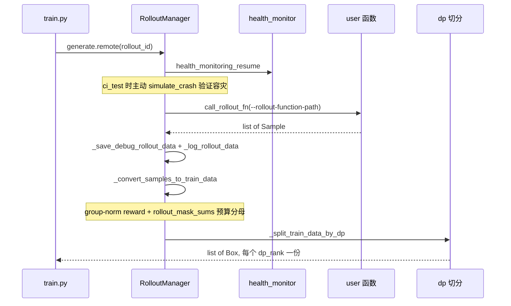
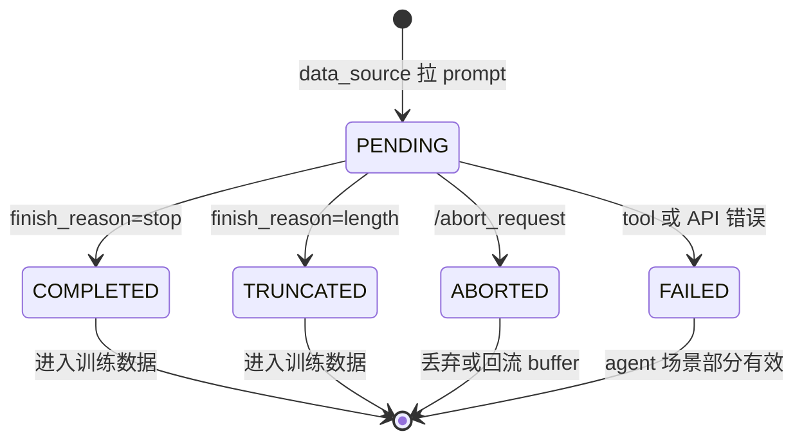
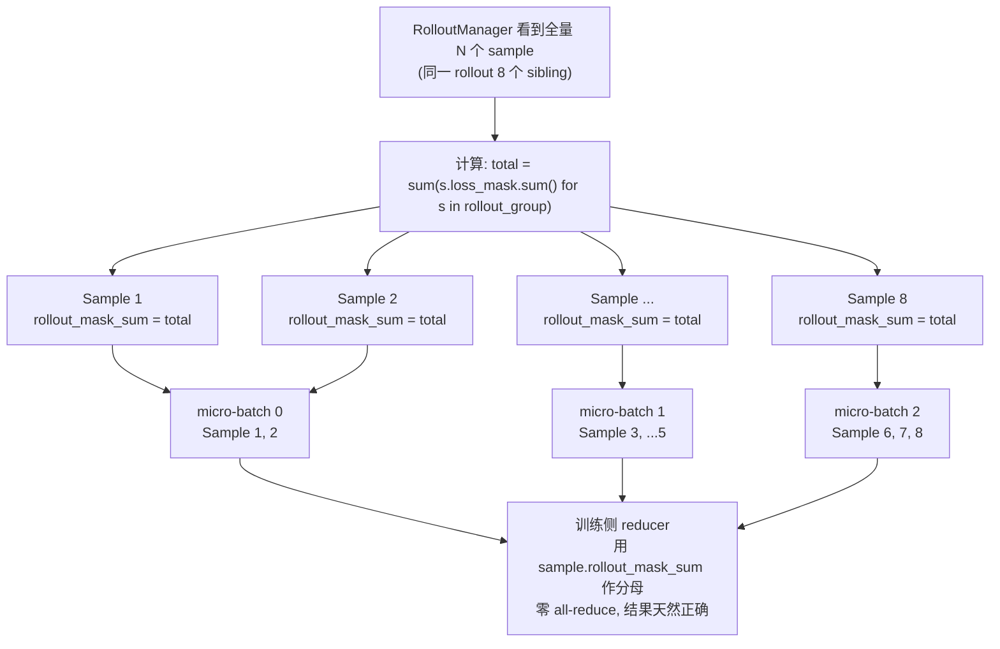

# 第 5 章：rollout loop——SGLang 这一侧

## 一个意外的行数分布

上一章 Megatron 侧的故事是"4 处放缩组合成一行干净的梯度"；这
一章 SGLang 侧的故事是"1485 行里大部分代码在管引擎生命周期与
可观测，真正的 rollout 业务逻辑被外移给用户函数"。两者都是 slime
"一条数据路径"赌注在两侧的具象表达。

入口是这一行：

```python
rollout_data_ref = rollout_manager.generate.remote(rollout_id)
```

`rollout_manager` 是上一章看到的那个 0 GPU 的 CPU sidecar，Ray actor。
`generate.remote(rollout_id)` 返回的 `rollout_data_ref` 是 `list[Box]`，
每个 Box 对应一个 dp_rank 该消费的训练数据。从这一行开始，rollout
manager 内部会调起 SGLang engines、做 generation、跑 reward、组装
样本、按 dp 切分，最后把训练数据交回主循环。

这件事的代码在 `slime/ray/rollout.py`，一个 **1485 行**的 Python
文件——slime 仓库里最大的几个文件之一。

但这一章想从一个反直觉的事实开始：**1485 行里"rollout 业务逻辑"
只占大约 200 行**。剩下 80% 是 SGLang 引擎的部署编排、端口与
placement group bundle 的 bookkeeping、metric 抽取与可观测。真正
"如何生成样本"那一段——发请求、收 token、算 reward——根本不在
这个文件里，它被外移给了用户函数（`--rollout-function-path`）。

这是 slime 的核心论点之一在 rollout 侧的具体体现：**RolloutManager
管"生命周期"，不管"业务逻辑"**。同步 / 流式 / 全异步 / SFT /
on-policy distillation / sleep 这 6 种 rollout 形态对 manager 透明
——它们都只是不同的用户函数，被 manager 当作黑盒调用。manager 自己
关心的事是：engine 起来了吗？health monitor 是不是该 pause？weight
update 时谁拿锁？sample 转成训练张量怎么切给 dp_rank？

这一章拆这套机制。我们会看到 RolloutManager 真正在做什么、Sample
作为数据契约怎么穿越整条流水线、6 种 rollout 形态如何用一个 hook
点解耦、`rollout_mask_sums` 这个反直觉但关键的"分母广播"设计、
以及 router 抽象上一个值得知道的泄漏点。

## 5.1 RolloutManager 真正在做什么

`RolloutManager.generate` 方法本身只有 14 行：

```python
# 伪代码 —— illustrative，rollout.py:546
def generate(self, rollout_id):
    self.health_monitoring_resume()
    if ci_test and use_fault_tolerance and rollout_id >= 2:
        self._try_ci_fault_injection()
    data, metrics = self._get_rollout_data(rollout_id)   # 调用户函数
    self._save_debug_rollout_data(...)
    _log_rollout_data(...)
    if debug_rollout_only: return
    data = self._convert_samples_to_train_data(data)     # rewards + masks
    return self._split_train_data_by_dp(data)            # 每个 dp 一份
```

`_get_rollout_data` 里调用的就是 `--rollout-function-path` 注入的
用户函数。manager 不知道它内部怎么走——是 HTTP 一次性请求、是流式
SSE、是异步队列、还是根本不调 SGLang（SFT 模式），manager 都不
关心。它拿到 `list[Sample]` 之后做样本组装与切片，就把数据交回主
循环。

把这 14 行画成时序图，能更直观看到 manager 的 7 个动作之间谁是
"协调"、谁是"调用用户代码"、谁是"组装数据"：



7 个动作里只有"调用 user 函数"那一步真正涉及 rollout 业务逻辑——
其余 6 步都是协调、组装、切片。这是 manager 1485 行里"业务逻辑
仅占 200 行"的另一种证据：14 行入口里只有 1 行调业务。

那 1485 行写了什么？打开文件你会看到三层抽象在做引擎编排：

```
RolloutManager (Ray actor, 1 个)
└── self.servers: dict[str, RolloutServer]
    └── server_groups: list[ServerGroup]
        └── all_engines: list[SGLangEngine actor]
```

- **`SGLangEngine`**：上一章讲过，是个 Ray actor，但模型实际跑在
  它 fork 出的 multiprocessing 子进程里
- **`ServerGroup`**：一组**配置同构**的 engine（同 TP size、同
  nodes_per_engine、同一个 PG bundle）。一个 group 可以是 prefill /
  decode / encoder / regular——PD 解耦时一个模型拆成多个 group
- **`RolloutServer`**：一个挂在**同一个 sgl-router 后面**的模型，
  可以包含多个 group。`servers` 是 `dict[model_name, RolloutServer]`
  ——`--sglang-config` 可以同时部署多模型（actor + reward model +
  reference model 并存），每个模型自带 router 端口

1485 行的实际分布是：

| 部分 | 行数 | 在做什么 |
|---|---|---|
| `RolloutManager` 类本体 | ~213 行 | 生命周期 + driver-facing 接口 |
| `ServerGroup` + `RolloutServer` | ~315 行 | 多 group 调度、recovery |
| `start_rollout_servers` + `_start_router` + 端口 / PG 编排 | ~340 行 | 启动逻辑大头 |
| metric 计算 | ~250 行 | 抽 sglang trace span 算 P50/P99 |
| 其他（验证、debug、checkpoint hook） | ~370 行 | |

**启动逻辑占了最大头**。为什么？因为同节点上不同 server group 不能
撞端口——`port_cursors: dict[node_idx, port]` 要在 group 之间串起来，
避免 prefill group 拿走的端口又被 decode group 试图占用。同 group
内的 engine 要在同一 PG bundle 上、不同 group 可能跨 bundle。每个
engine 还要分配 HTTP 端口、NCCL 端口、router 注册端口——三种端口
在不同生命周期阶段被使用，需要协调好。

PD 解耦的启动还要两阶段：encoder group 先起，**同步等所有
`ray.get(handles)`** 与 `get_url.remote()` 完成，把 encoder URL 收
集后通过 `sglang_overrides["encoder_urls"]` 注入给 prefill / regular
group。这一段是为什么 EPD 路径不能像普通路径那样把所有 init 并发
异步起——encoder URL 是 LLM init 的必需参数，存在跨 group 强依赖。

这种"启动编排比业务逻辑更复杂"的现象在分布式系统里很常见。slime
的应对是**把生命周期管理和业务逻辑严格分开**——manager 文件管前者，
`slime/rollout/*.py` 管后者，互不渗透。

## 5.2 Sample：穿越整条流水线的数据契约

`Sample`（`slime/utils/types.py:93`）是整个 rollout 子系统的数据
契约。一个 dataclass，跨越 `prompt → response → reward → train data`
整条流水线。它的状态机是 5 个：



**常规路径**（`PENDING → COMPLETED` 或 `PENDING → TRUNCATED`）：
一条 sample 从 data_source 拉出来时是 PENDING、空 tokens；rollout
函数把它喂给 SGLang engine，engine 流式吐 token，每个 chunk 都被
`sample.append_response_tokens(...)` 增量写回 sample（同时维护
loss_mask、rollout_log_probs）；engine 返回 `finish_reason=stop`
就转 COMPLETED、`finish_reason=length` 就转 TRUNCATED。两种状态
都意味着 "这条 sample 可以进训练数据"——差别只是 truncated 那条
loss_mask 末端可能被截断。

异常路径（`ABORTED` 与 `FAILED`）是这套状态机最值得说的两个状态。

**`ABORTED` 有两条分歧路径**：

- 非 `partial_rollout` 模式：abort 的样本直接丢弃，下一轮 rollout
  重新从 buffer 抽 prompt
- `partial_rollout=True`：abort 时把已经收到的部分 token 打包返回，
  通过 `data_source.add_samples` 回写 buffer，带上
  `metadata["start_rollout_id"]`；下一轮重新调度时**延续 `tokens`
  已有内容**（off-policy 部分可以被 mask 掉，避免梯度污染）

这套设计让 slime 在 weight update 时可以主动 abort 长尾样本，**已
生成的 token 不浪费**——下一步 rollout 时这些 sample 接着算。配合
流式 rollout（下一节会讲），整套"中断 + 续跑"的语义是 slime 撑住
长序列 agentic workload 的关键。

**`FAILED` 是为 agent 场景留的 "部分有效" 语义**。agent rollout 涉及
tool call、sandbox 执行、外部 API——任何一步出错都不应该让整条
trajectory 完全作废。`FAILED` 状态允许 sample 携带部分有效的轨迹
进入训练（loss_mask 由 agent harness 控制哪些 token 算梯度），这是
第 9 章会展开的内容。

`Sample.append_response_tokens`（`types.py:253`）是流式 / 分段写
response 的统一入口。每次写入会同步维护 `loss_mask`、`rollout_log_probs`、
top-p replay 的 token ids 与 offsets——不可训练的 token 自动
`mask=0`、`log_prob=0`、top-p span 用空 padding。整个 Sample 还支持
`to_dict / from_dict` round-trip，让 `--save-debug-rollout-data /
--load-debug-rollout-data` 可以把一份完整 rollout 序列化到磁盘后再
原样重放——这是 slime 在 RL bug 调试上能做"replay"的基础。

## 5.3 6 种形态都只是用户函数

`RolloutManager` 在 `__init__` 时用 `load_function(args.rollout_function_path)`
加载 generation 函数。这个函数的签名是个极小的契约
（`slime/rollout/base_types.py`）：

```python
# 伪代码 —— illustrative，base_types.py 共 26 行
@dataclass
class RolloutFnTrainOutput:
    samples: list[list[Sample]]
    metrics: dict[str, Any]

@dataclass
class RolloutFnEvalOutput:
    data: dict[str, dict[str, Any]]
    metrics: dict[str, Any]

def call_rollout_fn(fn, *args, evaluation, **kwargs):
    output = fn(*args, **kwargs, evaluation=evaluation)
    # 兼容 legacy：用户函数也可以直接返回 list[list[Sample]]
    if not isinstance(output, (RolloutFnTrainOutput, RolloutFnEvalOutput)):
        output = RolloutFnEvalOutput(data=output) if evaluation \
                 else RolloutFnTrainOutput(samples=output)
    return output
```

整个 `base_types.py` 只有 **26 行**。这是 slime 给 customization 子
系统留的最小契约表面——它故意做得轻，让用户函数可以直接返回
`list[list[Sample]]` 走 legacy 路径，框架自动包装。

凭这一个 hook 点，slime 内置了 6 种 rollout 形态：

| 形态 | 文件 | 在解决什么 |
|---|---|---|
| **同步默认** | `sglang_rollout.py:generate_rollout` | RL 主路径（GRPO / PPO） |
| **流式** | `sglang_streaming_rollout.py` | 不是顶层 rollout，是 `--custom-generate` 插件，让 abort 时已收到的 token 不丢 |
| **全异步** | `fully_async_rollout.py:generate_rollout_fully_async` | 长尾——下一个 rollout 不用等本轮最慢的样本 |
| **SFT** | `sft_rollout.py:generate_rollout` | 不调 SGLang，纯走 mask generator 算 loss_mask |
| **OPD** | `on_policy_distillation.py` | 不是 rollout，是 reward + post_process 钩子；让 teacher 通过 SGLang 算 logprob |
| **sleep** | `sleep_rollout.py:sleep` | debug：让 rollout actor 永远睡，验证 backend 启动 |

manager **不知道有几种形态**。换一种形态就是改一个 CLI 参数，整套
manager + 引擎部署 + sample 组装代码零修改。这是上一章讲到的"任务
类型不在 entry script 层面分"的具体落点——在 rollout 这一侧，
"什么任务"就是"什么用户函数"。

两个值得单独讲的形态：

**流式 rollout 是为"反 abort"而生，不是为"反延迟"**。
`sglang_streaming_rollout.py` 的注释说得很白：它存在的目的不是降低
首 token 延迟，而是**让 abort 时不依赖 `/abort_request` 的返回值**
——每个 SSE chunk 都把累计 state 写回 `sample.tokens / response /
log_probs`，断流瞬间 sample 已经在最后一个 chunk 的状态。这是为
partial_rollout 与 weight update 时部分样本可被无损"截图"。代码里
还埋了一个 footgun 警告：sglang 默认是**累积式流**（每个 chunk
包含 from-start 的全量 token），如果哪天打开
`--incremental-streaming-output`，这里要改成 delta 拼接——很小的
开关，但改错会让 token 双倍写入。

**fully_async 是模块级单例后台线程**。`fully_async_rollout.py:49`
的 `_global_worker` 是模块级单例，`_get_global_worker` 用
`threading.Lock` 守护。`generate_rollout_fully_async` 每次被调用时
**不创建新 worker**，而是从 worker 的 `output_queue` 里 drain 已完
成的 group。这意味着 worker 上一轮 rollout 没收完的 in-flight 任务，
下一轮调用还在跑——长尾样本不会阻塞下一个 rollout 的开始。配合
`atexit.register(_stop_global_worker)` 优雅退出。

`AsyncRolloutWorker._thread_main` 在专属线程里跑
`asyncio.run(self._loop())`——这是 Python 异步并发的一个常见模式：
**主线程的 event loop 已经被 Ray 占着，需要独立线程开自己的 loop**。
这个细节也会出现在 agent harness 章（第 9 章），slime 的
`aiohttp_threaded` 用的是同一招。

`compact rollout` 是个轻量约定。`_validate_rollout_id_annotated`
（`rollout.py:898`）既不是泛型也不是新类型——它直接 walk 用户返回
的嵌套 list，靠**叶子 `list[Sample]` 出现的 depth** 推断：default
在 depth=1 跳过校验；compact 在 depth ≥ 2 强制 sibling 共享
`rollout_id`。这避免引入新 dataclass，也保留了 legacy
`list[list[Sample]]` 兼容。

## 5.4 rollout_mask_sums：在能看到全量的位置预算分母

上一章讲了 Megatron 侧 4 处放缩反向消除得到 "per-rollout-mean"
梯度。那一套机制有个前提：训练侧 loss 函数能拿到正确的"分母"——
也就是每个 rollout 的 total mask sum。

但 RL 训练里这个分母不是直接可得的。DP + micro-batch packing 会
**把一个 rollout 的多个 sample 切到不同 micro-batch**——比如一个
prompt 采 8 个样本，可能 2 个进 mb0、3 个进 mb1、3 个进 mb2。每个
mb 内部局部分母都不对，因为它只看到这个 rollout 的部分 sample。

如果要在训练侧算正确分母，需要做一次额外的 all-reduce 把同一
`rollout_id` 的所有 sample 的 mask sum 聚合起来——这是个不便宜的
跨 dp 通信。

slime 的解法是**在 manager 这一侧（它能看到全量 sample 的位置）
提前算好**。`_convert_samples_to_train_data` 里有这一段
（`rollout.py:773-778`）：

```python
# 伪代码 —— illustrative
def _convert_samples_to_train_data(self, samples):
    # 步骤 1：group-norm rewards（GRPO 关键步骤）
    # 同一 prompt 的 N 个采样 reward 减均值除标准差
    rewards = torch.tensor([s.reward for s in samples])
    grouped = rewards.reshape(rollout_batch_size, n_samples_per_prompt)
    grouped = grouped - grouped.mean(dim=1, keepdim=True)
    if args.normalize_with_std:
        grouped = grouped / (grouped.std(dim=1, keepdim=True) + 1e-8)
    rewards = grouped.flatten()

    # 步骤 2：rollout_mask_sums——为分布式 reducer 预算分母
    by_rollout = group_samples_by_rollout_id(samples)
    rollout_mask_sums = {rid: sum(s.loss_mask.sum() for s in group)
                         for rid, group in by_rollout.items()}
    for sample in samples:
        sample.rollout_mask_sum = rollout_mask_sums[sample.rollout_id]

    return build_train_data_dict(samples, rewards)
```

两步都是"在能看到全量的位置算"——group-norm 需要看到同一 prompt
的 N 个采样才能算均值/标准差；rollout_mask_sums 需要看到同一
rollout 的所有 sample 才能算总分母。manager 是 0 GPU CPU sidecar，
正好处在这个全局视角的位置。

每个 sample 现在都带着自己所属 rollout 的**全局**mask sum 进入训练
数据。训练侧的 reducer 拿到正确分母，直接做加权求和，**省掉一次
all-reduce**。

把这个"分母广播"的过程画出来——关键是 manager 在样本被切到不同
mb 之前先算好全局分母、复制给每个 sample，让分散在不同 mb 的
sibling 都背着同一个值：



切到不同 mb 后每个 mb 局部看不到全量分母——但每个 sample 自己带着
全局分母进入，所以 reducer 不需要做跨 mb 通信也能算对。这是把
"通信成本"换成"数据复制成本"的具体例子，对每个 sample 多带一个
int 字段，省下一次跨 dp 的 all-reduce。

这是个少见的"在数据组装阶段提前算 reducer 元数据"的做法。它的成立
依赖一个具体条件：manager 在样本组装时**能看到全量 sample**——而
manager 是个 0 GPU 的 CPU sidecar，正好处于这个位置。如果你把样本
组装放到 GPU worker 上做（每个 worker 只看本地分片），这个优化就
没法做。

这件事和上一章那 4 处放缩组合起来看，浮现出一个更大的模式：
**slime 把"需要全局视角"的工作集中到无 GPU 的协调位置做**，让
GPU worker 只做本地计算。第 11 章工程基础设施会继续讲这个模式
在 trace / metric / health 上的应用。

## 5.5 router 之外的二次负载均衡

sgl-router 是 SGLang 上游提供的负载均衡器——slime 的多个 engine
都注册到同一个 router 端口下，外部请求只看到这一个端口，router
负责按 engine 负载分发。这套抽象在大多数场景下是完美的：用户不需
要关心 engine 列表。

但 SGLang 引入 `dp_attention` 之后，这个抽象有个**泄漏点**：一个
engine 内部可以有多个 dp_rank（每个 dp_rank 独立持有 KV cache），
router **看不到 dp_rank 级别的占用**——它只知道某个 engine 有 N
个请求在跑，不知道这 N 个请求是均匀分布在 dp_rank 上还是集中在
一个 dp_rank。

如果 slime 不做处理，多个请求可能都被 router 发到同一个 engine、
又被该 engine 都路由到同一个 dp_rank，导致单个 dp_rank 严重过载
而其他 dp_rank 空着。

slime 的应对是在 `GenerateState` 里**自己跟踪一个 dp_counts**
（`sglang_rollout.py:84`）：

```python
# 伪代码 —— illustrative
class GenerateState:  # singleton
    semaphore: asyncio.Semaphore
    dp_counts: list[int]   # 长度 = sglang_dp_size, 每个 dp_rank 当前 in-flight 请求数

    @contextmanager
    def dp_rank_context(self):
        # 选最空闲的 dp_rank
        min_count = min(self.dp_counts)
        candidates = [i for i, c in enumerate(self.dp_counts) if c == min_count]
        chosen = np.random.choice(candidates)
        self.dp_counts[chosen] += 1
        try:
            yield chosen
        finally:
            self.dp_counts[chosen] -= 1   # 即使异常也减回去
```

每次发请求时取 `dp_counts` 最小的 rank，通过 `sampling_params` 把
`dp_rank` 透传给 SGLang——告诉 router "请把这个请求路由到 engine X
的 dp_rank Y"。最小者多个时用 `np.random.choice` 随机抽，避免确定性
绑定。

这是 router 抽象上一个值得知道的设计细节：**当上游抽象的视角和你
需要的视角不一致时，自己在客户端补一层**。slime 没有去改 sgl-router
（那会污染上游），而是在自己的 client state 里做二次均衡——上游
抽象保持纯净，slime 的二次均衡作为补丁存在于自己代码里。

`@contextmanager` 的写法保证即使任务异常也能把计数器减回去——这是
异步并发里很容易踩的坑（任务抛异常 dp_counts 永远不减，最后整个
engine 看起来都"满载"了）。slime 把这个细节用上下文管理器固化下来。

## 5.6 与外部的集成接口

manager 与外部子系统通过几个清晰的接口耦合，值得单独列出：

**与 Data Buffer**：只走两个方法（`DataSource` 抽象类）：
- `data_source.get_samples(over_sampling_batch_size)` 拉 prompt
- `data_source.add_samples(aborted_samples)` 回写（partial_rollout
  / fully_async 用）
- `data_source.save / load` 持久化

manager 在 `__init__` 时用 `load_function(args.data_source_path)`
加载 data source class，**永远不直接操作 buffer 内部结构**。第 6
章会展开 Data Buffer 的设计。

**与 SGLang engine**：两条通道严格分开
- **HTTP（数据面）**：rollout 函数自己拼
  `http://{router_ip}:{router_port}/generate`，走全局 httpx client。
  slime **不在 Python 层拿 engine handle 发请求**——一律走 router
- **Ray remote（控制面）**：`engine.release_memory_occupation /
  resume_memory_occupation / update_weights / check_weights /
  health_generate / simulate_crash`。所有 GPU 内存动作走 ray，所有
  推理动作走 HTTP

这种"数据面走 HTTP、控制面走 Ray"的分离让 weight sync 等控制操作
不会被推理流量阻塞，也让推理流量不依赖 Ray object store。

**与 customization hook**：manager 在 `__init__` 加载 4 个用户函数
（全部可选）：`--rollout-function-path`、`--eval-function-path`、
`--custom-reward-post-process-path`、`--custom-convert-samples-to-train-data-path`。
二级钩子在 `sglang_rollout.py` 里。第 10 章会系统讲 18 个 hook。

> **深入剖析：CI 故障注入是一等公民**
>
> `RolloutManager.generate` 第三行有一段看起来很奇怪的代码：
>
> ```python
> if ci_test and use_fault_tolerance and rollout_id >= 2:
>     self._try_ci_fault_injection()
> ```
>
> 这是 `_try_ci_fault_injection`（`rollout.py:474`）——在 generate
> 时**主动 crash 一个 engine**，让 recovery 路径走一遍。
>
> 为什么写在生产代码里而不是测试代码里？因为 RL 训练的 recovery
> 路径很难单元测试——它涉及多个 Ray actor 的协调、HTTP 服务的重启、
> weight 的重新加载。把故障注入埋在 generate 里、用 CI 环境变量开关，
> 意味着**每次 CI 跑端到端测试都会走一遍 recovery 路径**——recovery
> 正确性被强制纳入 CI 一等公民。
>
> 配合 `RolloutServer.recover()`（`rollout.py:341`）：扫描
> `all_engines` 中 `None` 的槽位，重新 `start_engines`，然后按是否
> updatable 分两条路径：updatable model 触发
> `release_memory_occupation` + `resume_memory_occupation(WEIGHTS)`
> 等 train actor 后续 `update_weights` 灌进来；non-updatable model
> 直接调 `update_weights_from_disk(model_path)` 自己恢复。
>
> `num_new_engines` 字段是给 train actor 看的——actor 知道有 N 个
> 新 engine 后会跳过他们的 weight broadcast、改用 P2P 单独同步，
> 避免拖累整个集群。
>
> 这种"把容错路径做成生产代码 + CI 强制走一遍"是 slime "正确性
> 为先" 工程文化的另一个具体落点，第 11 章会展开。

## Apply This

5 条可迁移到自己 RL 或推理调度系统的设计模式：

**1. 把"how"外移给用户函数，框架只管生命周期**

slime 的 RolloutManager 1485 行里只有 ~200 行是 manager 本体，业务
逻辑（怎么生成、怎么算 reward）全部由用户函数注入。这种"框架只管
生命周期 + 业务逻辑用户提供"的设计让 6 种 rollout 形态共享同一套
manager 代码，加新形态不动框架。

**怎么改造适配**：每次你的框架里想加 `if mode == "X"` 分支时，问
一下"这个差异能不能表达成不同的用户函数？"。如果能，给框架定一个
极小的契约（slime 是 26 行的 `base_types.py`），把分支推给配置层。

**陷阱**：契约必须够小才有意义。如果你的"用户函数"还要接受十几个
框架内部对象作参数，那它实际上是框架的一部分而不是用户的代码。
slime 的 rollout function 只接受 `args + sample 列表`，依赖关系干净。

**2. compact 形状用嵌套深度区分，不引入新类型**

slime 的 `compact rollout` 让一次调用产出多个训练样本，但**没有
引入新 dataclass**——它直接 walk 嵌套 list，靠叶子 list 出现的
depth 区分 default vs compact，靠校验函数（`_validate_rollout_id_annotated`）
保证 sibling 共享 `rollout_id`。

**怎么改造适配**：当你想为"多产物"场景加一个新的容器类型时，先看
能不能用现有容器的嵌套深度表达——配合一个校验函数把约定固化。
这避免了 API 表面变宽，也保持了向后兼容。

**陷阱**：靠形状约定的契约必须有显式的校验函数。slime 的
`_validate_rollout_id_annotated` 在 manager 拿到用户返回值的第一时
间检查，错误立刻报；不要让这种约定在下游某个深处才被发现违反。

**3. 在能看到全量的位置预算 reducer 元数据**

`rollout_mask_sums` 把每个 rollout 的 total mask sum 在 manager
（能看到全量 sample 的位置）算好，复制给每个 sample，让训练侧的
分布式 reducer 拿到正确分母直接加权求和——省掉一次跨 dp 的 all-reduce。

**怎么改造适配**：你的训练循环里有没有"训练侧需要全局聚合，但聚合
所需的数据其实在 driver 侧就有"的情况？这种聚合可以提前算好喂给
训练侧，把通信成本从训练侧移到数据组装侧。

**陷阱**：预算的元数据要随 sample 一起序列化跨 Ray object store。
如果元数据很大（比如每个 sample 携带的不是一个数而是一个 tensor），
通信成本可能反过来变大。`rollout_mask_sums` 是个标量，所以这个优化
非常划算。

**4. 让 abort 路径成为 in-flight 数据的截图机会**

流式 rollout 让 abort 时已生成的 token 不丢——每个 chunk 都把累计
state 写回 sample。这把"abort 是损失"翻转成了"abort 是断点"，使
partial_rollout 和 weight update 中断长样本成为合理操作。

**怎么改造适配**：你的系统里有没有"任务被中断时就丢弃"的状态？
看看能不能在执行过程中把累计 state 持续 commit 到一个可序列化的
位置——中断的瞬间最后一次 commit 就是断点。

**陷阱**：commit 的频率要平衡——每个 token 都 commit 太慢，整个
请求才 commit 一次又退化成"中断即丢"。slime 是每个 SSE chunk
commit 一次，粒度合理。

**5. CI 故障注入做成生产代码的一等公民**

slime 把 `_try_ci_fault_injection` 直接写在 `generate` 里，用 CI
环境变量开关——每次 CI 跑端到端测试都会走一遍 recovery 路径。
recovery 正确性被强制纳入 CI 一等公民，不靠"我下次记得测一下"。

**怎么改造适配**：你的系统里有没有"出错了才走"的代码路径（fault
recovery、retry、fallback）？把这些路径的触发条件写一个 CI 模式
（环境变量开关），让 CI 主动触发——不要等真实故障来验证。

**陷阱**：故障注入必须是**可控的随机**，不能在生产环境意外触发。
slime 的开关是 `ci_test and use_fault_tolerance and rollout_id >= 2`
三个条件叠加，生产环境 `ci_test=False` 保证零误触发。

---

## 下一站

到这里 SGLang 这一侧的 rollout 讲完了。第 4 章和这一章合起来展示
了 slime "一条数据路径" 赌注怎么在训练与推理两侧落地——但路径中间
那段桥（Data Buffer）我们一直在引用而没展开。下一章打开 Data
Buffer——它没有独立目录，是 slime 整个项目里最"看起来不在但其实
处处都在"的子系统，理解它需要解释为什么 slime 选了"接口契约 + 默认
实现 + 外置参考"三层而不是单一中心化实现。
