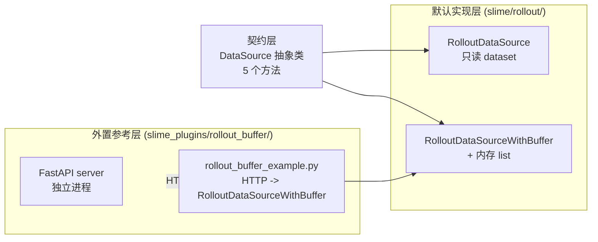
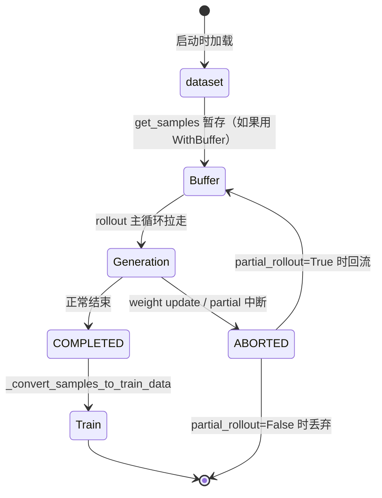

# 第 6 章：Data Buffer——隐式的桥梁

## 一个不存在的目录

第 4 章和第 5 章里，我们一直在引用一个叫做 "Data Buffer" 的东西——
训练侧从 Buffer 拉训练数据、rollout 侧把生成完的样本放回 Buffer、
partial rollout 时未完成的样本回流 Buffer。如果你按照这些引用去
源码里找，会有一个意外的发现：

**slime 没有 `slime/data_buffer/` 这个目录**。

打开仓库结构看一遍，你会找到 `slime/ray/`、`slime/rollout/`、
`slime/agent/`、`slime/backends/`、`slime/utils/`，但是没有 `data_buffer`。
README 架构图把 Data Buffer 画成与 training、rollout 并列的三个核心
模块之一，代码里却找不到对应实体。

这个"缺席"不是疏忽。它是 slime 整套数据流设计最有意思的取舍之一：
**slime 把 Data Buffer 做成了契约而不是模块**。

具体说，"Buffer" 这个词在 slime 里描述的是**一组约定**：训练侧
能从某处拿到 `list[list[Sample]]`，rollout 侧能把生成完的样本放进
同一个地方，断点续训时能 save/load 它的游标。这一组约定被一个 26
行的抽象基类（`DataSource`）固定住；具体怎么实现——是内存 list、
HTTP server、还是分布式存储——是另一回事。

这种"契约中心化、实现去中心化"的设计让 Buffer 既是 RL 论文里
replay buffer 的影子，又是 agent 系统里 trajectory queue 的影子，
但同时不被任何一种具体形态绑死。这一章拆这个设计：先看契约长什么样，
再看 slime 默认提供的实现，最后看一些反直觉的决策——比如为什么
dynamic filter 不在 Buffer 内部、为什么 Buffer 不进 checkpoint。

## 6.1 契约层：DataSource 的 5 个方法

整个 Buffer 体系的根是 `slime/rollout/data_source.py:17` 的
`DataSource` 抽象基类：

```python
# 伪代码 —— illustrative
class DataSource(abc.ABC):
    @abc.abstractmethod
    def get_samples(self, num_samples: int) -> list[list[Sample]]:
        """返回 num_samples 个 prompt 组，每组 n_samples_per_prompt 个 sample"""

    def add_samples(self, samples: list[list[Sample]]):
        """rollout 生成完的样本写回（可选）"""
        raise RuntimeError("This data source is read-only")

    def save(self, rollout_id: int): ...   # 断点续训：持久化游标
    def load(self, rollout_id: int): ...
    def __len__(self) -> int: ...           # 数据源还有多少
```

整个接口**只有 5 个方法**——`get_samples / add_samples / save / load
/ __len__`。整个 Data Buffer 子系统的对外承诺就在这 5 行里。这种
极简化是有意的：契约越窄，可替换实现越多。

值得停下来看一件事：`get_samples` 的返回类型是
`list[list[Sample]]`——一个**嵌套** list。外层是 prompt 维度，
内层是同一个 prompt 的 `n_samples_per_prompt` 次采样。这个嵌套
不是为了好看，它把 GRPO / DAPO 这类**按 group 做 reward 标准化**
的算法天然嵌进了 Buffer 的最小调度单元——Buffer 永远以 "一组同
prompt 的 N 次采样" 为最小单位发放与回写，而不是单个 sample。

这一选择影响了下游所有代码。`RolloutDataSourceWithBuffer.add_samples`
严格校验 `len(group) == n_samples_per_prompt`——你不能给 Buffer 塞
一个不完整的 group。`_post_process_rewards` 直接 reshape 成
`(rollout_batch_size, n_samples_per_prompt)` 做 group-norm——
因为它假设 Buffer 喂出来的样本天然按 group 对齐。这种"在数据结构
层把领域约束硬性表达"是 slime 减少下游 if/else 的关键技巧之一。

`add_samples` 在基类里**默认抛 `RuntimeError`**——这表达了一个具体
立场：**Buffer 默认是只读的**。只有显式提供了写回能力的子类（比如
`RolloutDataSourceWithBuffer`）才能 add；不要让"我应该能写"成为
默认假设。

## 6.2 三层结构与三种 RL 拓扑

DataSource 是契约层。在它之上，slime 提供了两个层次的实现：

**默认实现层**——`slime/rollout/data_source.py` 同文件里的两个类：

- `RolloutDataSource`（`:50`）：一次性 dataset 读取器。`__init__`
  把 jsonl prompt 全部加载进内存的 `Dataset` 对象，维护
  `sample_offset / epoch_id / sample_group_index / sample_index`
  四个游标。`get_samples` 切 num_samples 个 prompt，跨 epoch 时
  自动 reshuffle；对每个 prompt `deepcopy` 出
  `n_samples_per_prompt` 个 Sample，统一打 `group_index` 与
  `index`。`add_samples` 抛错——它是个**只生产 prompt、不接受写回**
  的源
- `RolloutDataSourceWithBuffer`（`:168`）：在父类之上加一个 Python
  `list` 作 buffer，加可插拔的 `buffer_filter`。读取顺序是先尝试
  从 buffer 摘，不够再调 `super().get_samples` 从底层 dataset 补足；
  `add_samples` 接受 group 严格校验

**外置参考实现层**——`slime_plugins/rollout_buffer/buffer.py`：
一个独立的 FastAPI server（端口 8889），演示
"agent 异步生成 → HTTP 写 buffer → 训练侧 HTTP 拉取" 的拓扑。它
**不是 DataSource 的子类**——它是另一个进程里的另一个程序——而是
通过 `slime_plugins/rollout_buffer/rollout_buffer_example.py` 里
的 `generate_rollout` 把 HTTP buffer 包装成 `RolloutDataSourceWithBuffer`
能消费的形态后接入。



这三层不是过度设计，它们分别对应**三种 RL 训练拓扑**：

| 拓扑 | 用什么 | 谁负责回写 |
|---|---|---|
| **同步 RL（默认）** | `RolloutDataSourceWithBuffer` | rollout 主循环偶尔回写 partial / aborted 样本 |
| **异步 RL（fully_async）** | 同上 | `AsyncRolloutWorker` 持续以 `get_samples(1)` 滴灌，ABORTED group 全部回流 |
| **agent / long-tail trajectory** | `slime_plugins/rollout_buffer/` 的 HTTP server | rollout 由独立进程驱动写 HTTP buffer，训练侧只 GET 已成型的 group |

三层共享同一组语义（拿 group / 放 group / 数 group），实现可以是
Python list、可以是 HTTP server、可以是任意外部存储——这是把
`data_source` 当 plugin 通过 `--data-source-path` 注入而非硬编码的
回报。**slime 不需要在早期对"用哪种 buffer"做决定**——它把决定权
推到运行时，由你的 CLI 参数选。

外置参考实现尤其值得说一下设计意图。`slime_plugins/rollout_buffer/`
是 FastAPI server，**故意不进入 `slime/` 包**。它的 `BufferQueue`
按 `instance_id` 做 key、按 group 完整性发放数据，自动扫描
`generator/` 目录注册不同任务类型的 generator——这套机制和 slime
本体非常不一样。slime 不把这套机制做进主包，是承认**agent
trajectory 怎么收集是个 task-specific 问题**：math、code、SWE-agent
任务各自需要的 buffer 行为差别太大，把它放在主包反而会绑死用户。

外置参考的价值是 "展示什么是可能的"——告诉你 Buffer 这一层可以
开成 HTTP server、可以按任务类型分目录、可以做 group 完整性发放，
但不强求你这样做。

## 6.3 dynamic filter 故意不在 Buffer 内部

RL 训练里经常需要丢弃一些样本——比如 DAPO 风格的策略要求 "全对
或全错的 group 不进 batch"（因为这类 group 的 advantage 全是同
一个值，反传梯度为零，浪费）。一个直观的设计是：让 Buffer 内部
维护 "valid group" 与 "invalid group" 两个 list，`get_samples`
永远只返回 valid 的。

**slime 不这么做**。`dynamic_filter` 在 `generate_rollout_async`
主循环里、**消费完 group 之后立刻判定**（`sglang_rollout.py:441`），
不 keep 的 group 直接丢弃，不进 buffer、不计数。`DynamicFilterOutput`
也很小：

```python
# 伪代码 —— illustrative，filter_hub/base_types.py
@dataclass
class DynamicFilterOutput:
    keep: bool
    reason: str | None = None
```

整个 `filter_hub` 模块只有一种内置 filter（`check_reward_nonzero_std`，
15 行），就是判断 group 的 reward 标准差是否非零——非零才 keep。
其他过滤策略全靠用户通过 `--dynamic-sampling-filter-path` 注入。

为什么不放进 Buffer？两层理由：

**第一，解耦数据持有与采样策略**。Buffer 不需要知道 reward、std、
长度阈值这些训练侧的概念。它只是一个数据容器。"哪些样本进 batch"
的决策是策略问题，应该让 filter 函数想看什么就传什么——把这些
策略放进 Buffer 会让 Buffer 持续膨胀，且每加一个策略都要改 Buffer
接口。

**第二，配合 over-sampling**。DAPO 风格的 dynamic filter 必然丢
一部分 group，意味着如果你想要 32 个 valid group，实际要拉 40 或
50 个 group 才够。这种 over-sampling 的循环（`while len(valid) <
target: more_samples = get_samples(...)`）必须在主循环里完成，而
不是在 Buffer 内部。Buffer 不知道也不应该知道 "上层想要多少 valid"。

slime 沿着这个原则做了 4 个独立 hook：

| hook | 时机 | 决策对象 |
|---|---|---|
| `--dynamic-sampling-filter-path` | 一个 group 生成完后立刻判 | 整个 group keep / drop |
| `--buffer-filter-path` | 从 buffer 摘 group 时 | 摘哪些 group |
| `--rollout-sample-filter-path` | batch 完成后 | 单个 sample 是否参与 loss |
| `--rollout-all-samples-process-path` | 拿到所有 oversample 样本（含被 drop 的） | 任意处理（通常是日志） |

这 4 个 hook **互不感知**，全靠 rollout 主循环串起来。第 10 章会
系统讲 18 个 customization hook 的设计哲学，dynamic filter 这套
4 hook 是其中最有代表性的一组——证明 "buffer 只持有数据，所有决策
都从外部注入" 不是一句口号，而是整套机制层面的承诺。

## 6.4 一个反直觉决策：Buffer 不进 checkpoint

`RolloutDataSource.save` 只保存 dataset 游标——`sample_offset`、
`epoch_id`、`sample_group_index`、`sample_index` 这四个数。
**`self.buffer` 这个 list 完全不进 state_dict**。`RolloutDataSourceWithBuffer`
也没有覆盖 `save / load`。

这意味着一个反直觉的事实：如果你正跑 partial rollout，攒了一堆没
生成完的 group 在 buffer 里，**节点挂了这些 group 就全丢**——它们
对应的 prompt 在下一次启动时会被重新当 fresh 处理（除非 dataset
游标恰好没走过那个位置）。

为什么 slime 这么选？序列化 buffer 听起来不难，但实际上要面对：

- **Sample 里 numpy / torch 字段的序列化**：Sample 是个跨 prompt /
  response / reward / train data 的 dataclass，里面有 token tensor、
  log_prob array、loss mask 等大量数值字段。序列化它们需要决定
  存什么格式（torch.save？json？safetensors？）、怎么处理 device
  placement、怎么处理跨版本反序列化
- **跨 rollout_id 的 weight_versions 一致性**：partial rollout 的
  样本 metadata 里会带 `start_rollout_id`，断点恢复时这些 metadata
  和当时的 weight 版本要对得上，否则 off-policy 部分的 mask 会
  失效

slime 做了一个明确的取舍：**Buffer 是临时缓存，断点不保证连续**。
代价是节点挂了会丢一批 in-flight 样本（在 partial rollout 下意味
着少几个 group 的训练数据），收益是 `DataSource` 接口可以保持
极简——`save / load` 各 10 行代码，没有跨版本兼容性陷阱，没有
"我升级了 Sample 字段，老 checkpoint 还能不能 load" 的问题。

这是个值得书里专门讲的取舍。它体现了一个常被忽略的工程原则：**当
某个数据丢了影响不大时，强行保存它反而增加系统复杂度**。slime 选
"少做一件事"，把 Buffer 的语义压到最小——training 侧拿不到样本就
重新生成，dataset 游标保证 prompt 不会被重复消费，整条数据流自我
修复。

## 6.5 Sample 的生命周期：Buffer 怎么看 Status

Buffer 表面上不关心 Sample 的 Status（5 个状态——PENDING、COMPLETED、
TRUNCATED、ABORTED、FAILED——在第 5 章 Sample 状态机那节讲过），
但 Status 决定了一个 Sample 会不会被回写到 Buffer。



注意右下角那条 `ABORTED → Buffer` 的边——只有 `partial_rollout=True`
时才存在。这条回流是 slime 在 weight update 时能主动 abort 长尾
样本、又不浪费已生成 token 的关键：abort 的样本带着已收到的部分
token 回到 Buffer，下一轮 rollout 时接着算。

`fully_async_rollout` 把这条边走得更激进——`AsyncRolloutWorker`
的 `_loop` 持续以 `get_samples(1)` 滴灌 group，每个 ABORTED group
都通过 `add_samples` 回流到 Buffer，不进 `output_queue`。这让
fully_async 在长尾极端的场景下 Buffer 一直处于流动状态——快的
group 流向训练，慢的 group 留在 Buffer 等下一轮。

> **深入剖析：方法引用切分读写权限**
>
> Buffer 子系统里有一个小但精巧的设计：`generate_rollout_async`
> 不接受完整的 `data_source` 对象，只接受 `data_source.get_samples`
> 这个**方法引用**：
>
> ```python
> # 伪代码 —— illustrative，sglang_rollout.py:649
> output, aborted_samples = run(generate_rollout_async(
>     args, rollout_id, data_source.get_samples
> ))
> ```
>
> `generate_rollout_async` 的签名是
> `data_source: Callable[[int], list[list[Sample]]]`——只接受函数，
> 不接受对象。
>
> 这是有意的。**内部生成循环只配拉数据、不应碰 `add_samples /
> save / load`**——这些"写"和"持久化"操作是 rollout 外层
> `generate_rollout` 的责任。只有外层才有完整 `data_source`，可以
> 在 abort 后决定是否 `data_source.add_samples(aborted_samples)`。
>
> 用 Python 的 first-class function 把"读"权限和"写"权限按层切开，
> 不需要新建一个 `ReadOnlyDataSource` 包装类。这种"权限是函数签名
> 表达出来的"小技巧在 Python 代码里很优雅，值得借鉴。

## Apply This

5 条可迁移到自己系统的设计模式：

**1. 把桥梁子系统做成契约而不做成模块**

slime 没有 `data_buffer/` 目录，但 Buffer 概念无处不在——它通过
`DataSource` 这个 26 行的抽象基类被规定，通过 `--data-source-path`
被注入。这种"契约中心化、实现去中心化"的设计让 Buffer 既不是
缺席也不是过度设计。

**怎么改造适配**：你的系统里有没有"在多个组件之间传递数据"的中间
层？看看能不能把它定义成一个极小的接口（5 个方法以内），让具体
实现可替换。Buffer / Cache / Queue 这类基础设施特别适合这种做法。

**陷阱**：契约太小会失去类型安全。slime 用 `list[list[Sample]]`
而不是新建一个 `Batch` 类型，赌的是 Sample 这个 dataclass 足够
稳定。如果你的数据结构还在剧烈演进，可能需要更显式的类型表达。

**2. 用嵌套类型把领域约束嵌进 API**

`get_samples` 返回 `list[list[Sample]]`（外层 prompt 维度、内层
同 prompt 的 N 次采样）。这个嵌套不是装饰——它强制下游所有代码
按 group 思考、按 group 校验、按 group 处理。下游的 GRPO reward
归一化代码假设输入天然按 group 对齐，不需要再做 group 切分。

**怎么改造适配**：你的 API 返回值里有没有"概念上的分组"被压平成
扁平 list 了？看看能不能恢复成嵌套结构——嵌套表达的约束不需要
文档说明，类型签名就够了。

**陷阱**：嵌套别太深。`list[list[list[...]]]` 这种 3 层嵌套会让
代码很难读。slime 的 compact rollout 在 depth=2 引入了"嵌套深度
区分形状"的约定（第 5 章），但配了显式校验函数。

**3. 把"选哪些数据"与"持有数据"解耦**

Buffer 只持有数据，所有"选哪些样本进 batch / 哪些被丢弃 / 哪些
参与 loss"的决策都通过外部 hook 注入。Buffer 接口不会随着策略
变多而膨胀。

**怎么改造适配**：你的数据容器（cache、queue、buffer）有没有
内置策略字段（pop_lru、filter_by_priority 之类）？看看能不能把
这些策略移到外部函数，让容器只暴露 add / get / __len__ 这种基础
操作。

**陷阱**：所有 hook 之间的协同（slime 的 4 个独立 filter hook）
必须在主循环里显式组合。如果协同复杂，主循环会变厚——slime 的
`generate_rollout_async` 是 100+ 行的状态机，承担了这部分组合
责任。

**4. 临时缓存不强行做断点恢复**

slime 的 Buffer 不进 checkpoint——partial rollout 攒的样本节点
挂了就全丢，dataset 游标保证不会重复消费 prompt，整条数据流自我
修复。这换来 DataSource 接口极简、没有跨版本反序列化问题。

**怎么改造适配**：你的系统里有没有"为了完美断点恢复而被迫复杂化
的临时状态"？算一下"丢了真的有多严重"——如果上游能重生（slime
的情况是 dataset 还在、prompt 可以重新拉），就让临时状态不进
checkpoint。少一类一致性问题。

**陷阱**：这个决策要明确传达给用户。slime 在文档里没有特别强调
"节点挂了 partial rollout 样本会丢"，因为这套设计的具体影响很小；
但如果你的系统里"丢一些样本"会让用户困惑，要在文档里写清楚。

**5. 用方法引用切分读写权限**

`generate_rollout_async` 只接受 `data_source.get_samples` 方法
引用而不是 `data_source` 对象。Python 的 first-class function
让 "权限通过函数签名表达" 变得自然，不需要新建一个 `ReadOnly`
包装类。

**怎么改造适配**：你的代码里有没有"我只想让这个函数能读、不能写"
的场景？传方法引用而不是对象，是最简单的实现方式——比 abstract
class 或 protocol 都轻。

**陷阱**：方法引用绑定了 self——传出去的方法引用持有对象本身，
GC 不会回收对象。如果你的"权限切分"涉及生命周期管理，可能需要
更显式的设计（比如 closure + weakref）。

---

## 下一站

Data Buffer 是 train 与 rollout 之间的桥。下一章我们看另一座桥
——weight sync。训练侧每完成一步要把新权重推到 rollout 侧，slime
为这件事实现了**四条不同的传输路径**（distributed NCCL、distributed
delta、tensor IPC、disk）。看起来像"性能优化"，实际上这四条路径
对应的是四种**部署形态前提**——同集群、colocate、跨数据中心、
跨厂商 GPU。下一章拆这个看似工程细节实则架构选择的设计。
