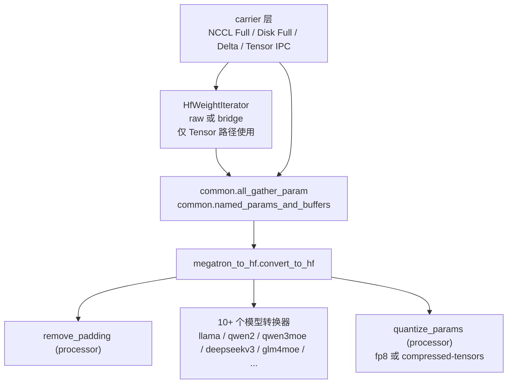

# 第 7 章：weight sync——四条传输路径

## 一座桥不够，需要四座

上一章 Data Buffer 是 train 与 rollout 之间数据方向的桥——样本
从 rollout 流向训练。这一章看反方向的桥：训练完一步之后，新权重
怎么从 Megatron 这一侧推到 SGLang rollout engine 那一侧。

听起来这件事不复杂——`tensor.copy_()` 一下就行。实际上 slime 为
这件事实现了**四条不同的传输路径**：

- **NCCL 全量广播**（`UpdateWeightFromDistributed`）
- **CUDA IPC / 共享内存**（`UpdateWeightFromTensor`，colocate 模式）
- **共享文件系统 disk 全量**（`UpdateWeightFromDisk`）
- **Delta sync**（`UpdateWeightFromDistributedDelta`，支持 NCCL 与
  disk 两种载体）

如果你的第一反应是"这四条肯定是性能档位——某条最快、其他是兜底"，
那你和我第一次读这段代码时的反应一样。但读进去之后会发现：**这四
条路径不是性能档位，它们是部署形态解锁器**。每一条对应一种不同的
基础设施前提：

| 路径 | 解锁的是什么部署形态 |
|---|---|
| NCCL 全量 | 训推**同集群**，能建跨进程的 NCCL group |
| Tensor IPC | **colocate**——训推在同一进程地址空间，权重换"句柄"而不是字节 |
| Disk 全量 | **跨厂商 GPU**——NCCL 在异构硬件上根本建不出 group |
| Delta sync | **跨数据中心**——训推可能在不同 region，只能通过 S3 / NFS 通信，带宽 100 MB/s 量级 |

这个观察改变了整章的视角。这一章不是"weight sync 的四种性能优化"，
是"slime 让 RL 训推系统能跑在四种不同部署形态上的具体技术"。理解
这一点之后再看代码，你会发现每条路径的设计取舍都是被它要解锁的
部署形态决定的——NCCL 路径追求 chunk 流式广播（同集群带宽足够），
disk 路径追求异步后台写入（共享 FS 带宽不足），delta 路径追求
bit-exact selective overwrite（跨数据中心 sync 失败代价高，必须
保证无漂移）。

## 7.1 carrier 选择：4 行 if-else 表达的部署矩阵

四条路径的选择逻辑在 `slime/backends/megatron_utils/actor.py:140-159`
里只有 4 行 if-else：

```python
# 伪代码 —— illustrative
if colocate:
    weight_updater_cls = UpdateWeightFromTensor      # IPC + 可选 distributed
elif update_weight_mode == "delta":
    weight_updater_cls = UpdateWeightFromDistributedDelta
elif update_weight_mode == "full" and transport == "disk":
    weight_updater_cls = UpdateWeightFromDisk
else:  # mode=full, transport=nccl
    weight_updater_cls = UpdateWeightFromDistributed
```

`--colocate`、`--update-weight-mode`、`--update-weight-transport`
三个 CLI 参数组合出四种 carrier。这种"用参数组合表达部署矩阵"是
slime 一贯的配置哲学（第 2 章已经讲过）——任务形态不在 entry script
分支，而是在参数里。

四个 carrier 类**没有公共基类**（除了 `UpdateWeightFromDistributedDelta`
继承自 `UpdateWeightFromDistributed`），只有**鸭子类型契约**：

```python
# 鸭子类型契约 —— 四个 carrier 各自实现
class _WeightUpdater:
    def connect_rollout_engines(rollout_engines, lock, *,
                                engine_gpu_counts, engine_gpu_offsets): ...
    def update_weights() -> None: ...
    def disconnect_rollout_engines() -> None: ...    # disk 是 no-op
    def pop_metrics() -> dict[str, float]: ...
    weight_version: int                              # 递增，CI 拿来核对
```

为什么没抽公共基类？读四条路径的实现你会看到原因——它们的**循环
结构差异巨大**：

- NCCL 全量是 chunk-by-chunk 流式广播，每个 chunk 凑够大小就立刻
  发出去，CPU 侧不攒整批
- Disk 全量是先把完整 HF checkpoint 落盘，再 RPC 让所有 engine 重读
- Tensor IPC 是"先序列化整桶再走 gloo gather_object 跨进程交换 IPC
  handle"，整桶为单位
- Delta 是"先 diff 再发 sparse blob 再更新 snapshot"，每个 chunk
  要在 GPU 上做位字节比对

强行抽公共基类只会逼大家走 template method + 一堆空 hook，反而不如
平铺四个类清晰。**Delta 是个例外**——它和 Full NCCL 共享 ~70% 代码
（PP/TP/EP gather、HF convert、bucket 累积），所以继承是合理的，
通过一个 `_on_chunk` hook 注入 delta-specific 行为。

## 7.2 共享层：四条路径都从同一个 Megatron→HF 转换出发

虽然四条 carrier 各写一遍循环结构，但它们**共享同一套权重格式转换**
——`megatron_to_hf/` 子目录。这是 weight sync 整个子系统的中间层：



`convert_to_hf(args, model_name, name, param, quantization_config)`
是参数级的统一入口：`remove_padding`（裁掉 vocab 对齐 padding） →
按模型名分发到具体 converter（命名 + shape 重组） →
`quantize_params`（FP8 / int4 量化，没量化时是恒等函数）。

**10 个模型转换器共享 95% 的代码结构**。差异点全部集中在 HF 侧的
命名约定细节：

| 模型 | 命名特殊性 |
|---|---|
| `llama` / `qwen2` / `qwen3` | 标准 dense，最简形态 |
| `qwen3moe` | shared expert 是 `mlp.shared_expert.*`（无 s） |
| `glm4moe` / `deepseekv3` | shared 是 `mlp.shared_experts.*`（带 s）+ 多 layernorm |
| `deepseekv3` | MLA + indexer + MTP（最复杂，151 行）|
| `minimax_m2` | `block_sparse_moe.experts.{i}.w1/w2/w3` |
| `qwen3_next` / `mimo` | MTP 递归映射到 `decoder.layers.{idx+N}` |
| `gpt_oss` | 可学习 softmax offset、expert 有 bias |

注册机制极简——`megatron_to_hf/__init__.py:37` 是一串纯字符串匹配
的 if-elif：

```python
# 伪代码 —— illustrative
def _convert_to_hf_core(args, model_name, name, param):
    if "minimaxm2" in model_name: ...
    elif "deepseekv3" in model_name or "glmmoedsa" in model_name: ...
    elif "glm4moe" in model_name: ...
    elif "qwen3moe" in model_name: ...
    elif "qwen2" in model_name or "qwen3" in model_name: ...
    elif "llama" in model_name: ...
```

没有 decorator，没有 `register_converter`。`model_name` 来自
`type(hf_config).__name__.lower()`——注册的 "key" 实际上是 HF
config 类名子串。新增模型就是：在这串 if-elif 里加一个分支 +
在头部 `from .X import convert_X_to_hf`。10 行代码完成"注册"。

这种"反工程化"的注册方式和第 4 章那个 megatron_patch 一样——slime
故意不用装饰器或类继承层级，因为 model converter 这种东西本来就是
被频繁阅读、对照 HF 实现写出来的，平铺 if-elif 比"找 decorator
注册位置"更好读。

## 7.3 Delta：跨数据中心训推解耦的支柱

四条路径里 delta sync 是技术含量最高的。它的设计动机也是最容易
被误读的。

直觉上 delta sync 是"传输量更少、节省带宽"——是个性能优化。但
读 `update_weight_from_distributed_delta.py` 注释和
`docs/zh/advanced/delta-weight-sync.md` 你会发现真正动机是
**训推跨数据中心解耦**：训练集群和推理集群可能在不同 region，只能
通过共享 S3 / NFS 通信，带宽在 100 MB/s 量级。对 355B 模型，全量
~700 GB 完全不可行；2-3% 密度的 delta 是 ~5 GB，可行。

NCCL transport 存在的唯一原因是"作为基线，在数据中心内验证 wire
encoding 和 apply 逻辑没问题"——它**不是 production path**。
production path 是 disk delta。这一点没看注释很容易理解错。

Delta 设计里最值得讲的是**bit-exact selective overwrite**——
接收端的 `_apply_delta_payload` 把变化位置直接覆写为训练端的精确
字节，**没有任何算术**：

```python
# 伪代码 —— illustrative，apply 端的核心
def apply_delta(current_weights, positions, values):
    # values 是训练端的精确字节，view as int dtype
    current_weights.view(int_dtype)[positions] = values
```

注意 `values` 是 view 成整数 dtype 之后的字节，不是 float 的"差值
然后加回去"。这种 selective overwrite 没有数值漂移，**不需要周期性
base re-sync 校正**。这一点比"每 N 步发一次 full sync 校正漂移"的
朴素 delta 设计强很多——后者总会有 N 步窗口里 rollout 用的权重和
训练端不完全一致。slime 的设计是 step-by-step 都精确同步。

Delta 的 4 阶段管线设计也值得说：

```
1. PP broadcast → TP gather → HF convert       ← 复用全量路径代码
2. prefetch snapshot H2D（侧 stream）            ← 与下一 chunk 计算重叠
3. bytewise diff: current ≠ snapshot           ← view as int dtype，不做算术
4. encode_indices / encode_deltas              ← 稀疏位置 + 紧凑 values

然后：
- NCCL: broadcast(__positions__, __values__)
- 或 disk: AsyncSafetensorsWriter.enqueue(...)  ← 两种 carrier 同 wire 格式

最后：
- D2H 更新快照（侧 stream，与下一 chunk encode 重叠）
```

**snapshot 在 pinned CPU memory**——`DeltaState` 保留全部 HF 参数
副本。355B 模型的 snapshot 大约 **700 GB pinned CPU memory**——这
是训练节点的硬性 host memory 需求，文档里通常不写但实际部署必须
留出。snapshot 的更新和读取都在**侧 stream** 上做（`d2h_stream`
和 `h2d_stream`），与默认 stream 的 compute 重叠：当前 chunk 在
GPU 上 diff + encode 时，下一 chunk 的 snapshot 正在 H2D 拷贝，
刚发完的 chunk 的新 snapshot 正在 D2H 拷贝。

整个 delta 设计是 Cursor + Fireworks AI 的 Composer 2 架构和
arXiv 2509.19128 的明显参考——这个引用直接出现在 README 的相关
段落里。

## 7.4 Disk 路径解锁的是异构 GPU

四条路径里 disk full 是代码最短的（97 行），但它解决一个 NCCL
**无能为力**的问题：**训练和推理用不同型号或不同厂商的 GPU**。

`docs/zh/advanced/external-rollout-engines.md` 说得很直接："训练
可以在一组 GPU 上运行，rollout serving 可以放在另一组不同型号或
不同厂家的 GPU 上"——只要 SGLang 支持目标硬件就行。NCCL 在跨厂商
场景（比如训练用 H100、推理用 AMD MI300）下根本建不出 group，更
谈不上 broadcast。

Disk 路径的工作流是最简单的——rank 0 把完整 HF checkpoint 写到
`weight_v{version:06d}/`，然后 RPC 让所有 engine 调
`update_weights_from_disk(model_path=...)`，SGLang 内部走 HF 标准
的 safetensors 加载。结束后默认 `shutil.rmtree(version_dir)`
删除 checkpoint，除非 `--update-weight-disk-keep-files`。

这条路径常被误以为是"fault recovery 兜底"——但 fault recovery 走
的是 `recover_updatable_engines` + 重建 NCCL group 的路径
（`actor.py:585-588`），跟 disk 路径无关。Disk 路径是**正面解决
异构硬件部署**，不是事后的兜底。

External engine（slime 不启动、连接已有 SGLang server）也常用 disk
路径——它不需要建 NCCL group，只要训练端和 engine 端能看到同一个
`--update-weight-disk-dir` 就行。

## 7.5 FP8 在发送前做，int4 在接收后做

slime 的量化设计里有一个看起来矛盾的细节，值得单独讲一节。

**第一反应**：量化是推理引擎的事。训练侧用 bf16 训，sync 时传 bf16，
engine 收到后再量化成 FP8 / int4 用于推理。这是最朴素的理解。

slime 不完全是这样。两种量化方案走的是不同方向：

**FP8 在发送前做**（`quantize_params_fp8` 在
`update_weight_from_distributed.py:166` 调用 `convert_to_hf` 时
就完成了量化）。Wire 上传的就是 FP8 + scale，rollout engine 不需要
再做量化。这么做的两个理由：

1. **省带宽**——FP8 wire 大小是 bf16 的一半，对 NCCL 全量路径意味
   着 sync 时间减半
2. **训推使用一致的量化算子**——具体是 deepgemm 的 `ue8m0` scale
   变体（`sglang.py:3 quant_weight_ue8m0`）。这是 SGLang 内部使用
   的量化算子，slime 直接调用它确保**比特级一致**——训练端量化后
   的 FP8 表示与 SGLang 后续推理时看到的字节完全相同，没有 reload
   过程中的二次转换误差

**int4 在接收后做**（compressed-tensors 路径）。这一路 wire 上传的
是"伪量化"——bf16 占位 + 两阶段 hook：

- broadcast 前：`restore_weights_before_load` 把 SGLang 侧老的
  weight cache 复原（避免 AWQ-style int4 packing 与新权重不匹配）
- broadcast 后：`post_process_quantization` 让 SGLang 把刚收到的
  bf16 张量压回真正的 int4 packing

为什么 int4 不像 FP8 一样在发送前做？slime 的文档没解释，但读代码
可以推测：int4 packing 太复杂——AWQ-style int4 涉及
`pack_to_int32`、`WQLinear_GEMM` 重排、scale + zero_point + g_idx
三组元数据。这套 packing 跟 inference kernel 强耦合（SGLang 用的
GEMM kernel 期望特定的 packing layout），把它放在训练端做意味着
slime 要 mirror SGLang 内部的 packing 细节，每次 SGLang 改了 packing
slime 都要跟着改。让 SGLang 自己做 packing 反而维护成本更低。

这是个不对称设计——同一个 sync 子系统里，FP8 走 send-side、int4
走 receive-side。它体现了一个具体的工程权衡：**当量化方案与下游
kernel 紧耦合时，让下游做；当量化方案稳定（FP8 是 IEEE 标准的扩展）
且能省带宽时，让上游做**。这两个量化方案的分叉不是设计不一致，
是被各自的成熟度决定的。

> **深入剖析：Expert pass 切 4 个 sub-pass 的 pipeline**
>
> MoE 模型的 expert 参数总量非常大（DeepSeek-V3 671B 大头都是
> expert），是 weight sync 的最大单一消耗者。delta 路径里
> `_EXPERT_SUBPASSES = 4`（`update_weight_from_distributed_delta.py:648`）
> 把 expert 参数切成 4 份依次处理，每份处理完做一次
> `_publish_batch`。
>
> 为什么切 4 份？注释里写明："receiver apply for an earlier batch
> overlaps with later expert encoding"——让 SGLang 端在 apply
> 第 1 个 sub-pass 时，训练端已经在 encode 第 2 个 sub-pass，把
> "end-of-sync 大 RPC 等待"摊平。
>
> Megatron 把 MoE 层均匀分到 PP rank，所以每个 rank 的 expert
> param 列表长度一样，切 4 份后每个 rank 的 publish 次数也一样
> （保持 barrier 不会 desync）。非 expert pass 不切，因为非 expert
> 参数总量小、流式广播本身已经够流畅。
>
> 配合 `AsyncSafetensorsWriter`（`:402`）这个 daemon 线程——从
> Queue 拉 `(path, tensors, metadata)` 在后台做 safetensors encode
> + 可选 zstd 压缩 + 原子 rename——整个 disk delta 的 publish 流程
> 变成：
>
> ```
> GPU 算完一个 bucket
>   → 后台写盘 + 后台 zstd 压缩 + 后台等 commit + 后台 fire RPC
>   ↑ 主线程不阻塞，继续 encode 下一个 bucket
> ```
>
> 这是为什么 disk delta 在 100 MB/s 共享 FS 上还能跑得动的关键。
> 把 I/O 和 compression 摘出 GPU 计算关键路径，让 GPU 永远在做下一
> chunk 的 encode 而不是等磁盘。

## Apply This

5 条可迁移到自己分布式系统的设计模式：

**1. 多条路径不一定是性能档位，可能是部署形态解锁器**

slime 的四条 weight sync 路径不是"哪条最快"，是"哪条能在你的部署
形态里跑"。NCCL 要同集群、IPC 要同进程、disk 解锁跨厂商 GPU、
delta 解锁跨数据中心。把这件事讲清楚——不是为了"灵活"，是因为
现实世界的部署形态本来就是多样的。

**怎么改造适配**：你的系统支持多种部署形态吗？把"形态前提"作为
一等概念在文档里列出来——同集群 / colocate / 跨集群 / 异构硬件。
每种形态对应一条数据流路径，不要硬塞所有形态走同一条。

**陷阱**：多条路径要明确"哪条是 production、哪条是 baseline"。
slime 的 NCCL delta 是 baseline（验证 wire 格式），disk delta 是
production。不写清楚会让用户跑了 baseline 还以为是 production。

**2. Delta sync 用 bit-exact selective overwrite 避免漂移**

slime 的 delta 不传"差值"再加回去，传**变化位置 + 精确字节**，
接收端直接覆写。没有数值漂移，不需要周期性 full sync 校正。这套
设计配合 GPU 上的 bytewise diff（view as int dtype），既快又精确。

**怎么改造适配**：你的系统里有"增量同步"的需求吗？算一下"差值
是不是一定要做算术"——很多场景下"变化字节直接覆盖"完全够用，
比"diff + apply"的传统设计简单且无漂移。

**陷阱**：bit-exact 要求训练端的 snapshot 与上次发送的字节完全
一致。slime 用 pinned CPU memory + 侧 stream pipeline 维护
snapshot，host memory 需求很大（355B 模型 700GB）。如果你的 host
memory 不够，这条路径直接不可行。

**3. 共享中间层 + carrier 分叉的分层**

slime 的四条路径在最后的 wire 层分叉，但共享一套 Megatron→HF
转换（10 个模型转换器 + 量化 processors）。这意味着新增模型只改
转换器（一处），新增 carrier 只改传输（一处），互不污染。

**怎么改造适配**：你的系统里有没有"格式转换 + 传输"两个独立维度？
把它们分层——格式转换独立成模块，传输 carrier 独立成模块，每个
维度的扩展不影响另一个。

**陷阱**：分层要克制——如果某条路径需要 carrier 与转换层之间深度
交互（slime 的 NCCL 全量路径就是这样：chunk 边界要与 broadcast
边界对齐），那条路径就不该走共享中间层，自己写一遍循环结构更好。

**4. Pipeline 化要同时考虑发送端 encoding 与接收端 apply 的重叠**

slime 的 expert 4-sub-pass 切分让 receiver apply earlier batch 与
sender encoding later batch 重叠——而不是"sender 全部 encode 完
再 RPC，receiver 全部 RPC 完再 apply"的串行模式。把 end-of-sync
等待摊平到每个 sub-pass 里。

**怎么改造适配**：你的同步流程有"sender 等待 receiver 确认"的
环节吗？尝试把数据切成 N 份，让 receiver 处理第 K 份时 sender 已
经在准备第 K+1 份。这把串行的 sender-receiver-sender 链路变成
pipeline。

**陷阱**：sub-pass 切分要保证 barrier 不 desync——slime 利用
Megatron 把 MoE 层均匀分到 PP rank 这个事实，确保每个 rank 的
publish 次数一样。如果你的数据切分不均匀，需要额外的 barrier
同步逻辑。

**5. 异构硬件兜底路径要单独设计**

NCCL 在跨厂商 GPU 上建不出 group，这是个硬性限制。slime 的 disk
路径正面解决这个问题——把 weight 持久化成 HF safetensors，让推理
端用自己的 loader 读。这种"通过文件系统中转避开通信库限制"的设计
是异构硬件部署的标准答案。

**怎么改造适配**：你的系统支持异构硬件吗？不要寄希望于"用一套
通信库覆盖所有硬件"——给异构场景一条单独的、基于共享存储的兜底
路径。这条路径慢一些，但能跑通比快但跑不通强得多。

**陷阱**：disk 路径的存储成本不可忽略。slime 默认 `shutil.rmtree`
删除旧 checkpoint，但保留 `--update-weight-disk-keep-files` 开关
用于调试。你的设计也应该有 "保留 N 个最近版本" 的策略，避免磁盘
被旧 checkpoint 撑爆。

---

## 下一站

到这里 slime 数据流的两座桥（Buffer 与 weight sync）都讲完了。
下一章我们走出"单节点 / 单 colocate group"的视角，看 slime 怎么
在多节点、PD 解耦、external engines、router policy 这些**部署
拓扑**层面把 SGLang 原生能力暴露给 RL workload。这一章 weight
sync 的四条路径已经埋下了伏笔——`--update-weight-disk-dir` 和
external engines 的配合是其中一条具体落点。
