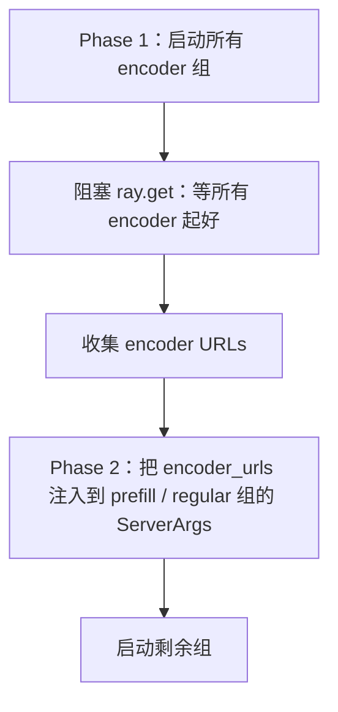

# 第 8 章：部署拓扑——SGLang config、PD 解耦与外部引擎

## 一个 600 行的子系统

上一章 weight sync 是单点角度的"训练侧到推理侧"。这一章拉远视角，
看整个 rollout 部署拓扑——slime 怎么让你从单节点 8 卡跑到
GLM-5.2 这种 744B-A40B MoE 多节点训练。

如果你按"部署能力"的复杂度预期来读源码，会有第二个意外（第一个
意外是上一章的"四条 weight sync 路径不是性能档位"）：**整个
deployment 子系统加起来不到 600 行 Python**。

具体说，这 600 行分布在五个位置：

- `sglang_config.py`（208 行）—— YAML schema dataclass
- `external.py`（233 行）—— HTTP 发现 + 一个所有生命周期都 no-op
  的 `ExternalRolloutServer`
- `server_control.py`（68 行）—— 只做一件事：`abort-until-idle`
- `routing_replay.py`（93 行）—— MoE 路由重放 hook
- `slime/ray/rollout.py` 里的 `_resolve_sglang_config` /
  `_start_router` / `start_rollout_servers`—— 实际编排链路

为什么这么少？因为 slime **不重新实现 router、不重新实现 PD、不
重新实现 disk 加载**——它只做编排层。router 是 SGLang 上游的
`sgl-router`，PD 是 SGLang 自己的 disaggregation runtime，disk 加载
是 SGLang 的 `update_weights_from_disk`。slime 在它们之上加了一个
**YAML 配置层**和一个**生命周期编排层**——剩下的活全在上游。

这一章拆这个 600 行子系统。重点不在"slime 实现了什么部署功能"，
而在"slime 给上游能力暴露了什么样的扩展点"。每一节都对应一个具体
的设计决策——为什么 SGLang config 选 YAML 而不是 CLI、PD 解耦的
真正收益是什么、external engine 为什么所有生命周期都 no-op 反而
是好设计、为什么每个 model 都要拉一个独立 router、为什么 RoutingReplay
要用环境变量驱动状态机。

## 8.1 YAML 三层 dataclass：用上游字段名做 key

`sglang_config.py` 定义的 YAML schema 是三层 dataclass：

```
SglangConfig                # 顶层：含 models 列表
└── ModelConfig             # 模型级：name、model_path、update_weights
    └── ServerGroupConfig   # 组级：worker_type、num_gpus、overrides
```

最值得讲的是 `ServerGroupConfig.overrides`——它**直接以上游 SGLang
`ServerArgs` 字段名作 key**，靠 dict 合并实现 per-group 覆盖：

```yaml
# 伪代码 —— illustrative，sglang-config.md 的典型形态
models:
  - name: actor
    model_path: /models/qwen3-30b
    server_groups:
      - worker_type: prefill
        num_gpus: 8
        overrides:
          chunked_prefill_size: 8192
          deepep_mode: auto
      - worker_type: decode
        num_gpus: 24
        overrides:
          mem_fraction_static: 0.88
          deepep_mode: low_latency
          attention_backend: deep_gemm
```

这里 `chunked_prefill_size`、`mem_fraction_static`、`deepep_mode`、
`attention_backend` **全部是 SGLang `ServerArgs` 的原生字段名**——
slime 没有为它们发明新名字。这种"用上游字段名做 key"的设计意味着：

1. **上游加新字段，YAML 当天就能用**。新字段名出现在 `ServerArgs`
   里，YAML 写它就生效，不需要 slime 代码改一行
2. **上游字段更名，旧 YAML 不破**。`_compute_server_args` 把 unknown
   key 仅 log 不报错——老配置遇到上游已删除字段时只打 info 日志
3. **不需要文档说明"slime 的某个 YAML key 对应 SGLang 的哪个参数"**
   ——key 名一致，对照 SGLang 文档即可

这是上一章讲的"借力上游不重新实现"赌注在配置层的具体体现。slime
不发明命名空间，让上游成为 schema 的事实定义。

`_compute_server_args` 的合并优先级是三层叠加：

```
1. base kwargs (host/port/nnodes、worker_type 派生的 disaggregation_mode 等)
        ↓
2. 从 args.sglang_* 自动同步到所有 ServerArgs 字段（--sglang-* CLI 的统一入口）
        ↓
3. YAML overrides 以最高优先级覆盖（带 `-` 自动转 `_`）
```

90% 的常规字段仍走 CLI 一处配；只有 prefill / decode 需要差异
（不同的 `chunked_prefill_size`、不同的 `mem_fraction_static`）时
才在 YAML 里写覆盖。**CLI 是默认，YAML 是 override**——这种分层让
简单场景不需要 YAML，复杂场景才用。

`ModelConfig.resolve` 还做一个隐式推断——如果 `model_path` 与
`args.hf_checkpoint` 一致就默认 `update_weights=True`，否则默认
`False` 并打 warning。这等于说：**reference 或 reward 模型只要写
一个不同的 `model_path` 就自动变成冻结模型**，不需要显式声明
`update_weights: false`。

## 8.2 worker_type 五元枚举与 placeholder 的真实用途

`ServerGroupConfig.worker_type` 有五个值：`regular / prefill /
decode / placeholder / encoder`。前三个直观，后两个值得展开。

**encoder** 是为 EPD（Encoder-Prefill-Decode）解耦设计的。VLM 模型
的视觉编码器和语言模型可以分到不同 GPU 组，这意味着 `start_rollout_servers`
必须有一个**两阶段启动**：



这是 slime 整个部署链路里**唯一非异步的同步点**——encoder URL 是
prefill / regular 组初始化的必需参数，存在跨 group 强依赖。其他
所有 group 都是并行启动，只有这两阶段是必须串行的。

**placeholder** 这个 worker_type 第一眼看不知道为什么存在——它占
GPU 槽位但不启 engine（`all_engines=[]`）。读注释才知道它的真实
用途：**colocate 模式下要在 rollout 端"宣告"某些 GPU 不会被 rollout
占——这些槽位会留给 training**。

如果没有 placeholder，rollout 会按 `--rollout-num-gpus` 把整段
placement group 全用掉，让 training 无 GPU 可用。placeholder 是
colocate 部署下"我在这里占着但不真用"的显式声明，让 placement
管理保持一致——上一章讲到的"角色与 GPU 在 placement 层 1:1 绑定"
原则要求每张卡都有归属，placeholder 就是 colocate 下 training 那
部分卡的归属。

这是个非常微妙的设计——它不是"功能"，是"协议层的补丁"，让
colocate 这种复用 GPU 的部署形态能在 placement 抽象里被自洽表达。

## 8.3 PD 解耦的真正收益：multi-turn prefix cache 跨轮复用

PD（Prefill-Decode）解耦是 SGLang 上游一个相对新的能力——把 prompt
prefill 阶段和 token decode 阶段拆到不同 GPU 组上跑。slime 把它
通过 `--sglang-config` YAML 暴露出来。

直觉上 PD 解耦是 throughput 优化——prefill 是计算密集（一次性算
长 prompt），decode 是 KV cache 带宽密集（逐 token 输出），分开
让两者各自优化。但读 `docs/zh/advanced/pd-disaggregation.md` 会
发现 slime 在 RL 场景下用 PD 的真正动机不是单 token 吞吐，是**让
rollout topology 贴近真实 serving workload**：

- **长 prompt**（来自 tool history）
- **多轮交互**（agent 反复调 LLM）
- **decode latency long tail**（不同 sample 的 response 长度差异大）
- **session-local prefix cache**（同一 sample 多次调用复用 KV cache）
- **不同模型不同资源**（reference / reward 模型独立）

这些都是 agent RL 的典型特征。PD 解耦真正解锁的是
**multi-turn prefix cache 跨轮复用**——前提是同一个 sample 的所
有轮次去**同一个 decode worker**。

slime 通过三个组件配合实现这点：

1. **`router_policy = consistent_hashing`**——sgl-router 的路由策略，
   按 hash key 一致性路由到固定 worker
2. **UUID `session_id`**——`Sample` 数据结构里携带一个 UUID，每个
   sample 一个
3. **`X-SMG-Routing-Key` HTTP header**——rollout 函数发请求时把
   `session_id` 放到这个 header 里，router 用它做 hash

```
Sample(session_id="abc-123")
        │
        ▼
rollout 函数发请求时：
  headers = {"X-SMG-Routing-Key": "abc-123"}
  POST http://router/generate
        │
        ▼
sgl-router (consistent_hashing 策略)：
  hash("abc-123") → worker_3
        │
        ▼
worker_3 的 KV cache 里命中之前轮次的 prefix
  → 跳过 prefill 阶段
  → 直接进入 decode
```

agent 场景里这意味着 prefix cache 跨轮复用——同一个 conversation
的第 N 轮调用直接命中之前 N-1 轮累积的 KV cache，省掉重新 prefill
长 history。这是 PD 解耦真正给 RL 训练带来的算力节省，比单纯的
"prefill / decode 资源隔离"重要得多。

GLM-5.2 744B 的脚本是这个动机的极端体现——1 个 prefill engine + 3
个 decode engine，prefill 用 `deepep_mode=auto`，decode 用
`low_latency + deep_gemm`。整套配置在 YAML 里 30 行不到。

## 8.4 External Engine：声明性的训推解耦

`external.py` 的 `ExternalRolloutServer` 是个有趣的设计——它的所有
生命周期方法都 **no-op**：

```python
# 伪代码 —— illustrative，external.py
class ExternalRolloutServer:
    def offload(self):     return []   # no-op
    def onload(self):      return []   # no-op
    def onload_weights(self): return []
    def onload_kv(self):   return []
    def recover(self):     logger.warning("external server cannot recover")
```

第一反应可能是"这是个未实现的占位符"。但读文档（`external-rollout-engines.md`）
你会发现这是**有意为之**——slime 显式放弃 colocate / fault tolerance
假设，换来：

> rollout serving 可以使用与训练完全不同的 Python 环境、不同的容器、
> 甚至**不同型号或不同厂家的 GPU**（前提是 disk transport 而非
> NCCL）。

这条路径是面向**跨数据中心训推解耦**的生产形态。文档主动引用 Cursor
Composer 2 的 S3 + delta compression 作为"同类基础设施问题"——
external engine 不是 future work 或临时方案，是 slime 对"训推
完全解耦"这种部署形态的官方答案。

`ExternalRolloutServer` 存在的真正意义是**给 `RolloutManager` 提供
一个和普通 `RolloutServer` 同形的对象**，避免在 manager 那一层
if/else。`offload` 返回空 list 就等于告诉 manager "我没有可以
offload 的 GPU 资源"；`recover` 打 warning 就等于告诉 manager
"我不能 recover，你别等我"。整个对象通过同形接口表达"这个 server
不参与生命周期管理"这个语义，比写一堆 `if isinstance(server,
External)` 干净。

这种"用 no-op 实现声明放弃"的设计在第 6 章 Data Buffer 的
`_TensorBackuperNoop` 里见过——slime 反复用这个模式：**当某个能力
不适用时，用一个能 fail-safely 的 no-op 实现填充接口位置，让上层
代码不需要分支判断**。

External engine 与上一章讲的 weight sync disk 路径是天然配合——
slime 不启动 SGLang server（external 接管），但训练端把权重写到
共享 disk，external server 自己调 `update_weights_from_disk` 重读。
这条流水线让 slime 完全不需要管 external server 的进程模型——它
就是 slime 看不见也管不着的另一个系统，通过 disk 中转通信。

## 8.5 每模型独立 router

slime 支持在同一个训练里同时部署多个模型——actor、reference、reward
可以是不同的模型文件，挂在不同的 SGLang serving 后面。这套机制
的关键设计是：**每个模型拉一个独立的 router 端口**。

`_start_router` 的 `force_new=(model_idx>0)`（`slime/ray/rollout.py:1121`）
保证多模型场景下每个 model 都拿到一个新的 router 端口。`args.sglang_model_routers`
（一个 `dict[name, (ip, port)]`）是这个设计对外暴露的唯一 API：

```python
# 伪代码 —— illustrative
# rollout 函数想调 reference model 时
def custom_generate(args, sample):
    actor_url = get_model_url(args, "actor", "/generate")
    ref_url = get_model_url(args, "ref", "/generate")
    # actor 和 ref 走完全不同的 router，互不影响
```

为什么不让一个 router 复用、所有模型走同一个端口？因为
**模型隔离不应该在 server 内部**——把它下沉到路由层意味着 actor、
ref、reward 在路由层就分流，连负载均衡都是独立的。actor 的高并发
不会让 reference 的请求排队等待，反之亦然。

这种"用独立 router 实现模型隔离"是把"隔离边界"放在最外层的设计。
对比常见的"一个 router 内部多模型路由"方案，独立 router 在
fault tolerance 上更好——一个模型的 router 挂了不影响其他模型；
在配置上更简单——每个模型独立配自己的 `--sglang-router-*` 参数；
在监控上更清晰——每个 router 的 metric 自然按模型分。

## 8.6 server_control：只做 abort-until-idle 一件事

`server_control.py` 是 5 个文件里最小的（68 行），它**只做一件事**：
在 weight sync / 切模型前让 SGLang server 进入完全空闲状态。

```python
# 伪代码 —— illustrative，server_control.py
def abort_servers_until_idle(servers):
    for _ in range(MAX_ITERATIONS):
        # 给所有 server 发 abort 信号
        for s in servers:
            requests.post(f"{s.url}/abort_request?abort_all=true")
        # 等一会让 abort 生效
        time.sleep(POLL_INTERVAL)
        # 查负载
        loads = [num_requests_from_load(s) for s in servers]
        if all(load == 0 for load in loads):
            return
    raise TimeoutError("servers did not become idle")
```

这件事看起来微不足道，但**为什么要单独成一个模块**？因为 weight
sync 的正确性依赖一个前提：sync 时 server 上**没有任何 in-flight
请求**。如果有请求还在跑，weight 在它读到一半时被改掉，结果是
未定义行为——可能 crash，可能产生错乱的 logits。

`abort_servers_until_idle` 通过 `/abort_request?abort_all=true`
告诉 SGLang "把所有正在跑的请求都 abort 掉"，然后轮询
`/v1/loads?include=core` 直到所有 server 的 load 归零。这套"循环
abort + 轮询确认"的模式比"sleep 一段时间就开始 sync"健壮得多——
后者依赖你对 abort 延迟的估计是准的。

把这件事单独成一个 68 行的模块而不是和 weight sync 混在一起，是
slime 关于"模块化"的另一个观察：**当某个动作有清晰的前后条件
（前：server 不空闲；后：server 空闲），且这个动作会被多处调用
（weight sync / 切模型 / fault recovery），就值得独立成一个模块**。

> **深入剖析：RoutingReplay 用环境变量做四态状态机**
>
> `routing_replay.py` 是 93 行的 MoE 路由重放 hook。它解决一个 RL
> 训练中很难的问题：rollout 时 SGLang engine 给 MoE 模型选了一组
> expert，训练时 Megatron 又会重新选一次——如果选的不一样，rollout
> 期生成的样本就和训练期梯度对不上，破坏 on-policy 性质。
>
> RoutingReplay 让训练期重放 rollout 期的 expert 选择。注入点是
> `compute_topk` 函数（MoE 的 router 算子），slime 在它外面包一层
> wrapper，根据环境变量 `ROUTING_REPLAY_STAGE` 切换四种行为：
>
> ```python
> # 伪代码 —— illustrative
> def get_routing_replay_compute_topk(original_compute_topk):
>     def wrapped(scores, ...):
>         stage = os.environ.get("ROUTING_REPLAY_STAGE", "fallthrough")
>         if stage == "fallthrough":
>             return original_compute_topk(scores, ...)
>         elif stage == "record":
>             topk = original_compute_topk(scores, ...)
>             ROUTING_REPLAY.append(topk.indices.cpu())
>             return topk
>         elif stage in ("replay_forward", "replay_backward"):
>             recorded = ROUTING_REPLAY.pop()
>             return rebuild_topk_from_indices(scores, recorded)
>     return wrapped
> ```
>
> **为什么不用函数参数？** 因为 `compute_topk` 是 SGLang / Megatron
> 深处的算子，调用路径埋在好几层抽象后面。如果要通过函数参数控制
> stage，需要修改所有调用 `compute_topk` 的上游代码——侵入性极大。
>
> 环境变量是**唯一既不改上游签名又能精确切换语义的通道**。它的成本
> 是 stage 切换必须由 actor 训练循环手工"翻牌"
> （`actor.py:434-537`）——ref / teacher 前向设 `fallthrough`、本地
> actor 前向设 `record` 或 `replay_forward`、反向设 `replay_backward`、
> 每个 rollout 结束 `clear_all()`。
>
> 这是一个"用全局信号在不可侵入的代码间通信"的典型例子。当你遇到
> "上游 hook 点深埋、必须切换语义"的场景时，环境变量是合法的反向
> 通道——slime 把这个用得很干净，把状态机的四个值都写成枚举常量，
> 让所有切换点显式可查。

## Apply This

5 条可迁移到自己部署系统的设计模式：

**1. 编排层只做编排，不重新实现上游已有的能力**

slime 的 600 行部署子系统不实现 router、不实现 PD、不实现 disk
加载——它只在上游能力之上加 YAML 配置和生命周期编排。这种"借力
不重做"的克制让 slime 跟随上游升级几乎零成本。

**怎么改造适配**：你的系统包装了什么上游组件？画一张图：上游能
做的事 vs slime 在上面加的事。如果"上面加的事"包含"重新实现 X"
（X 是上游已经做的），考虑能不能直接用上游、自己只做编排。

**陷阱**：上游能力不稳定时这套策略会变成痛苦——slime 的赌注是
SGLang / Megatron 上游够稳定。如果你的上游 API 每月都变，可能
需要包一层抽象。slime 在 `slime/backends/megatron_utils/sglang.py`
那个 44 行防火墙模块（第 3 章讲过）就是这种"防上游 API 变化"的
妥协。

**2. YAML override 用上游字段名做 key**

slime 的 `overrides` 直接以 `ServerArgs` 字段名作 key——不发明新
命名。这让 schema 跟随上游演进而不需要 slime 改一行；让用户不需
要查"slime 的 X 对应上游的 Y"。

**怎么改造适配**：你的配置文件里有没有"自己发明名字然后映射到上
游名字"的字段？看看能不能直接用上游名字——少一层翻译，文档少一
半，上游升级也更顺。

**陷阱**：上游名字可能不够语义化（比如 SGLang 的 `mem_fraction_static`
对没读过文档的用户不直观）。slime 的解法是接受这一点——目标用户
是"知道自己在配什么的人"，不是"看名字就要能猜出意思的人"。如果
你的用户群体更广，可能需要发明更友好的名字。

**3. PD / 路由的真正收益看 workload 不看微观吞吐**

PD 解耦在 slime RL 场景下的核心收益是 multi-turn prefix cache 跨
轮复用，不是单 token 吞吐。这要求你看具体 workload 而不是 benchmark
数字——benchmark 通常是单 prompt 短 response，掩盖了 multi-turn
prefix cache 的价值。

**怎么改造适配**：评估"上游能力对我的 workload 有多大价值"时，
不要只看上游 benchmark。把你的实际请求模式（长度分布、turn 数、
prefix 重复度）跑过去，看能命中多少。slime 是通过 `X-SMG-Routing-Key`
显式声明 prefix cache 复用意图，让上游能命中。

**陷阱**：consistent_hashing 路由会让 sample 分布不均匀——某些
session 长某些短，固定路由意味着某些 worker 更忙。slime 接受这
个代价，因为 prefix cache 命中带来的算力节省远大于负载不均的损失。
你的 workload 可能不一样，需要量化。

**4. 让"外部资源"成为一等公民，no-op 实现也是合法的接口实现**

`ExternalRolloutServer` 所有生命周期方法 no-op——这不是"未实现"，
是声明"这个 server 不参与生命周期管理"。同形接口让上层代码不需
要 `if isinstance(server, External)` 分支。

**怎么改造适配**：你的系统里有"自己管理的资源"和"外部资源"两类
吗？给外部资源做一个**同形接口的 no-op 实现**——上层代码不知道
也不需要知道是哪种。生命周期方法返回空 list / 打 warning，不抛错。

**陷阱**：no-op 实现要选对"安全的默认值"——`offload` 返回 `[]`
是安全的（manager 拿到空 list 就跳过这个 server），`recover` 抛
错也是安全的（明确告诉调用者不能 recover）。如果你 no-op 返回了
错误的默认值（比如 `True` 当成功），会让上层逻辑跑偏。

**5. 上游 hook 点深埋时，环境变量是合法的反向通道**

RoutingReplay 用 `os.environ["ROUTING_REPLAY_STAGE"]` 在四种语义
间切换，因为 `compute_topk` 调用路径埋在 SGLang / Megatron 内部，
没法通过函数参数传递。环境变量是这种场景下最少侵入性的通道。

**怎么改造适配**：你的系统里有没有"想在深处的算子改行为，但又
不想 patch 上游所有调用点"的场景？环境变量驱动的状态机是个低成
本方案——但要把状态值定义成枚举常量，让所有切换点显式可查，避免
"魔法字符串"散落在代码各处。

**陷阱**：环境变量是进程级的全局信号，多线程并发时要小心。slime
的 RoutingReplay 假设训练循环是单线程顺序执行——如果你的场景有
多线程并发跑 forward，环境变量切换会互相干扰，需要换成 thread-local
storage 或显式 context manager。

---

## 下一站

到这里 slime "训练循环 + 数据流 + 部署拓扑" 这套基础设施都讲完了。
下一章我们打开另一条独立的子系统：`slime/agent/`——slime 自带的
agentic 执行层。`harness/` 目录下有两个真实集成（claude_code 与
codex），它们的设计与本章讲的部署拓扑紧密配合：multi-turn agent
依赖 PD 解耦的 prefix cache 跨轮复用、sandbox 服务依赖 router
session affinity 把请求路由到同一 worker。下一章会展开 agent
harness 怎么把这些上游能力组合成 agentic RL 的执行层。
