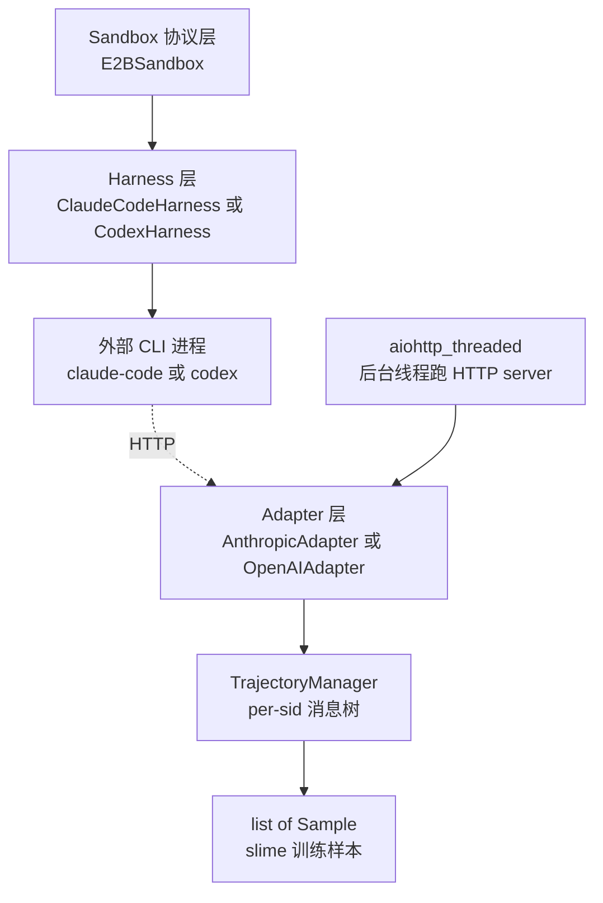
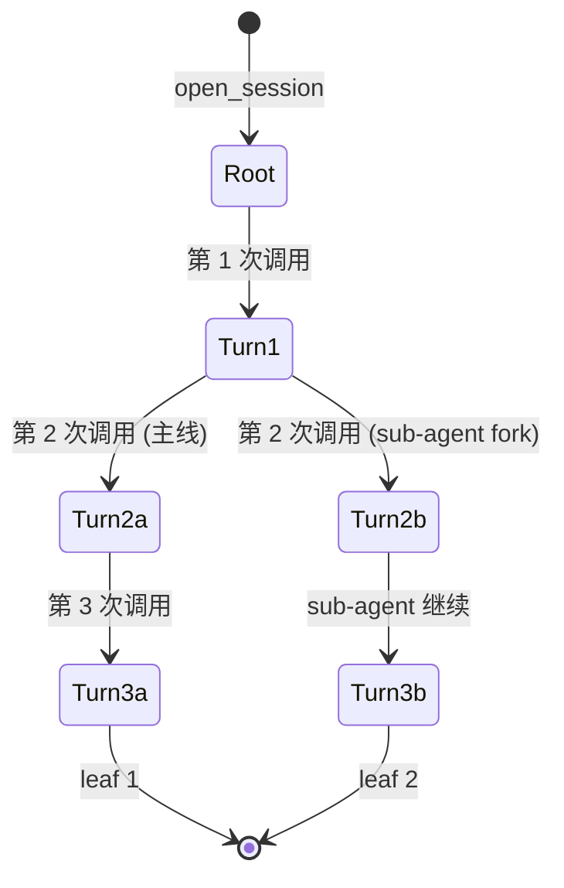

# 第 9 章：agent harness——slime 自带的执行层

## 一个看起来矛盾的子系统

slime 的核心叙事里有一句话反复出现：**"don't be an agent
framework"**。strands、tau-bench、retool 这些 example 都被允许自己
造 agent——slime 主仓不提供 agent 抽象层，把这一层留给社区。

但是如果你打开 `slime/agent/` 目录，会看到 6 个文件 1.4k 行代码。
这里面住着两个**真实的 agent CLI 集成**：`ClaudeCodeHarness` 和
`CodexHarness`。一个声称"don't be an agent framework"的项目，主仓
里却有 70+ 行的代码专门处理 Anthropic claude-code CLI 的
`bypassPermissionsModeAccepted` 字段。

这是个看起来矛盾的子系统。理解它需要先理解一个具体问题：**有一类
训练目标社区框架解决不了——让真实的、社区维护的 agent CLI 跑在
沙盒里产生 trajectory，并且 token 级地训练那条 trajectory**。

注意这件事的特殊性。`coding_agent_rl` 这种 example 训练的是真实的
SWE coding agent——目标模型最终要在 Anthropic claude-code 这种
**真实工具**里被部署。如果训练时用 slime 自定义的 agent 框架跑
rollout，训练完模型在真实工具里行为会偏离——CLI 的 prompt 渲染、
tool call 格式、context 管理细节训练时都不一样。要让训练的
trajectory 和部署时一致，**只能让真实的 CLI 跑在 sandbox 里出
trajectory**。

这就是 `slime/agent/` 存在的唯一理由。它不是给用户写 agent 的脚手
架——是一组"把外部 agent CLI 接进 slime 训练循环"的胶水。设计的
中心问题是 **token capture without TITO drift**：既要让 CLI 把模型
当成真实的 Anthropic/OpenAI 服务来用，又要保证训练的 token id 与
采样时一致。

这一章拆这套胶水。每一节都对应一个具体的设计决策：把真实 CLI 集成
写进核心代码、用 API key 字段携带 session id、trajectory 用消息树
而不是列表、DriftKind 三档容错、aiohttp 跑进独立线程。每一个决策
都是 slime "愿意把 hard-won knowledge 直接写进仓库"的具体体现。

## 9.1 6 个文件，两层正交解耦

`slime/agent/` 的整体架构是两层正交解耦：**adapter 层**实现 HTTP
协议（Anthropic Messages 或 OpenAI Chat-Completions），**harness
层**实现"安装 CLI + 启动它指向某个 URL"。



6 个文件的分工：

| 文件 | 职责 |
|---|---|
| `trajectory.py`（477 行） | per-sid 消息树 + token 漂移分类 + Sample 装配 |
| `sandbox.py` | `Sandbox` Protocol + `E2BSandbox` 实现 |
| `parsing.py` | sglang 解析器适配 + XML tool_call fallback |
| `aiohttp_threaded.py` | 把 aiohttp 跑到 daemon 线程里 |
| `harness/*.py` | agent CLI 生命周期抽象 + 两个真实集成 |
| `adapters/*.py` | Anthropic/OpenAI 协议 → sglang `/generate` 的 HTTP 适配 |

**adapter 与 harness 完全正交**。测试 `test_codex_openai_rollout_closes_loop`
显式验证 `CodexHarness + OpenAIAdapter` 也能跑通——任意 harness 配
任意 adapter，只要 CLI 端能接受 adapter 的协议即可。这种正交让 slime
能用同一套基础设施支持任意"协议 × CLI"组合，不会因为加新 CLI 必须
重写 adapter。

解耦的代价是：harness 必须**把 sid 编码进 CLI 能接受的某个字段里**
（下一节展开）。adapter 端从那个字段反解出来路由到正确的 trajectory
树。两层之间的通信通道由 sid 承载，harness 不直接调 adapter，adapter
也不知道 harness 启动了什么进程。

## 9.2 把真实集成写进核心代码

`slime/agent/harness/` 里有 `BaseHarness`（抽象基类），但同时也有
71 行的 `ClaudeCodeHarness` 和 86 行的 `CodexHarness`——**两个具体
CLI 的真实集成**就住在主仓里。

设计上"更干净"的做法是只 ship `BaseHarness`，让用户自己 subclass
实现 claude-code 集成。slime 没这么做。原因看一下两个 harness 的
内容就清楚了。

`ClaudeCodeHarness.write_config` 的核心是这几行：

```python
# 伪代码 —— illustrative，harness/claude_code.py
async def write_config(self, sb, ctx):
    settings = {
        "bypassPermissionsModeAccepted": True,  # 必须预先 ack
        # ... 其他配置
    }
    await sb.write_file("~/.claude/settings.json", json.dumps(settings))
```

`bypassPermissionsModeAccepted: true` 必须**预先**写到
`settings.json`，否则 claude-code 启动会卡在 onboarding 等用户交互。
这个细节文档里有，但你不踩一次根本不知道要这么写。

`launch_and_wait` 启动 CLI 时必须带特定参数：

```python
# 伪代码 —— illustrative
cmd = (
    f"claude -p '{prompt}' "
    f"--permission-mode bypassPermissions "
    f"--output-format stream-json "          # 必须，否则缺训练信号
    f"--include-partial-messages "           # 必须，否则缺中间状态
    f"--include-hook-events "                # 必须，否则缺 tool 调用
    f"--verbose"                              # 必须，否则缺 reasoning
)
```

这四个 flag 任何一个漏了，trajectory 都会缺关键字段。这种"必须
传这套参数"的知识属于"踩了半年才明白"的经验。

Codex 那边更复杂：它的 `base_url` **必须**写在 TOML 文件里 inline，
因为它只对 "default OpenAI provider" 才认环境变量；配置文件还要
base64 round-trip 进沙盒，否则 shell quoting 会把 `&` `"` 这类
字符吃掉。

```python
# 伪代码 —— illustrative，harness/codex.py
config_toml = f"""
[provider.custom]
base_url = "{adapter_url}"
# ...
"""
encoded = base64.b64encode(config_toml.encode()).decode()
await sb.exec(f"echo '{encoded}' | base64 -d > ~/.codex/config.toml")
```

这些是配置上的"非显然细节"。把它们留给用户自己踩，每个用 slime 训
claude-code agent 的团队都要重新踩一遍。slime 的选择是**把经验固化
为代码**：

> 把"踩了半年才明白的细节"直接写进仓库，让每一个想训 agent 的人
> 不用重新踩坑。

这违背了一般的"框架不该 ship 用法"原则——但很符合 slime 这种
"愿意把 hard-won knowledge 直接写进仓库"的风格。第 1 章和第 2 章
讲过这种态度——slime 的主循环不抽象、参数文件不拆分、megatron_patch
直接住在 `slime/backends/`。这一章是同一种态度在 agent 集成层的延
伸：当一个细节是"必须知道才能跑通"，slime 选择写代码而不是写文档。

## 9.3 用 API key 字段携带 session id

agent harness 的一个核心问题是：每个 sample 一个 sid，CLI 在沙盒
内部要把 sid 带回每次 HTTP 调用——但 claude-code 和 codex 的命令
行界面**没有"session id"参数**。

slime 的解法是一个极优雅的 hack：**abuse "API key" 字段**。所有 LLM
CLI 都接受一个 API key 环境变量（`ANTHROPIC_AUTH_TOKEN` /
`OPENAI_API_KEY`），CLI 都会把它放进 `Authorization: Bearer` header。
adapter 端从 Bearer 解出 sid 就行了——**zero-code-change** 复用了
一个普适字段。

```python
# 伪代码 —— illustrative
# harness 端启动 CLI 时
env = {
    "ANTHROPIC_BASE_URL": adapter_url,
    "ANTHROPIC_AUTH_TOKEN": session_id,  # 把 sid 当 API key 传
}
# CLI 内部把它放进 Bearer header 发请求

# adapter 端处理请求时
def _session_id(self, request, body):
    auth = request.headers.get("Authorization", "")
    if auth.startswith("Bearer "):
        return auth[7:]  # 这就是 sid
```

这是个非常 hacky 但极聪明的复用。"API key" 字段在所有 LLM CLI 里
都存在，正好拿来做 session 标识。CLI 不知道也不需要知道这不是
"真正的 API key"——它当成 key 用，adapter 接受任何字符串，整套
机制 zero-friction 工作。

副作用：sandbox 内的 CLI 看到的 "API key" 其实是 sid。这一点对
安全或调试都没影响（沙盒环境本来就不该泄露 key），但写代码时要
记得——你看到 `ANTHROPIC_AUTH_TOKEN=cagent-instance-42-7-3` 这种
看起来奇怪的环境变量值，那不是 bug，是设计。

这种"通过 abuse 普适字段实现 hack 通信"的模式在系统里很值得借鉴。
当你需要在两个系统之间传一个新字段，但两边都不支持加新字段时，
找一个语义上接近、形式上自由的现有字段（slime 用 API key，其他场景
可能是 User-Agent / X-Request-ID / 甚至 Cookie），把你的数据塞进去。
代价是命名上有点奇怪，收益是不需要改任何一端的代码。

## 9.4 trajectory 用消息树，不用消息列表

最自然的 trajectory 数据结构是每个 sid 一个 turn 列表——agent 来一
次 HTTP 调用就 append 一条 turn。

但 claude-code 这种现代 agent 的行为远比这复杂。至少有三种场景列表
表达不出来：

**Sub-agent 派发**。主 agent 派一个子 agent 处理 sub-task。子 agent
有自己独立的消息流，不应该和主 agent 的消息混在一起。如果用列表，
要么把子 agent 消息也 append 进去（混乱），要么把子 agent 当独立
trajectory 处理（丢失父子关系）。

**Auto-compaction**。claude-code 的上下文打到 80% 时会自动把历史
压缩成一条 system 消息再继续。这意味着同一个 sid 在 compact 前后
是两条不同的 trajectory，但它们应该共享 reward。

**Rewrite**。agent 偶尔会把上一次的 assistant 消息微调（去掉尾空
格之类）后重发。如果用列表，新消息会替换老消息，丢失原始训练信号。

slime 的解法是**消息树**：每个 sid 一棵树，每条新 prompt 在树上
找匹配的前缀挂载，找不到就 fork 一个新分支。



挂载点的判定是 `_find_mount_point`——它**走树用 dict 相等比较**
决定每条消息挂在哪：

- sub-agent 派发：produce 不同的 user 消息序列 → 自然 fork
- auto-compaction：system 消息不匹配 → 在树根附近 fork
- 同一条历史回放过来：完全匹配 → 不 fork

`response_trained: bool` 字段（`trajectory.py:81`）是 **sibling
共享前缀去重**的关键：多个叶子如果共享同一个生成 turn，只有第一
个 leaf 训练它，后面的当 context 重发。子任务 fork 出去后，前面
共同的 turns 在两条 Sample 里只有一边带 `loss_mask=1`，另一边当
context 重发。

但要让 dict 相等成立有几个**容易踩的不变量**：

- `tool_calls[].function.arguments` 必须保持 dict（不是 JSON 字符串），
  否则 key order 一变就 diverge
- 每次响应的 wire-only id（`call_xxx` / `toolu_xxx`）必须丢掉——
  它们每次都不一样，留着 dict 永远不相等
- assistant 同时有 text 和 tool_calls 时 content 设 `""`（OpenAI 协议）
  或对应处理（Anthropic 协议），因为客户端会拆

这些不变量散在 adapter 代码里以注释形式提醒（`adapters/common.py:109`
和 `adapters/openai.py:107`）。任何一条破坏会让 trajectory 树异常
fork，浪费训练样本。

## 9.5 DriftKind 三档容错

trajectory 树的核心机制是 "prompt 不匹配就 fork"。但 TITO（token-in
token-out）回放在生产里**到处都会轻微不匹配**——chat template 重
新渲染、UTF-8 边界、引号转义。如果每次微小不匹配都 fork，trajectory
树会爆炸成数千个孤立 leaf，每个都要单独训。

slime 的解法是 `DriftKind`——把漂移分成三档：

```python
# 伪代码 —— illustrative，trajectory.py:129
class DriftKind(Enum):
    CLEAN    = "clean"    # prompt_ids 是已持有 token 的精确前缀延伸
    REALIGN  = "realign"  # 漂移落在最近一次响应跨度内，且短，可覆盖
    FORK     = "fork"     # 其它都是 fork：关闭这个 builder，开新的
```

`CLEAN` 是理想情况——新 prompt 完全匹配已有 token，直接 extend。

`REALIGN` 是**软化补丁**——只对"最后一次响应跨度内、且新响应短于
`fork_threshold`"的漂移做覆盖。这个边界条件的设计很微妙：

- 老 turn 的 token 不动（已经训过，不能毁）
- 新 turn 因为短，覆盖掉的训练信号也少
- 漂移如果落在更早的 turn 里，老的训练信号会被毁掉——所以必须 fork

`FORK` 是最后兜底——任何不能 CLEAN 也不能 REALIGN 的情况都 fork
出新分支。

`_try_merge_assistant_rewrite`（`trajectory.py:351`）是 REALIGN 的
具体实现：claude-code 偶尔会在下一次 prompt 里把上一次的 assistant
微调（去掉尾空格之类），导致 dict 不等→正常应该 fork→孤立的旧 leaf
还得训。短于 `fork_threshold` 的就强行覆盖原节点 + demote 成
routing-only，不再训。

这是经验性的设计，不是理论上 optimal——但实测能把"无意义 fork"
压到很低。它体现了一个常见但容易忽略的工程原则：**当一个"绝对正
确"的规则会让系统过载时，加一档"实用主义的容忍"通常比"全有或全
无"更有效**。

## 9.6 aiohttp_threaded：HTTP 跑进独立线程

slime 的 rollout 函数（`generate`）是 async 的，自己有事件循环。
但 adapter 也要监听 HTTP——而且要被沙盒里**所有 sample 的 CLI
同时调用**。

最自然的设计是 adapter 跑在同一个事件循环里。但这样会有问题：

- 任何一个 sample 的 sync 操作或长 await 都会卡住 adapter 响应给
  其它 sample 的 CLI
- adapter 内部还要 await sglang `/generate`（可能 30 秒+），共用
  loop 的话这次 await 期间整个 rollout 的进度都得跟着它的 scheduler

slime 的解法是**让 aiohttp 跑在专门的 daemon 线程**，里面用自己的
`asyncio.new_event_loop()`：

```python
# 伪代码 —— illustrative，aiohttp_threaded.py
def run_app_in_thread(app):
    handle = AppHandle()
    started = threading.Event()

    def _thread_main():
        loop = asyncio.new_event_loop()           # 独立 event loop
        asyncio.set_event_loop(loop)
        runner = web.AppRunner(app)
        loop.run_until_complete(runner.setup())
        site = web.TCPSite(runner, "0.0.0.0", 0)
        loop.run_until_complete(site.start())
        handle.port = site._server.sockets[0].getsockname()[1]
        started.set()                              # 通知主线程"我起来了"
        loop.run_forever()

    thread = threading.Thread(target=_thread_main, daemon=True)
    thread.start()
    started.wait()                                 # 同步等到 socket listen
    return handle
```

`started.wait()` 同步等到 socket 实际 listen 才返回，这点很重要——
返回后调用方可以立即用 `handle.port` 配 CLI 启动，不会出现 race。

`AppHandle.stop` 用 `run_coroutine_threadsafe` 跨线程停止——主线程
和后台线程通过这个原语通信，不会破坏后台线程的 event loop。

`FilteredAccessLogger`（`aiohttp_threaded.py:14`）只 log 慢请求
（>120s）或非 200 响应。一次 SWE rollout 几百次 turn，默认 access
log 会把磁盘和 stdout 都打爆。这种"默认行为就要静音"的细节也是
slime "经验固化为代码"的体现。

命名也很坦诚——不是 "AdapterServer" 或 "HTTPHost"，就叫
`aiohttp_threaded`，清楚说明这是"把 aiohttp 跑进线程"的工具。

> **深入剖析：与上一章部署拓扑的天然配合**
>
> 第 8 章讲过 PD 解耦的核心收益是 multi-turn prefix cache 跨轮
> 复用，通过 `consistent_hashing` 路由策略 + UUID `session_id` +
> `X-SMG-Routing-Key` header 三件套实现。
>
> 本章的 agent harness 是这套机制的**最主要消费者**。
> `call_sglang_generate`（`adapters/common.py:408`）每次调 sglang
> 时都带这个 header：
>
> ```python
> headers = {"X-SMG-Routing-Key": sid}
> await session.post(f"{sglang_url}/generate", json=body, headers=headers)
> ```
>
> 同一个 agent sample 的所有轮次都带同一个 sid，意味着 sgl-router
> 把它们全部路由到同一个 decode worker。worker 上的 KV cache 在
> 第 N 轮命中之前 N-1 轮累积的所有 prefix——这是 multi-turn agent
> 训练的关键性能保障。
>
> 异常路径也很重要：客户端断开 / 超时时立刻 fire-and-forget 一个
> `/abort_request`（`adapters/common.py:472`）释放 sglang 的 slot，
> 否则孤立生成会一直占 KV 到 length cap。
>
> 这是上一章"声明性 router policy"与本章"agent execution"之间的
> 具体配合——slime 把部署拓扑（router）与执行层（agent）做成两个
> 独立子系统，通过 sid 这个共享 key 把它们粘起来，每一层都不需
> 要侵入对方。

## Apply This

5 条可迁移到自己 agent 训练或系统集成场景的设计模式：

**1. 子系统在生态里的位置要说清——是脚手架还是胶水**

slime 的 `agent/` 子系统不是给用户写 agent 的脚手架（strands、retool
那种），而是把外部 CLI 接进训练循环的胶水。如果你不分清这两种定
位，agent 子系统会被设计成"既要又要"——既想给用户 base class 自
己 subclass、又想 ship 真实 CLI 集成——结果两边都不好用。

**怎么改造适配**：你的"集成层"子系统是脚手架还是胶水？前者要 ship
抽象接口让用户填，后者直接 ship 具体集成更好。两者的边界要清晰，
不要试图一套代码满足两种需求。

**陷阱**：胶水类子系统会被批评"耦合上游 CLI 版本"。slime 接受
这个代价——claude-code 升级时 slime 可能要跟着改 harness。这种
跟随的工作量比"维护一个万能 base class + 让每个用户自己踩坑"小
得多。

**2. 把"踩坑经验"固化为代码而不是文档**

slime 的 `ClaudeCodeHarness` 直接 ship 了
`bypassPermissionsModeAccepted: true` 这种"踩了半年才明白"的细节。
文档可以写"启动 claude-code 前要预先 ack permission mode"，但每
个新用户读完文档还是要试错——把它写成代码意味着这个错从此不会
被重新踩。

**怎么改造适配**：你的项目里有多少"必须知道才能跑通"的细节藏在
issue tracker 或 wiki 里？尝试把它们写进代码——一个 6 行的辅助
函数 + 注释解释为什么这么写，胜过 60 行 wiki 文档。

**陷阱**：把经验写进代码不能掩盖"为什么"。slime 的 harness 代码
里有大量注释解释每个 flag 为什么必须传。如果只写代码不写理由，
下一个 refactor 的人会"清理"掉这些"看起来多余的代码"。

**3. 用普适字段做 hack 通信**

slime 用 `Authorization: Bearer` 字段在 CLI 和 adapter 之间传 sid，
因为这是所有 LLM CLI 都支持的字段。你不需要让 CLI 支持新参数，
也不需要让 adapter 解析新 header——abuse 一个语义上接近、形式上
自由的现有字段。

**怎么改造适配**：你需要在两个系统间传一个新概念，但两端都不支持
加新字段？找一个现有的、语义接近、形式自由的字段（API key、
User-Agent、Cookie、X-Request-ID）拿来用。命名上有点奇怪，但
zero-code-change 通信。

**陷阱**：被 abuse 的字段不能与原始用途冲突。slime 的 API key 字
段对 adapter 来说没有原始用途（adapter 不真做认证），所以可以
随便 abuse。如果原始用途还存在（比如真有认证），你需要先确认两
种用途能共存。

**4. 当行为有 branching / rewrite 时数据结构选树**

agent trajectory 用消息树而不是列表，因为 sub-agent / auto-compact
/ rewrite 这三种行为本质上是分支结构。强行用列表表达要么扭曲（丢
信息）要么过度特化（每种行为一段 special case 代码）。

**怎么改造适配**：你的系统里有没有"看起来是序列但偶尔会分叉"的
数据？画一下分叉的形态——如果一年内出现过 sub-task / undo /
rollback / merge 等行为，序列结构迟早会撑不住，从一开始就用树。

**陷阱**：树要配 `_find_mount_point` 这种判定逻辑——决定每条新
数据挂在哪个节点上。这个判定通常基于 dict 相等比较，意味着你的
data 必须有稳定的"identity 字段"。slime 在 adapter 里花大量篇幅
保证 tool_calls.arguments 保持 dict、wire-only id 被剥掉——就是
为了让 dict 相等可靠。

**5. 单独线程跑 event loop 避免互相 starvation**

slime 的 adapter 跑在独立 daemon 线程的 event loop 里，因为它要服
务沙盒里所有 sample 的并发请求。如果共用 rollout 的 event loop，
adapter 的长 await（sglang `/generate` 30 秒+）会卡住整个 rollout。

**怎么改造适配**：你的系统里有"需要持续响应外部请求的 HTTP server"
和"主业务逻辑跑长任务"两类工作吗？让它们各自跑自己的 event loop
（独立线程），通过 thread-safe queue / future 通信。比"塞进同一个
loop 然后小心 yield" 简单得多。

**陷阱**：跨线程 event loop 通信要用 `run_coroutine_threadsafe`
或类似原语——不能直接 `await` 另一个 loop 的 coroutine。slime 的
`AppHandle.stop` 就是这种跨线程通信的典型例子。

---

## 下一站

到这里我们看到了 slime "agent execution" 那一面——内置 harness
怎么把真实 CLI 接进来。但 agent 执行只是 slime customization 系统
的一种特例——slime 还暴露了 **18 个独立的 hook 点**让用户在 rollout
/ training 各个阶段注入自己的逻辑。下一章打开
`tests/plugin_contracts/` 看 slime 怎么用契约测试守住这 18 个 hook
的语义，以及为什么 slime 选择 hook-by-path 而不是 plugin 或继承。
