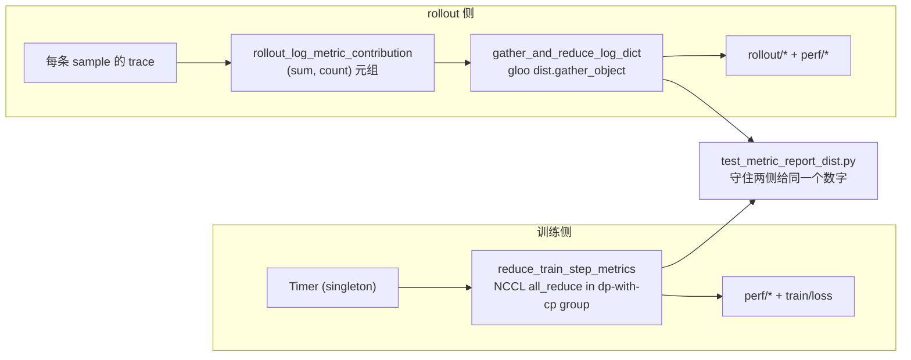
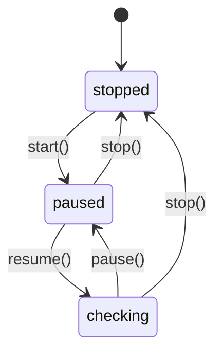

# 第 11 章：工程基础设施——可观测、debug、CI、容错

## 一句口号背后的整套体系

slime 五条核心赌注的最后一条是 **"explicit dataflow + CI 一等
公民"**——把工程基础设施做成一等的设计组成部分，而不是事后补的
监控和测试。

这一章不像前面 10 章那样围绕一个核心抽象（主循环、配置面、Buffer、
weight sync 等）展开。它讲一组**防止 silent failure** 的工程实践——
trace、metric、health monitor、profiling、CI 矩阵、reproducibility、
fault tolerance。

为什么 slime 需要把这些放在一起强调？因为它的整个工程文化建立在
一句口号上：

> **RL 的 bug 不报错**。

loss 还在下降、grad_norm 看起来正常、wandb 曲线漂亮，但模型其实
没学到任何东西。这种 silent failure 在传统 supervised learning 里
也存在，但在 RL 里**致命**——一次 RL 训练动辄烧几千 GPU 小时，等
你发现 reward curve 不收敛回头排查时，前 5 天的训练都白费了。第 4
章讲过那个 4 处梯度放缩组合的故事——`test_loss_cp_invariance.py`
那个用 CPU spawn 跑真分布式的测试，能在 5 秒内发现"CP 改变了 grad
norm"这种 bug，而不是等到 GPU e2e job 跑 1 小时后才报警。

这一章把这种"5 秒发现 1 小时无法发现"的工程哲学摊开。每一节都对
应一个具体的反常识设计：trace 系统为什么比 log 更重要、metric 为
什么走两条管线但用同一组公式、CPU CI 为什么真敢跑 4-rank 分布式、
health monitor 的 first wait 为什么是 300 秒、fault tolerance 为
什么只覆盖 rollout 侧。

每一条都不是"加点监控"或"补几个测试"。它们是对"RL bug 不报错"
这个事实的**结构性应对**——意识到 silent failure 是 RL 训练的
默认状态、然后倒推出哪些基础设施必须做成一等公民才能让 bug 浮出
水面。

## 11.1 trace 系统：sample-scoped 且全身吞异常

`slime/utils/trace_utils.py` 是 **776 行**——比许多 utils 加起来
还长。这个体量背后是个具体的痛点：

RL 训练中"长尾 sample"和"特定 sample 卡住"是常见故障，但日志
只会显示"rollout 慢"——你不知道是哪几条 sample 慢、慢在 generation
还是 reward call、reward call 是 sandbox 慢还是 verifier 慢。
log 是流水账，无法关联同一个 sample 的多次调用。

slime 的 trace 系统专门解决这个问题——**sample-scoped span/event
模型**：每条 sample 一条 timeline，记录它经历的每个 generation、
reward、agent step 的耗时和属性。trace API 长这样：

```python
# 伪代码 —— illustrative
from slime.utils import trace_utils

@trace_utils.trace_function("generate_and_rm", target="sample")
async def generate_and_rm(sample):
    with trace_utils.trace_span(sample, "sglang_generate") as span:
        meta_info, response = await sglang.generate(prompt)
        span.update(trace_utils.build_sglang_meta_trace_attrs(meta_info))

    with trace_utils.trace_span(sample, "reward_model"):
        reward = await rm.compute(sample.response)
```

这里 `trace_function` 是个 decorator，自动把进入/退出包成 span；
`trace_span` 是 contextmanager，可以嵌套；`span.update(attrs)`
允许在 span 结束时补充属性（比如 SGLang 返回的 timing 拆解）。

trace 数据被存在 `sample.trace` 字段里（一个普通 dict carrier），
跟着 sample 走 Ray object store——**不需要额外的传输管道**。
rollout 结束后用 `--save-debug-rollout-data /path/to/rollout_N.pt`
把整批 sample 序列化（包含 trace），离线跑
`python tools/trace_timeline_viewer.py rollout_0.pt` 生成 HTML
viewer——每行一个 sample，span 为条形块，event 为点。

trace 系统有两个**防御性设计**值得单独讲。

**第一**，`_log_trace_error` 是个核心原则——**所有 trace 异常都走
`logger.debug` 吞掉，绝不向上抛**：

```python
# 伪代码 —— illustrative
def _log_trace_error(action: str, exc: Exception):
    logger.debug(f"trace {action} failed: {exc}")
    # 注意：不 raise，不 log warning，吞掉

@contextmanager
def trace_span(sample, name, attrs=None):
    try:
        # ... 创建 span 的代码
        yield ctx
    except Exception as e:
        _log_trace_error("span creation", e)
        yield _NoOpContext()  # 失败时给个 no-op，让 with 块继续跑
```

为什么这么设计？因为 trace 系统失败永远不能拖垮训练。RL 训练动辄
跑几天，你绝对不希望"我在某条 sample 上加了一个 trace_span，结果
trace 系统某个边界 case 抛异常把整次 rollout 搞崩"。trace 是辅助
观察工具，它的可用性永远低于训练本身的可用性。

**第二**，trace 用 `contextvars.ContextVar` 维护 span 栈而不是
`threading.local` 或全局字典：

```python
# 伪代码 —— illustrative
_TRACE_STACK: ContextVar = ContextVar("trace_stack", default=())

@contextmanager
def trace_span(sample, name):
    parent_span_id = _TRACE_STACK.get()[-1] if _TRACE_STACK.get() else None
    span_id = generate_span_id()
    token = _TRACE_STACK.set(_TRACE_STACK.get() + (span_id,))
    try:
        yield ctx_with_parent(parent_span_id)
    finally:
        _TRACE_STACK.reset(token)
```

`ContextVar` 是 Python 3.7+ 引入的 **asyncio 友好**的上下文管理
机制——同一 thread 内不同 asyncio task 自动拥有独立的 `_TRACE_STACK`，
不会互相覆盖。slime 的 rollout 是高度异步的（一个 worker 进程内
跑几十个并发 task），用 `threading.local` 会让所有 task 共享同一
个栈，trace 就乱套了。

## 11.2 metric：两条管线 + 同一组公式

slime 的 metric 系统走两条物理上**独立**的管线，但用一组**共享**
的公式：



为什么需要两条管线？因为训练侧和 rollout 侧物理上在不同进程——
训练侧每个 GPU 一个 Megatron actor，rollout 侧是 CPU sidecar 加
SGLang engine。两边的 metric 自然来自不同位置。

但**关键的一点**是：两条管线必须给出同一个数字。`reduce_train_step_metrics`
和 `rollout_log_metric_contribution` 用的是同一组公式——per-rollout-mean
的分母都是 `step_global_batch_size`、CP 反向消除的因子都是
`cp_factor`。如果两边的实现哪天 diverge，wandb 上的"训练 loss"
和"rollout reward"会对不上时间轴。

slime 用 `test_metric_report_dist.py` 守住这件事——它枚举 `(dp_size,
cp_size)` 的多个组合，让两条管线在同一份样本上各跑一遍，断言**结果
完全相等**。这个测试在 CPU 上跑（下一节展开），每次 PR 都会跑。

`rollout_log_metric_contribution` 还有个微妙的设计——它输出
**`(sum, count)` 元组而不是均值**。为什么？因为不同 DP rank 可能
处理不同数量的样本（dynamic batching 下不均匀），如果每个 rank
先算均值再 gather，等于"均值的均值"——这不等于真实均值。slime 的
做法是每个 rank 输出 `(本地 sum, 本地 count)`，driver 端拿到所有
rank 的元组后做 `total_sum / total_count`——这才是真实均值。

metric 命名也有严格的 prefix 强分组：

| prefix | 含义 |
|---|---|
| `perf/` | 性能指标（时间、tflops、tok/s） |
| `rollout/` | rollout 统计（response_len、reward 分布、truncated_ratio） |
| `train/` | 训练数值（loss、kl、entropy、grad_norm） |
| `eval/` | 评测指标 |

prefix 由 `dict_add_prefix` 统一加，避免散落各处。这种"命名规范
作为代码约定"让 wandb dashboard 配置和搜索都简单——按 prefix 折叠
panel、按 prefix 写 alert 规则。

## 11.3 CPU 上跑真分布式：slime 最反常识的 CI 投资

如果让你设计 RL 框架的 CI 矩阵，一个很自然的判断是：**分布式行为
必须在 GPU 上测**。CPU 上没有 NCCL、没有 CUDA、没有真实的多卡通信，
怎么可能测得出 cp_size 影响 grad norm 这种问题？

slime 偏要在 CPU 上跑真分布式。这是它最反常识的 CI 投资。

具体怎么做？看 `tests/_cp_dist_helpers.py`：

```python
# 伪代码 —— illustrative，_cp_dist_helpers.py 的核心
def stub_megatron_in_worker(cp_size, cp_rank):
    """在 mp.spawn 出来的 child 进程里 mutate megatron.core.mpu stub"""
    import megatron.core.mpu as mpu  # 提前安装的 fake module
    mpu.get_context_parallel_world_size = lambda: cp_size
    mpu.get_context_parallel_rank = lambda: cp_rank
    # ... 其他 mpu 函数

def run_distributed_test(test_fn, dp_size, cp_size):
    world_size = dp_size * cp_size
    mp.spawn(
        _worker_main,
        args=(world_size, dp_size, cp_size, test_fn),
        nprocs=world_size,
    )

def _worker_main(rank, world_size, dp_size, cp_size, test_fn):
    # 用 gloo backend (CPU 友好) 起真实 process group
    dist.init_process_group(
        backend="gloo",
        rank=rank,
        world_size=world_size,
        init_method="tcp://127.0.0.1:29500",
    )
    cp_rank = rank % cp_size
    stub_megatron_in_worker(cp_size, cp_rank)
    test_fn(rank, dp_size, cp_size)
```

`mp.spawn` 起 `dp_size × cp_size` 个 child 进程，每个跑 gloo backend
的真实分布式通信。`stub_megatron_in_worker` 在 child 里 mutate
一个事先安装的 `megatron.core.mpu` fake module，让 slime 的
`cp_utils` 以为自己在真的 Megatron CP 环境里。

`test_metric_report_dist.py` 用这套基础设施枚举 `(dp_size, cp_size)`
组合，跑真实的 `reduce_train_step_metrics` 和 `gather_and_reduce_log_dict`，
断言两条管线在不同切分下给出同一数字。整个测试在 ubuntu-latest
runner 上 **5 秒**跑完。

`test_loss_cp_invariance.py` 更激进——它在 CPU 上跑真实的 `nn.Linear`
backward，验证 grad norm 在不同 (dp, cp) 切分下完全一致。这个测试
的 docstring 直接点名指出：

> 在它存在之前，slime 只有 report-formula 检查，没有 backward
> 检查，sign 或 factor 错误会漏掉。

这是为什么 slime 敢在 CPU 上跑分布式的核心理由——RL loss 的公式
（per-rollout-mean / cp_size 反向消除）是核心正确性，一旦错了
silent failure 代价极大。**等到 GPU e2e job 跑 1 小时后才发现，
就太晚**。CPU 上跑真分布式让这些公式在 PR 阶段就被守住。

这种"用 mock + spawn 在 CPU 上跑真分布式"的技术在很多团队看来
是 over-engineering——大家直觉是"反正最后要在 GPU 上跑，干脆只
测 GPU"。slime 的反驳是：**GPU 测试慢 + 贵 + 不稳定**，而 CPU
真分布式 5 秒 + 免费 + 确定性。同样的 invariance 检查，CPU 上跑
比 GPU 上跑性价比高 1000 倍。

## 11.4 health monitor：300 秒不是 magic number

`RolloutHealthMonitor` 是个 daemon thread，每 10 秒 ping 一次
SGLang engine 的 `health_generate` endpoint，超时就 `ray.kill`
engine 等下次 rollout 重启。这套机制是 fault tolerance 的核心。

设计上最值得讲的是它的**四态机**：



`pause` 而不是 `stop` 是为了支持 weight sync 期间临时关闭检测——
offload 时 engine 无法响应 `health_generate`，如果 health check
继续跑会把 engine 误杀。`pause` 让监控线程进入"暂时不查"状态，
weight sync 完了 `resume` 让它继续。

`--rollout-health-check-first-wait` 默认是 **300 秒**。这个数字
看起来很可疑——为什么不是 30 秒或 600 秒？

答案藏在 docs 里：**"大 MoE 模型首次运行可能需要 kernel
compilation"**。

MoE kernel JIT compile 在 first generate 时可能要几分钟——DeepEP
这类内核会在第一次跑到具体输入 shape 时才编译，编译期间 engine
对 `health_generate` 没响应。如果 health check 立刻开火，会把还
在 warming up 的 server 杀掉，然后陷入"杀掉 → 重启 → 重新 JIT
compile → 再被杀掉"的死循环。

`_need_first_wait` 标志在每次 `resume()` 后**重置**——不只是初次
启动等 300 秒，每次 weight onload 后也等 300 秒。原因是 weight
权重变化可能触发 kernel re-compile（比如 expert 路由分布变了），
这一段时间 engine 又不响应了。

这是 slime 在生产 MoE 训练中**踩过坑**的产物。300 秒不是 magic
number，是"足够大覆盖最长 JIT compile + 足够小不浪费过多启动时间"
的折中。这种"参数默认值背后有具体故事"的设计在 slime 里很多——
所有"为什么是这个数字"的问题，去 docs 或 commit message 里找通常
都有答案。

## 11.5 fault tolerance 的"明确边界"

slime 的 fault tolerance 文档（`docs/zh/advanced/fault-tolerance.md`）
开头第一句话就划清边界：

> 集群级抢占、trainer rank failure 和 full-job resume 仍应由集群
> 调度器、Ray restart policy 和 slime checkpointing 共同处理。

也就是说，slime 的 fault tolerance **只覆盖 rollout 侧**。

为什么？因为 trainer rank 死了，整个 NCCL ring 就崩了——剩下的
rank 没法继续，最经济的做法是 fail-fast + 重启整个 job + 从
checkpoint resume。slime 不试图做"trainer 容灾"，因为它技术上不
可行（你不可能让 NCCL ring 在中间插一个新 rank 而不重建）。

slime 只做 rollout 侧的容灾，原因是 SGLang server 是**无状态的**
（除了 KV cache），可以原地重启 + 推一次权重恢复。这个差异决定了
两者的容灾策略完全不同。

这种"明确边界"的态度比"什么都自己做"更可维护。slime 不试图重新
发明集群调度器、不试图重新发明 Ray restart——它就做自己能做好的
那一段，剩下的交给上层基础设施。

但 rollout 侧的容灾被做得很扎实——包括**把容灾代码本身做成 CI
一等公民**。`_try_ci_fault_injection`（`slime/ray/rollout.py:474`）
在 `--ci-test` 模式下故意调一次
`engine.simulate_crash.remote()` + sleep 一段时间，验证容灾路径
真的能 recover：

```python
# 伪代码 —— illustrative
def _try_ci_fault_injection(self, rollout_id):
    if not self.args.ci_test:
        return
    if rollout_id % self.args.ci_fault_inject_interval != 0:
        return

    # 故意崩一个 engine
    target_engine = random.choice(self.engines)
    ray.get(target_engine.simulate_crash.remote())

    # 等监控线程发现 + 处理
    time.sleep(
        self.args.rollout_health_check_interval
        + self.args.rollout_health_check_timeout
        + 5
    )

    # 后续 rollout step 必须能正常工作
    # 如果 recovery 路径有 bug，这里会 hang 或失败
```

这是个非常 slime 风格的工程实践——**容灾代码本身也要被 CI 覆盖**。
不依赖"等线上出问题再发现 bug"，而是让 CI 主动注入故障验证 recovery
路径。

## 11.6 CI 基础设施的工程务实

slime 的 CI 矩阵覆盖了 6 个 GPU 维度（dense、MoE、PPO、MTP、async、
OPD、checkpoint 4 种 save/load 组合、PD/Mooncake、debug rollout-then-train
replay、parallel 精度、FP8、DeepEP）。这套矩阵的设计目标不是覆盖
率，而是**任何一个轴向变化都至少有一个 e2e 覆盖到**。

CI 基础设施本身有几个值得讲的工程务实选择。

**Jinja2 模板渲染 workflow**。`.github/workflows/pr-test.yml.j2`
是 Jinja2 模板，由 `generate_github_workflows.py` 渲染成 `.yml`。
为什么不直接写 yml？因为 28 个 Megatron 测试的 entry 形态相似（只
是模型名 / GPU 数 / docker tag 不同），手写 28 段 `docker run` 维护
噩梦。Jinja2 模板把它压成一个 for-loop。

定界符改成 `<% %>` / `<< >>` 是因为 GitHub Actions 自己用了
`${{ }}` 语法——如果 Jinja2 也用 `{{ }}`，模板里到处是 escape。
改成 `<% %>` 完全避开冲突，简洁。

**GPU 文件锁**。`tests/ci/gpu_lock_exec.py` 用 `fcntl LOCK_EX |
LOCK_NB` 文件锁路径 `/dev/shm/custom_gpu_lock_{gpu_id}.lock`，让
自托管 8 卡 runner 能**同时跑多个 CI job**而不相互踩 GPU：

```python
# 伪代码 —— illustrative
def acquire_gpus(count):
    acquired = []
    for gpu_id in range(NUM_GPUS):
        lock_path = f"/dev/shm/custom_gpu_lock_{gpu_id}.lock"
        f = open(lock_path, "w")
        try:
            fcntl.flock(f, fcntl.LOCK_EX | fcntl.LOCK_NB)
            acquired.append((gpu_id, f))
            if len(acquired) == count:
                return acquired
        except BlockingIOError:
            continue
    # 没拿够，释放已拿到的，退避重试
    for _, f in acquired:
        f.close()
    time.sleep(SLEEP_BACKOFF * random.random())
    return acquire_gpus(count)
```

完全**不依赖 nvidia-smi 也不依赖 CUDA SDK**——这意味着 runner
环境不需要装 NVIDIA driver 就能锁卡。LOCK_NB 让 acquire 非阻塞，
配合退避重试避免羊群效应。

**`e2e-test-changed-detect`**。workflow 里有一段用 `git diff
origin/main...HEAD` 找新增/修改的 `tests/test_*.py`，从每个文件
顶部读 `NUM_GPUS = N` 常量动态生成 matrix。这意味着新增一个测试
**不需要修改 workflow 文件**就能在 `run-ci-changed` label 下被
运行——降低了"写新测试"的摩擦。

约定是"测试文件顶部必须写 `NUM_GPUS = N`"——8 GPU 任务写 `NUM_GPUS
= 8`，CPU 测试写 `NUM_GPUS = 0`。这种"约定大于配置"的设计让新增
测试零摩擦，代价是约定本身要在 docs 里强调（缺省值可能把 CPU 测
试错跑到 GPU 上）。

> **深入剖析：reproducibility 是调试模式不是日常配置**
>
> slime 的 reproducibility 设计有一个值得单独讲的反常识决策——
> **它没有一个 `--enable-reproducibility` 总开关**。
>
> 为什么？因为 bitwise reproducibility 需要同时关掉 5 个不同层的
> 非确定性源头：
>
> ```bash
> # 必须同时做的 5 件事，每件都有性能代价
> --sglang-enable-deterministic-inference \
> --sglang-attention-backend flashinfer    # 关 FA3
> --deterministic-mode                      # Megatron
> NCCL_ALGO=Ring                            # 关掉 NCCL 自动选最快算法
> CUBLAS_WORKSPACE_CONFIG=:4096:8           # cuBLAS 确定性
> NVTE_ALLOW_NONDETERMINISTIC_ALGO=0        # Transformer Engine
> ```
>
> 外加一条 docs 明说的：`pip uninstall flash_attn_3 -y`——FA3 在
> 某些版本是非确定性的，必须卸载。
>
> 每一条都让某个组件慢一些。如果做一个 `--enable-reproducibility`
> 总开关默默打开所有这些，性能会下降一大截，用户却不一定知道为
> 什么。
>
> slime 的选择是把这些罗列在 `docs/zh/advanced/reproducibility.md`
> + 一个完整可跑的 `scripts/run-qwen2.5-0.5B-reproducibility.sh`
> 里——**让用户显式地承担确定性的成本**。
>
> 这反映了一个理念：**"reproducibility 是一种调试模式，不是日常
> 配置"**。日常训练你不需要 bitwise 一致——你需要的是数值上"足够
> 接近"。只有当你需要复现某个具体 bug、需要让两次实验输出完全
> 一样的 token id 时，才打开 reproducibility 模式。slime 的设计
> 让你**有意识地**做这个选择，而不是默默承受性能损失。

## Apply This

5 条可迁移到自己 RL（或其他长任务）系统的设计模式：

**1. trace 系统：sample-scoped + 吞异常 + contextvars**

slime 的 trace 系统给每条 sample 一条 timeline，所有异常用
`_log_trace_error` 吞掉，用 `contextvars` 维护 span 栈让异步友好。
这套设计的核心原则是：**辅助观察工具的可用性必须低于业务本身**——
trace 失败不能拖垮训练。

**怎么改造适配**：你的 RL 系统有"业务单元"概念吗（sample、request、
trajectory）？给每个业务单元一个 trace carrier，串起它经历的所有
阶段。重点是 **吞异常 + 异步友好** 这两条防御性设计——业务异常和
trace 异常必须严格分开。

**陷阱**：trace carrier 跟着业务单元在系统里穿越（slime 是 Ray
object store），多了几 KB 的 overhead。对高 QPS 的场景（supervised
inference）可能不划算，但对 RL 这种"sample 数量本来就低"的场景
完全 OK。

**2. CPU 上跑真分布式守关键不变量**

slime 用 `mp.spawn + gloo + Megatron mpu stub` 在 ubuntu-latest
跑真 4-rank 分布式，5 秒发现 GPU 上 1 小时才能发现的 bug。这种
"用 CPU spawn 替代 GPU 集成"的思路适用于任何"关键不变量是公式
级别"的场景。

**怎么改造适配**：你的系统里有哪些"看起来该一样的事"（不同 DP
因子下 grad 应该一样、不同 TP 切分下 logits 应该一样、不同 CP 下
loss 应该一样）？把这些不变量写成 CPU spawn 测试，比 GPU 集成
测试快几百倍且更可重复。

**陷阱**：CPU 上 mock 分布式不算——必须真起 process group（gloo
backend），跑真 forward/backward。mock 出来的测试不会暴露真实
`all_reduce` 的细微差异。slime 还需要写一个 Megatron `mpu` 的
fake module 让 production 代码以为自己在分布式环境里——这一步是
重头戏，但值得投。

**3. 容灾代码本身做成 CI 一等公民**

slime 的 `_try_ci_fault_injection` 在 `--ci-test` 下主动调
`simulate_crash` 故意崩 engine，验证 recovery 路径。这把"容灾
代码"从"等出问题才被验证"变成"每次 PR 都被验证"。

**怎么改造适配**：你的系统里有 recovery / retry / fallback 代码
吗？写一个"fault injection 模式"在 CI 下主动触发——不要等真实
故障来验证。CI 5 分钟内必须跑完一次完整 recovery，不能依赖"我下
次记得测一下"。

**陷阱**：fault injection 必须是**可控的随机**，不能在生产意外
触发。slime 的开关是 `args.ci_test and rollout_id % interval == 0`
组合条件，生产 `ci_test=False` 保证零误触发。

**4. 容灾要有"明确边界"——分清谁的责任**

slime 的 fault tolerance 只覆盖 rollout 侧，trainer crash 明确交给
Ray restart + checkpoint。这种"明确放弃"的态度比"什么都自己做"
更可维护——你不需要重新发明集群调度器。

**怎么改造适配**：写出你系统里所有可能的故障来源（硬件 / 网络 /
软件 bug / 用户错误），逐个标注"这一层由谁负责"。你只做你能做好
的那一层，剩下的写到文档里告诉用户"这一层应该用 X 来覆盖"。

**陷阱**：边界划清后必须有文档明确说明。slime 在
`fault-tolerance.md` 第一段就划边界——这是给用户的承诺，不是
implementation detail。

**5. reproducibility 是调试模式不要做总开关**

bitwise reproducibility 需要同时关 5 个组件的非确定性源头，每个
都有性能代价。slime 不做 `--enable-reproducibility` 总开关，让
用户**显式地**承担成本——这反映"reproducibility 是调试模式不是
日常配置"的理念。

**怎么改造适配**：你的系统有"为了某种特殊用途需要付出性能代价"
的功能吗（精确数值复现、详细日志、严格检查）？不要做总开关默默
打开——列出每一项的成本和适用场景，让用户根据当前任务**有意识
地**选择启用哪些。

**陷阱**：这种"无总开关"设计要求 docs 写得很清楚——每个组件的
确定性配置、每个配置的性能代价、典型组合。slime 的
`docs/zh/advanced/reproducibility.md` + 完整可跑的 reproducibility
脚本是范本——用户不需要自己拼配置。

---

## 下一站

到这里 slime 五条核心赌注都讲完了——主循环 + native engine 透传
+ 单一 SGLang backend + customization 取代 fork + explicit
dataflow with CI。每一条都对应一组章节展开了它的具体技术。下一章
我们把视角拉到**性能与正确性**——slime 在哪些数字上做了什么具体
妥协（BF16 训练 + FP8 rollout 的精度混合、CP 不变量的具体保证、
loss 不变量的边界），以及这些妥协背后的工程权衡。这是把前面 11
章的"设计赌注"具象到"具体数字"的最后一章。
