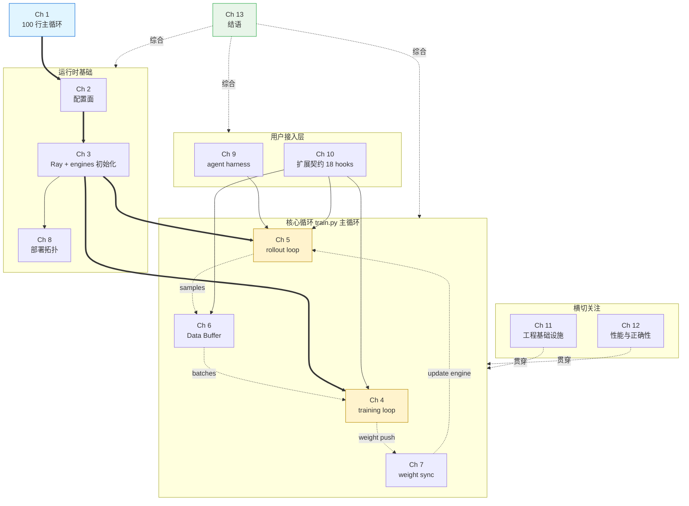
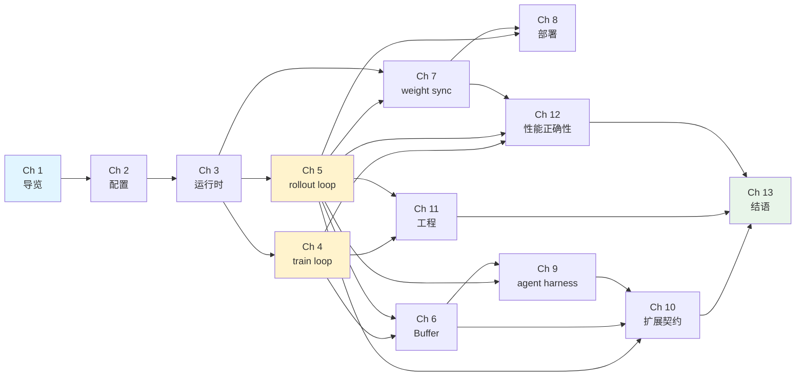
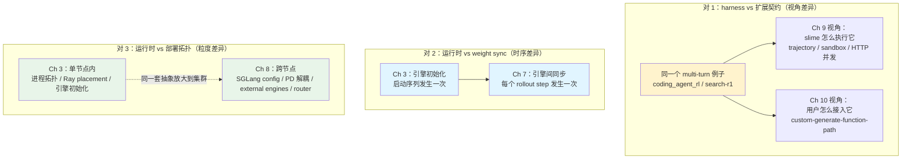

# slime 技术书大纲

## 全书论点

slime 在赌一件事：**RL post-training 是一个问题，不是三个被胶水粘起来的问题**。
所有看似割裂的"训练框架 + 推理服务 + agent 框架"都被收束进同一条
`training ↔ rollout ↔ Data Buffer` 路径。这个核心赌注派生出五个具体决定：
**native engine 透传**（不在 Megatron / SGLang 之上再叠抽象层）、
**单一 SGLang backend**（不为兼容性牺牲特性）、
**customization 取代 fork**（agentic workflow 是数据生成而非新框架）、
**显式 dataflow**（让 RL 那些"不报错的 bug"浮出水面）、
**CI 与不变量是一等公民**（脚本能跑不算 done）。读完这本书，读者会知
道这五条赌注分别落在哪几行代码里，以及在自己的系统中能借鉴哪些。

## 目标读者

- **主要**：做过 LLM 训练或推理工程、正在或将要做 RL post-training 的
  资深工程师；想把 slime 当作生产 RL 基础设施使用或二次开发的团队。
- **次要**：技术领导者，想理解 RL post-training 框架在架构上的关键
  取舍；研究者，想用 slime 跑实验但不想读完整源码。
- **不适合**：第一次接触 LLM 训练的读者（本书假设读者知道什么是
  Megatron 并行、什么是 SGLang serving、PPO/GRPO 的损失函数长什么样）；
  寻找 step-by-step 教程的读者（本书讲设计，不讲操作，操作请看
  `docs/zh/get_started/quick_start.md`）。

## 阅读路径

- **技术领导者**（约 3-4 小时）：第 1 章导览 + 第 4、5 章的开篇与结尾
  + 第 7、10、13 章 + 每章 Apply This。
- **资深工程师**（通读，约 20 小时）：从头读到尾，深入剖析小节全看。
- **想做 agentic RL 的读者**：第 1 章 → 第 5 章（rollout loop）→ 第 6
  章（Data Buffer）→ 第 9 章（agent harness）→ 第 10 章（扩展契约）
  → 回到第 11 章（工程基础设施）。
- **想做 weight sync 优化或异构部署**：第 3 章（运行时基础）→ 第 7
  章（weight sync）→ 第 8 章（部署拓扑）→ 第 12 章（性能与正确性）。

---

## 全书地图

### 章节与 slime 架构的对应

把 13 章映射到 slime 的实际架构上——每章对应一个明确的代码区域或
跨区域的横切话题。

蓝色 = 导览章，黄色 = 全书最重要的两章（核心循环），绿色 = 结语。
实线粗箭头是必读顺序，虚线是综合关系。

### 章节依赖与累进（验证"无前向依赖"）

第 N 章只依赖第 1..N-1 章的概念。下图显式标出每章的前置依赖，可以
直接审查是否有概念前向引用。

---

## 全书结构

### 第 I 部：入门

> 用一个 100 行的主循环，把全书要讲的所有概念先摆出来。

#### 第 1 章：100 行的主循环

**问题**：slime 这套东西到底在做什么？读完本章读者要能在 100 行
`train.py` 里指认出 placement、rollout manager、actor model、weight
sync、save、eval 这几个角色之间的关系。

**读者带走**：理解 slime 主循环的核心节奏（rollout → train → update
weights → eval），并建立后续每一章对应到这 100 行哪一处的心智地图。

**覆盖**：
- 拆解 `train.py` 的 5 个阶段：placement → rollout_manager 初始化 →
  models 初始化 → 第一次 weight push → for-loop（generate / train /
  save / update_weights / eval）
- 引入全书的核心论点：所有 RL 复杂度都被压到了这 100 行 + 它调用的
  几个 ray actor 上，没有第二条"agent framework"或"rollout service"
  的代码路径
- 展示一个 rollout step 端到端经过哪些代码（埋下后续章节的钩子）

**代码锚点**：
- `train.py`（全 103 行）、`train_async.py`（80 行，对比异步版本）
- 关键调用：`create_placement_groups`、`create_rollout_manager`、
  `create_training_models`、`rollout_manager.generate.remote()`、
  `actor_model.async_train()`、`actor_model.update_weights()`

**官方文档参考**：`README_zh.md` 的"架构总览"小节、
`docs/zh/get_started/quick_start.md`

**示例**：无（本章是导览，示例在后续章节）

**与其他章节的关系**：所有后续章节都从本章的 100 行中"放大"某一段。

---

### 第 II 部：起步

> 在跑起来之前，slime 已经做了两个赌注：参数透传与 Ray 编排。

#### 第 2 章：配置面——把参数透传当作架构原则

**问题**：slime 有 2000 多个参数（`arguments.py` 2010 行），为什么
还要直接透传 Megatron 与 SGLang 的所有参数？这种"两层 + 透传"的配置
模型解决了什么问题？

**读者带走**：理解 native 透传不是偷懒的产物，而是一个架构决定——
它的代价、收益、以及在自己框架里复用的条件。

**覆盖**：
- 参数三分法：Megatron 直读、`--sglang-` 前缀透传、slime 自身
- "为什么不在 Megatron 之上再抽象一层"——上游优化的免费午餐 vs.
  封装稳定性的取舍
- `arguments.py` 的组织（分组、validation、cross-arg constraints）
- 启动脚本 `scripts/run-*.sh` 与 `examples/` 如何示范多模型 recipe

**代码锚点**：
- `slime/utils/arguments.py`（2010 行，按功能分组的 argparse）
- `slime/backends/megatron_utils/arguments.py`、
  `slime/backends/sglang_utils/arguments.py`（两个 backend 各自的
  参数注册点）
- `tests/test_megatron_argument_validation.py`（参数 validation 的
  契约测试）

**官方文档参考**：`README_zh.md` 的"参数说明"、
`docs/zh/get_started/usage.md`、`docs/zh/advanced/megatron-config.md`、
`docs/zh/advanced/sglang-config.md`

**示例**：`scripts/run-qwen3-4B.sh`（dense 基线）、
`scripts/run-glm4.7-30B-A3B.sh`（MoE）

**与其他章节的关系**：依赖第 1 章；为第 3、4、5 章准备配置词汇表。

---

#### 第 3 章：运行时基础——Ray placement 与引擎初始化

**问题**：从 `python train.py` 到 actor / rollout / ref / critic 全部
就位、每个角色占着正确的 GPU、Megatron 与 SGLang 各自完成初始化，
中间发生了什么？

**读者带走**：能画出 slime 启动后的进程拓扑图，理解 placement_group
的设计原则与 actor_group 如何把"逻辑角色"映射到"物理 GPU"。

**覆盖**：
- `placement_group.py`（246 行）：GPU 分配策略，actor / ref / critic /
  rollout 的角色划分，offload 设计
- `actor_group.py`（169 行）：actor 集合的抽象，async 训练协调
- Megatron 侧引擎初始化：`megatron_utils/initialize.py` + `actor.py`
  + `megatron_patch/`（monkey patch 上游 Megatron）
- SGLang 侧引擎初始化：`sglang_utils/sglang_engine.py` +
  `server_control.py` + `sglang_config.py`（YAML 扩展配置）
- 模型 bridge：`slime_plugins/mbridge/` 与 `slime_plugins/megatron_bridge/`
  为不同模型注册到 Megatron 的桥接

**代码锚点**：
- `slime/ray/placement_group.py`、`actor_group.py`、`train_actor.py`、
  `ray_actor.py`
- `slime/backends/megatron_utils/initialize.py`、`actor.py`、`model.py`、
  `model_provider.py`、`megatron_patch/megatron_chunked_grad_coalesce_patch.py`
- `slime/backends/sglang_utils/sglang_engine.py`、`sglang_config.py`、
  `server_control.py`
- `slime_plugins/mbridge/`、`slime_plugins/megatron_bridge/`、
  `slime_plugins/models/`

**官方文档参考**：`docs/zh/advanced/sglang-config.md`、
`docs/zh/advanced/arch-support-beyond-megatron.md`

**示例**：`tests/test_placement_group.py`（团队认为必须守住的 placement
契约）

**与其他章节的关系**：依赖第 2 章；为第 4、5、7、8 章准备运行时词汇。

---

### 第 III 部：核心循环

> 两个循环，是全书最重要的两章。

#### 第 4 章：training loop——Megatron 这一侧

**问题**：当 `actor_model.async_train(rollout_id, rollout_data_ref)`
被调用，从 Megatron 角度看一个训练 step 经历了什么？slime 在 Megatron
之上加了什么，又故意没加什么？

**读者带走**：理解 slime 如何把 RL 损失函数、CP（context parallel）、
chunked GAE、log-prob 计算、checkpoint 串到 Megatron 的训练接口上，
而不破坏 Megatron 原生的并行与优化器栈。

**覆盖**：
- `actor.py`：训练 step 的主入口
- `loss.py`：PPO / GRPO / 自定义 loss 的组织；与上游不同的 loss 不变
  量（CP invariance、cispo loss）
- `cp_utils.py`：context parallel 下的 logprob / loss 一致性
- `data.py`：rollout 数据如何被切成 micro-batches
- `chunked_gae`（在 `tests/test_chunked_gae.py` 体现）：advantage 计算
- checkpoint：`checkpoint.py` + `hf_checkpoint_saver.py`，含 HF 格式
  保存路径

**代码锚点**：
- `slime/backends/megatron_utils/actor.py`、`loss.py`、`data.py`、
  `model.py`、`cp_utils.py`
- `slime/backends/megatron_utils/checkpoint.py`、`hf_checkpoint_saver.py`
- `slime/utils/seqlen_balancing.py`、`dp_schedule.py`（dp 调度与
  序列长度平衡）
- `tests/test_chunked_gae.py`、`test_cispo_loss.py`、`test_cp_utils.py`、
  `test_loss_cp_invariance.py`、`test_dp_schedule.py`

**官方文档参考**：`docs/zh/advanced/megatron-config.md`

**示例**：`examples/on_policy_distillation/`（OPD 训练范式）

**与其他章节的关系**：与第 5 章并列；二者通过第 6 章的 Data Buffer 串联。

---

#### 第 5 章：rollout loop——SGLang 这一侧

**问题**：`rollout_manager.generate.remote(rollout_id)` 返回的
`rollout_data_ref` 是怎么生成的？默认 `sglang_rollout` 与
`sglang_streaming_rollout`、`fully_async_rollout`、`sft_rollout`、
`on_policy_distillation`、`sleep_rollout` 这些变体分别在解决什么
不同问题？

**读者带走**：理解 rollout manager 的 1485 行设计，能根据自己的场景
选择或定制合适的 rollout 模式。

**覆盖**：
- `slime/ray/rollout.py`（1485 行）：rollout manager 的职责分层——
  task 调度、sample 状态机、与 SGLang engine 的并发协议
- `slime/rollout/sglang_rollout.py`：默认 rollout 实现，多数 RL 任务
  的起点
- 多种特殊形态：streaming（流式生成）、fully_async（长尾场景）、
  sft（监督微调）、on_policy_distillation（蒸馏）、sleep
- `base_types.py`：Sample / RolloutFn 输出类型的契约
- `data_source.py`：rollout manager 如何从 Data Buffer 拉 prompt

**代码锚点**：
- `slime/ray/rollout.py`（核心，1485 行）、`rollout_validation.py`
- `slime/rollout/sglang_rollout.py`、`sglang_streaming_rollout.py`、
  `fully_async_rollout.py`、`sft_rollout.py`、`on_policy_distillation.py`、
  `sleep_rollout.py`
- `slime/rollout/base_types.py`、`data_source.py`、`forge_load.py`
- `slime/utils/types.py`（Sample 数据结构）

**官方文档参考**：`docs/zh/advanced/on-policy-distillation.md`、
`docs/zh/advanced/speculative-decoding.md`

**示例**：`examples/fully_async/`、`examples/on_policy_distillation/`

**与其他章节的关系**：依赖第 3 章；与第 4 章并列；为第 6、9、10 章
准备 rollout 词汇。

---

### 第 IV 部：数据流与同步

> 把 training 与 rollout 串成一条路径，靠两件事：一个共享的 Buffer，
> 一次定时的 weight push。

#### 第 6 章：Data Buffer——隐式的桥梁

**问题**：README 的架构图把 Data Buffer 画成与 training、rollout 并列
的核心模块，但代码里没有 `slime/data_buffer/` 目录。slime 的 Buffer
到底在哪里？它的设计为什么是"分散的"？

**读者带走**：理解 Data Buffer 作为"概念上的中心、实现上的接口"是如何
让 prompt 生命周期、sample 流转、dynamic filter 在不同执行模式下
（同步 / 异步 / 长尾）保持一致行为的。

**覆盖**：
- `data_source.py` 的 `RolloutDataSource` 与 `RolloutDataSourceWithBuffer`：
  接口层与默认实现
- `slime_plugins/rollout_buffer/`：外置 buffer 的参考实现
  （`buffer.py` + `generator/`）
- prompt 生命周期：从 dataset 加载、采样、被 rollout 消费、采样结果
  回写、被 train 消费
- `forge_load.py`：dataset 加载形态
- dynamic filter：`filter_hub/dynamic_sampling_filters.py`
  （check_reward_nonzero_std 等）
- 异步与长尾下的 Buffer 行为差异（与第 5 章 fully_async 联动）

**代码锚点**：
- `slime/rollout/data_source.py`（`DataSource` 基类与
  `RolloutDataSourceWithBuffer`）
- `slime/rollout/filter_hub/dynamic_sampling_filters.py`、
  `filter_hub/base_types.py`
- `slime/rollout/forge_load.py`
- `slime_plugins/rollout_buffer/buffer.py`、`generator/base_generator.py`、
  `rollout_buffer_example.py`

**官方文档参考**：`docs/zh/get_started/customization.md` 中
"数据源" 与 "动态采样过滤器" 小节

**示例**：`examples/eval_multi_task/`（多任务 buffer 的实际用法）

**与其他章节的关系**：依赖第 4、5 章；为第 10 章的数据相关 hook
铺路。

---

#### 第 7 章：weight sync——四条传输路径

**问题**：训练完成后必须把更新的权重推到 rollout 引擎。slime 为什么
实现了四条不同的传输路径（distributed、distributed_delta、tensor、
disk），它们各自的取舍是什么？

**读者带走**：理解 weight sync 在 RL 系统里为什么是性能与稳定性
关键路径，能根据自己的部署形态（同节点 / 跨节点 / 异构 GPU / external
engine）选择合适的传输路径。

**覆盖**：
- `update_weight/` 五个文件的分工：from_distributed（NCCL 直传）、
  from_distributed_delta（增量 NCCL）、from_tensor（中间张量）、
  from_disk（共享文件系统）、common（公共抽象）
- `hf_weight_iterator_*.py`：HF 权重格式迭代（base / direct / bridge）
- `megatron_to_hf/`：10 个模型转换器（llama / qwen2 / qwen3moe /
  deepseekv3 / glm4 / glm4moe / gpt_oss / mimo / minimax_m2 /
  qwen3_5 / qwen3_next / qwen3_vl）+ `processors/`（FP8、quantization）
- Delta sync 的原理与适用场景
- `tests/test_full_disk_weight_update.py` 透露的不变量

**代码锚点**：
- `slime/backends/megatron_utils/update_weight/` 全部 7 个文件
- `slime/backends/megatron_utils/megatron_to_hf/`（10 模型 + processors）
- `slime/backends/megatron_utils/sglang.py`（Megatron 侧与 SGLang
  对接的具体代码）

**官方文档参考**：`docs/zh/advanced/delta-weight-sync.md`、
`docs/zh/advanced/external-rollout-engines.md`

**示例**：`examples/delta_weight_sync/`、
`tests/test_full_disk_weight_update.py`

**与其他章节的关系**：依赖第 3、5 章；与第 8 章（部署拓扑）紧密相关。

---

### 第 V 部：部署与扩展

> 一旦核心循环稳定，剩下的问题是"如何把它跑在真实集群上"和"如何
> 让别人接入自己的 agent / reward / data"。

#### 第 8 章：部署拓扑——SGLang config、PD 解耦与外部引擎

**问题**：从单节点 8 卡到 GLM-5.2 这种 744B-A40B MoE 的多节点训练，
deployment 形态会怎么变？slime 的 SGLang config（YAML 扩展）、PD
disaggregation、external rollout engines、router policy 分别在解决
哪一类拓扑问题？

**读者带走**：理解 slime 的部署能力不是"功能堆叠"，而是 SGLang 上游
能力被原样暴露后的自然组合；能为自己的集群与 workload 选合适的拓扑。

**覆盖**：
- `sglang_config.py`：YAML 扩展配置，topology-specific control，
  per-group SGLang override
- PD Disaggregation：prefill / decode 资源解耦，适合 multi-turn 与
  agentic workload
- External Rollout Engines：训练任务外部管理的部署，跨型号 / 跨
  厂家 GPU
- router policy（上游 `sgl-router`）：session affinity 对 multi-turn
  agent 的意义
- heterogeneous server group：异构 server 拓扑

**代码锚点**：
- `slime/backends/sglang_utils/sglang_config.py`、`external.py`、
  `server_control.py`
- `slime/utils/routing_replay.py`（routing replay 与 R3）
- 主仓**没有** `slime/router/`，需引用上游 `sgl-router`

**官方文档参考**：`docs/zh/advanced/sglang-config.md`（核心）、
`docs/zh/advanced/pd-disaggregation.md`、
`docs/zh/advanced/external-rollout-engines.md`、
`docs/zh/examples/glm5.2-744B-A40B.md`（最大规模的部署实例）

**示例**：`tests/test_external_sglang_engines.py`、
`tests/test_glm4.7_30B_A3B_pd_mooncake.py`

**与其他章节的关系**：依赖第 3、5、7 章；与第 12 章性能讨论联动。

---

#### 第 9 章：agent harness——slime 自带的执行层

**问题**：很多人以为"agent framework" 是 RL 之外的东西。slime 为什么
要自带 agent harness（`slime/agent/`），它又如何避免变成又一个独立的
agent framework？

**读者带走**：理解 slime 内置 harness 的执行模型（trajectory 数据结构、
sandbox 协议、HTTP 并发模型），看到 slime 怎么把"agent 执行"作为
"数据生成"的一种形态，而不是新增一条代码路径。

**覆盖**：
- `slime/agent/` 的组织：trajectory（轨迹数据结构）、sandbox
  （沙盒接口）、parsing（响应解析）、aiohttp_threaded（HTTP 并发）
- `harness/`：两个真实集成——`claude_code.py`、`codex.py`、`common.py`
- `adapters/`：LLM API 适配——`anthropic.py`、`openai.py`、`common.py`
- "agent harness 也是 generate function" 的体现——它最终被
  `--custom-generate-function-path` 或 `--rollout-function-path` 调用
- 与 `--custom-generate-function-path` 返回 `list[Sample]` 的关系
  （sibling samples、rollout_id 共享语义）

**代码锚点**：
- `slime/agent/trajectory.py`、`sandbox.py`、`parsing.py`、
  `aiohttp_threaded.py`
- `slime/agent/harness/claude_code.py`、`codex.py`、`common.py`
- `slime/agent/adapters/anthropic.py`、`openai.py`、`common.py`

**官方文档参考**：`docs/zh/get_started/agent.md`（73 行短文，引出
agent harness 设计哲学）、`docs/zh/get_started/customization.md` 中
"通过 customization 接口实现 agentic workflow" 小节

**示例**：`examples/coding_agent_rl/`（端到端 SWE coding agent）、
`examples/multi_agent/`、`examples/tau-bench/`、`examples/strands_sglang/`、
`examples/retool/`、`examples/search-r1/`、`tests/test_agent/`

**与其他章节的关系**：依赖第 5、6 章；为第 10 章铺路（同一个例子在
两章用不同视角讲——见边界澄清）。

---

#### 第 10 章：扩展契约——18 个 hook 与契约测试

**问题**：slime 没有 plugin 机制、没有继承式 API，而是用 18 个函数
路径参数提供扩展点。这种"hook-by-path"设计的内在逻辑是什么？为什么
它需要专门的契约测试来护住？

**读者带走**：理解 slime 的扩展契约是有结构的（按 rollout 阶段分组），
能根据自己的 agentic / reward / filtering / 训练定制需求，挑选合适
的 hook 而不是过度覆盖。

**覆盖**：
- 18 个 hook 的分组视角（不要一个个列）：
  - **rollout 与生成**（1、2、16）：替换整个 rollout vs. 只替换 generate
  - **奖励**（3、12）：custom rm + reward post-process
  - **过滤与采样**（4、5、6、7）：dynamic filter / buffer filter /
    sample filter / all-samples process
  - **数据处理**（8、13）：rollout data postprocess + samples-to-train-data
  - **损失与训练**（9、10、11）：custom loss / TIS / pg_loss reducer
  - **数据源**（15）：替换 DataSource
  - **Megatron hooks**（17）：init / before log_prob / before train_step
  - **日志**（14）：训练 rollout 日志 + 评估 rollout 日志
  - **MoE 路由重放**（18）：use-routing-replay、
    use-rollout-routing-replay（R3）
- "core 4" 优先级：`--custom-generate` + `--custom-rm` 覆盖 80% 的
  agentic 场景，何时才需要 `--rollout-function-path`
- 契约测试（`tests/plugin_contracts/`）：通过字符串导入路径动态加载，
  把"用户自定义实现"与"内置实现"放在同一测试 harness 下校验
- 一次 prompt 产生多个训练样本：sibling samples 与 rollout_id 共享

**代码锚点**：
- `slime/utils/arguments.py`（搜索 `path` 后缀的参数）
- `slime/rollout/rm_hub/`（deepscaler / f1 / gpqa / ifbench /
  math_dapo_utils / math_utils）
- `slime/rollout/filter_hub/dynamic_sampling_filters.py`
- `slime/utils/eval_config.py`
- `tests/plugin_contracts/test_plugin_rollout_contracts.py`、
  `test_plugin_generate_contracts.py`、
  `test_plugin_path_loading_contracts.py`、
  `test_plugin_runtime_hook_contracts.py`

**官方文档参考**：`docs/zh/get_started/customization.md`（496 行，
全套 hook 的参考手册——本章不复述，只讲设计哲学）

**示例**：`examples/search-r1/generate_with_search.py`（custom-generate）、
`examples/multi_agent/rollout_with_multi_agents.py`
（rollout-function）、`examples/train_infer_mismatch_helper/mis.py`
（custom TIS）

**与其他章节的关系**：依赖第 5、6、9 章；与第 9 章共享 multi-turn
示例但视角不同（第 9 章看 harness 如何执行示例，本章看示例如何接入）。

---

### 第 VI 部：工程实践

> RL bug 往往不会立刻报错。slime 把工程基础设施与正确性不变量当作
> 一等问题来做。

#### 第 11 章：工程基础设施——可观测、debug、CI、容错

**问题**：RL 训练比常规 LLM 训练脆弱得多，原因是"bug 不会报错"。
slime 用什么基础设施让这些 silent failure 浮出水面？

**读者带走**：理解 trace、profile、metric、health monitor、CI、
reproducibility、fault tolerance 在 RL 项目里为什么不是 nice-to-have
而是必需品；能在自己的 RL 项目里抄走对应的实践。

**覆盖**：
- 可观测三件套：`trace_utils.py`（细粒度 trace）、
  `metric_utils.py` + `train_metric_utils.py`（指标聚合）、
  `health_monitor.py`（健康监测）、`profile_utils.py`（GPU profiling）、
  `timer.py`
- CI 矩阵：CPU unit test + GPU e2e + plugin contract test，覆盖
  dense / MoE / async / SGLang config / checkpoint / precision /
  debug replay
- Reproducibility：seed、确定性、replay
- Fault tolerance：训练长时间运行的故障恢复
- Debug 工具链：rollout-only / train-only 分离调试

**代码锚点**：
- `slime/utils/trace_utils.py`、`metric_utils.py`、
  `train_metric_utils.py`、`health_monitor.py`、`profile_utils.py`、
  `timer.py`
- `tests/ci/`（CI 配置）、`tests/test_metric_report.py`、
  `tests/test_metric_report_dist.py`
- `slime/backends/megatron_utils/ci_utils.py`

**官方文档参考**：`docs/zh/developer_guide/ci.md`、`debug.md`、
`trace.md`、`profiling.md`、`docs/zh/advanced/reproducibility.md`、
`docs/zh/advanced/fault-tolerance.md`、`docs/zh/advanced/observability.md`

**示例**：`tests/test_qwen2.5-0.5B-reproducibility.sh`、
`scripts/run-qwen2.5-0.5B-gb10-smoke.sh`

**与其他章节的关系**：穿插全书；本章把分散在前面章节的工程线索集中
讲清楚。

---

#### 第 12 章：性能与正确性——混合精度、CP 不变量与瓶颈分析

**问题**：BF16 训练 + FP8 rollout + FP8 KV cache 这种"混合精度组合
拳"在 slime 里怎么落地？CP（context parallel）下的 loss 一致性如何
保证？什么时候哪一环会成为瓶颈？

**读者带走**：理解 slime 在性能与正确性之间下的具体赌注，知道在自己
扩展 slime 时哪些不变量必须守住、哪些可以放松。

**覆盖**：
- BF16 + FP8 训练 / rollout：`megatron_utils/kernels/`（int4_qat、
  fp8_kernel）、`megatron_to_hf/processors/quantizer_fp8.py`、
  `quantizer_compressed_tensors.py`
- KV cache FP8：`--sglang-kv-cache-dtype fp8_e4m3` 在 long-context
  下的容量收益
- CP 一致性：`cp_utils.py` + `tests/test_cp_utils.py`、
  `test_loss_cp_invariance.py`
- Loss 不变量：cispo loss、chunked GAE、PG loss reducer
- 瓶颈分析：rollout long-tail（参考 APRIL 项目）、weight sync 占比、
  CP overhead

**代码锚点**：
- `slime/backends/megatron_utils/kernels/`（fp8_kernel.py、int4_qat/）
- `slime/backends/megatron_utils/megatron_to_hf/processors/`
- `slime/backends/megatron_utils/cp_utils.py`
- `slime/utils/seqlen_balancing.py`、`dp_schedule.py`、`tensor_backper.py`
- `tests/test_cispo_loss.py`、`test_chunked_gae.py`、
  `test_cp_utils.py`、`test_loss_cp_invariance.py`

**官方文档参考**：`docs/zh/advanced/low-precision.md`、
`docs/zh/advanced/speculative-decoding.md`

**示例**：`scripts/low_precision/`、`examples/train_infer_mismatch_helper/`

**与其他章节的关系**：综合第 4、5、7 章的性能讨论；为第 13 章结语
准备素材。

---

### 第 VII 部：收尾

#### 第 13 章：结语——slime 教会我们的事

**问题**：把整本书的内容压缩成一份可迁移的清单：在自己的 RL（或
非 RL）系统中，能从 slime 借鉴哪些设计原则？

**读者带走**：一份具体的、可执行的"如果我要从零做一个 RL 框架，我
会做哪些和 slime 一样的决定、哪些不一样"。

**覆盖**：
- 五条核心赌注的回扣：unified data path / native passthrough /
  single backend / customization-not-fork / explicit dataflow，
  以及 CI-as-first-class
- 没走的路：为什么不做 plugin 机制？为什么不抽象成 trainer 基类？
  为什么不支持多个 rollout backend？
- 可迁移经验：12 条跨章节的核心模式（按"小而精"原则筛选，每条
  对应前面某章的某个具体决定）
- 反向适用性：什么场景下 slime 的设计不合适（例如：极小规模实验、
  跨多种推理后端 benchmark、纯 SFT 场景）
- 前瞻：基于 slime 生态（Miles、vime、Relax、P1、RLVE、TritonForge、
  APRIL、qqr、ART）观察到的下一阶段问题

**代码锚点**：（结语章不引代码，只引前面章节）

**官方文档参考**：`README_zh.md` 的"基于 slime 构建的生态"、
博文部分

**示例**：综合前面所有章节引过的示例

**与其他章节的关系**：综合全书。

---

## 章节排序的理由

与 `codebase_outline.md` 中建议的排序对比，本大纲做了以下调整：

1. **新加第 1 章"100 行的主循环"作为导览**：原排序从配置开始，但
   slime 的主循环只有 100 行，提前把它摊开能让后续每一章都有"挂钩
   位置"。这一章是技术领导者最容易跳读 + 资深工程师最快建立心智的
   入口。
2. **Ray 编排与引擎初始化合并为第 3 章**：原排序分两章。合并后
   故事更紧凑——Ray 拉起进程、每个进程内引擎初始化，是同一条
   "启动序列"的故事。如果合并后超过 15000 字再考虑拆分。
3. **agent harness 放在 customization 之前**（第 9 章 → 第 10 章）：
   遵循"系统提供什么 → 系统暴露什么扩展点"的顺序。读者先理解 slime
   自带的执行机制，再理解扩展契约能在哪些位置嵌入自定义代码。
4. **保留"性能与正确性"为独立章**：slime 在 `tests/` 里花了大力气
   守住的不变量（cispo / cp_invariance / chunked_gae / dp_schedule）
   值得独立讲，混进"工程基础设施"会被淹没。

## 部（Part）的合并思路

7 部：入门（1）/ 起步（2）/ 核心循环（2）/ 数据流与同步（2）/
部署与扩展（3）/ 工程实践（2）/ 收尾（1）= 13 章。

每部一句话引语已经在大纲里写出。第 V 部（部署与扩展）章节数最多
（3 章），因为这一部覆盖了 slime 区别于其他 RL 框架的三个差异化能力：
真实集群部署、自带 agent 执行层、18 个扩展点。

## 边界澄清

三对易混章节的视角差异可以一图说清：

- **第 9 章（agent harness）与第 10 章（扩展契约）**：第 9 章讲
  slime 内置 harness 的实现机制（系统提供什么——trajectory 数据结构、
  sandbox 协议、HTTP harness 并发模型）；第 10 章讲用户怎么通过 hook
  接入自己的 agent / tool / verifier（系统暴露什么扩展点）。两章
  可以共享 `examples/coding_agent_rl/`、`examples/search-r1/` 等
  示例——第 9 章看 harness 如何执行它们，第 10 章看它们如何通过
  `--custom-generate-function-path` 接入。
- **第 3 章（运行时基础）与第 7 章（weight sync）**：第 3 章讲引擎
  初始化与参数透传（一次性发生）；第 7 章讲已经初始化的两个引擎之间
  如何同步参数（每个 rollout step 发生）。
- **第 8 章（部署拓扑）与第 3 章（运行时基础）**：第 3 章讲单节点
  内的进程拓扑；第 8 章讲跨节点的 router、PD 解耦、external engines。

## 每章图示建议

写作时每章建议的关键图示（仅列必要的，写正文时可增减）：

| 章 | 建议图示 |
|---|---|
| Ch 1 100 行主循环 | 1) `train.py` 5 阶段时间线（gantt） 2) 一个 rollout step 的端到端调用流（sequenceDiagram） |
| Ch 2 配置面 | 1) 参数三层透传决策树（flowchart） 2) `arguments.py` 参数分组架构（graph TB） |
| Ch 3 运行时基础 | 1) Ray placement group 与 actor 角色分配（graph TB） 2) Megatron + SGLang 启动序列（sequenceDiagram） |
| Ch 4 training loop | 1) 一个 train step 内部流程（flowchart） 2) CP 下的 logprob 计算切分（graph LR） |
| Ch 5 rollout loop | 1) rollout manager 状态机（stateDiagram-v2） 2) 同步 / streaming / fully_async 三种模式对比（graph TB） |
| Ch 6 Data Buffer | 1) Sample 生命周期状态机（stateDiagram-v2） 2) Buffer 在不同执行模式下的行为差异（graph LR） |
| Ch 7 weight sync | 1) 四条传输路径决策树（flowchart） 2) NCCL 直传 vs disk 传 的时序对比（sequenceDiagram） |
| Ch 8 部署拓扑 | 1) 单节点 → 多节点 → PD 解耦 → external engines 的递进拓扑（graph TB） 2) router session affinity 的请求路由（sequenceDiagram） |
| Ch 9 agent harness | 1) trajectory 数据结构（graph TB） 2) HTTP harness 并发模型（sequenceDiagram） |
| Ch 10 扩展契约 | 1) 18 个 hook 按 rollout 阶段嵌入的位置图（flowchart） 2) plugin_contracts 测试覆盖矩阵（graph TB） |
| Ch 11 工程基础设施 | 1) trace / metric / profile 的数据流（graph LR） 2) CI 矩阵（graph TB） |
| Ch 12 性能与正确性 | 1) BF16+FP8 混合精度的数据流（graph LR） 2) rollout long-tail 的时序图（gantt） |
| Ch 13 结语 | 无图（结语章靠提炼，不靠图） |

总图数：约 24 张。复杂章（Ch 5、7、8、10）2 张，其他章 2 张。Ch 13
无图。这个密度与"图能替代散文时就画、纯文字能讲清的不必硬塞图"
原则一致。

## 大纲自检（已过一遍）

- [x] 论点清晰：5 条赌注 + CI 一等公民，每章都能挂到某一条
- [x] 章节累进：第 N 章只引用 1..N-1 章的概念
- [x] 代码锚点真实：每个引用的路径都经过 `find` / `ls` 验证
- [x] 论点回扣：每章"读者带走"都对应某一条赌注
- [x] 可跳读：技术领导者路径在"阅读路径"里明确给出
- [x] 覆盖均衡：核心循环（第 4、5 章）单独成章，weight sync 单独
  成章；不重要的话题不凑章
- [x] 每章独立题目：13 个章名互不重复，不出现"深入 X"或"再谈 X"
- [x] 示例真实：每个引用的 `examples/<name>/` 目录都存在
- [x] 不重复 `docs/zh/`：customization 章不复述 18 个 hook 的签名
  （那是 customization.md 的事），只讲设计哲学；性能章不复述
  low-precision.md，只讲 slime 的具体取舍

---

## 写完大纲之后

按 `codebase_outline.md` 的约定，**这里停下来等评审**。等大纲被
确认后，再讨论：
- 哪些章顺序还要调整
- 哪些章可以合并或拆分
- 每章"覆盖"清单是否还要展开
- 是否需要为某些章节先写一个 sample chapter 跑通格式
