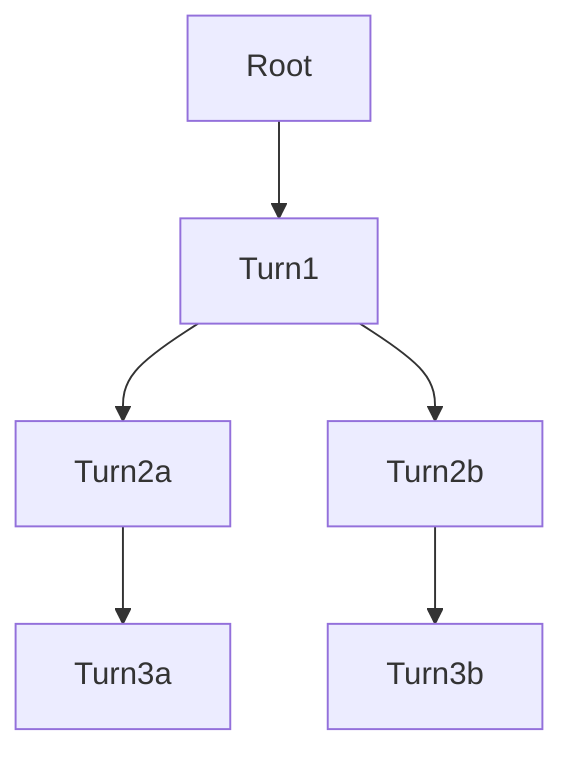

# 第 V 部评审：部署与扩展（Ch 8 + Ch 9 + Ch 10）

> 评审范围：`ch08_deployment.md`（453 行）、`ch09_agent_harness.md`（476 行）、
> `ch10_customization.md`（488 行）。三章合计约 1.4k 行 markdown，是全书
> 篇幅最大的一部。

## 摘要

整体质量在全书已写章节里属于第一梯队——核心洞见全部抓到了（Ch 8 PD 解耦
真正收益是 prefix cache 跨轮复用、Ch 9 用 API key 字段携带 sid 的 hack、
Ch 10 契约测试双向校验设计），叙事弧线扎实，三章之间有真实的跨章引用
（不只是空挂"见第 X 章"）。最值得修的三处：(1) Ch 8 第 8.2 节 encoder
两阶段启动的论点没说透——它给的图示和"唯一同步点"的措辞之间有信息差，
读者搞不清那张图到底证明了什么；(2) Ch 9 开篇"6 个文件 1.4k 行"和后
文表格里写的文件 LoC 加起来对不上，事实级别要核对；(3) Ch 10 第 10.1
节"5 行加载器"的对比表把 plugin / ABC / decorator 写成劣势对比，
节奏上过于辩护性，读起来像在替设计辩白而不是讲设计。

---

## 1. 开篇质量与章节边界

**章节衔接**：三章之间的过渡做得不错。Ch 8 → Ch 9 的过渡（"agent
harness 怎么把这些上游能力组合成 agentic RL 的执行层"）明确指了
PD 解耦与 router session affinity 这两个 Ch 9 会消费的能力；Ch 9 →
Ch 10 的过渡（"agent 执行只是 customization 系统的一种特例"）也把
Ch 10 的核心论点提前埋了。Ch 8 开篇与 Ch 7 的衔接稍弱——只说"上一章
是单点角度，这一章拉远视角"，但没解释"拉远视角"在内容上具体指什么；
Ch 7 讲的是 weight sync 四条路径，Ch 8 讲的是部署拓扑，两者关系不是
"远近"是"两个独立维度"。

**Ch 9 / Ch 10 边界**：outline 明确写过 Ch 9 是"系统提供什么"、
Ch 10 是"系统暴露什么扩展点"。**正文里这条边界守住了**——Ch 9 全章
讲的都是 slime 自己实现的 harness 机制（trajectory 树、DriftKind、
aiohttp 线程模型），Ch 10 讲的是 18 个 hook 如何被加载与契约化。但
两章共享的 multi-turn 示例确实兑现了 outline "视角切换不重复讲解"
的承诺：Ch 9 9.4 节讲消息树的 fork 是为了 sub-agent / auto-compact，
Ch 10 10.5 节讲 sibling samples 同样涉及 sub-agent / compact 场景，
两者讲的是同一物理现象的两面——Ch 9 看 harness 内部如何组织、Ch 10
看用户接入时的返回值约定。这是干净的视角切换，没有重复。

**唯一灰色地带**：Ch 10 10.6 节讲 MoE routing replay 时说"第 8 章
讲过它用环境变量 ROUTING_REPLAY_STAGE 做四态状态机切换"。但 Ch 8
是把 RoutingReplay 放在第 8.6 节后的"深入剖析"框里讲的，且明显是
为了讲"上游 hook 点深埋时环境变量是合法的反向通道"这个 Apply This
模式。Ch 10 把它归类为"hook"也合理——但两章都讲它，读者会觉得是
重复。**建议**：Ch 10 10.6 节那一段压缩到一句："详见 Ch 8 深入剖析
框，本章只标注它是 hook 谱系里的特殊成员"。

## 2. 流畅性

**Ch 8**：节奏稳。8.1（YAML 三层 dataclass）→ 8.2（worker_type 枚举）
→ 8.3（PD 解耦）是从配置语法逐步走到具体能力的自然链路；8.4
（External Engine）→ 8.5（独立 router）→ 8.6（server_control）是
"逐个拆 600 行子系统里的小模块"。整体没有拖沓。**唯一一处节奏问题**：
8.6 节后接的 RoutingReplay 深入剖析框篇幅快赶上 8.6 本身（44 行
vs 32 行），但它和 8.6（server_control）主题完全无关——逻辑上更像
8.1 节那种"YAML 配置之外的另一个 hook 点"。建议把这个深入剖析框
独立放在 8.4 / 8.5 之间，或者降级成 8.6 后面"另一类小模块"的几段
散文。

**Ch 9**：节奏也好。9.1 总览 → 9.2 真实集成 → 9.3-9.6 具体设计决策。
9.2 节里两段 CLI 启动参数 + base64 round-trip 的伪代码合起来略长——
读者会以为这是 claude-code / codex 的教程，但实际是为了支撑"把
hard-won knowledge 写进仓库"这个论点。**建议**：9.2 节把代码块压
缩成 1 个（不是 3 个），把 codex base64 那段降级成散文。

**Ch 10**：略有"辩护性"倾向。10.1 节那个 plugin / ABC / decorator
vs hook-by-path 的对比表读起来像在辩护"我们为什么不选其他方案"
而不是讲"我们选了什么"。这种对比在论证上有用，但放在 10.1 节
（章的第一节）会让读者感觉防御姿态太强。**建议**：把对比表移到
10.1 节末尾的小字提示，主线先讲"5 行加载器 + 普通函数即可接入"
的正面叙事。

## 3. 内容删减——哪些是参考手册式内容

**Ch 8**：基本守住了"不复述 sglang-config.md"的承诺。8.1 节的
YAML 示例是为了讲"用上游字段名做 key"这个设计原则，不是教读者怎
么写 YAML——这是叙事性引用，可保留。8.2 节 worker_type 五元枚举
没有一个个列含义，只挑了 encoder 和 placeholder 两个讲——这是
正确的"挑非平凡的讲"取舍。

**Ch 9**：9.2 节的代码块密度偏高（claude-code 启动参数 + codex
TOML + base64 round-trip 三段）。这些代码块每一段都在支撑"hard-won
knowledge 写进仓库"这一个论点。**建议**：保留一段（claude-code 启
动参数最有说服力），其他两段压成散文："Codex 那边更复杂——base_url
必须 inline 写在 TOML、配置文件必须 base64 round-trip 进沙盒，否
则 shell quoting 会把 `&` `"` 吃掉。"

**Ch 10——这是评审重点**。outline 明确说"不复述 18 个 hook 的签
名"。**Ch 10 守住了这条**——10.2 节那张 9 组表只列了 hook 名 +
调用位置，没列签名；10.3 节挑了"core 4"做引言而不是 18 个全讲；
10.4 节讲契约测试时只贴了 1 个测试样例（rollout signature）而不是
18 个。这是教科书级的"讲设计哲学不讲签名"实现。**唯一可优化的**：
10.2 节那张 9 组分组表占了 12 行，但表后的散文只解释了"为什么按
进程分上下半"和"4 个 filter 职责"两件事——表里的其他 5 组没有任
何后续讨论。**建议**：要么把表压缩到 5 组（把不展开的合并），要
么在表后给每组一句话点评（不是签名，是"这组解决什么类型的问题"）。

## 4. 缺失内容

**Ch 8**：

- **PD 解耦的真正收益**——已经讲清，8.3 节把"multi-turn prefix
  cache 跨轮复用 > 单 token 吞吐"这个洞见用三个组件（router_policy
  + UUID session_id + X-SMG-Routing-Key）+ 流程图说透了。无需补充。
- **缺一个收尾问题**：8.6 节后没有总结"600 行子系统做了哪些事 +
  没做哪些事"。开篇说"重点不在 slime 实现了什么部署功能，而在 slime
  给上游能力暴露了什么样的扩展点"——但章末没回扣这条主线。Apply
  This 第 1 条"编排层只做编排"是回扣，但被 Apply This 的格式挤掉
  了节奏。**建议**：在 Apply This 之前补一段 80 字的总结，把 5 个
  小节的设计串成一条线。

**Ch 9**：

- **"用 API key 字段携带 sid"hack**——9.3 节讲透了。优秀。
- **缺一个对比维度**：9.4 节讲消息树时给的是"为什么不用列表"，但
  没讲"为什么不用 DAG"。子任务 fork 出去后又回到主任务的场景（即
  父任务等子任务返回后继续）是 DAG 而不是树。slime 的消息树是怎么
  处理"sub-agent 完成后主 agent 继续"这种合流？**建议**：9.4 节末
  尾补一句，说明"slime 假设 sub-agent 是独立 trajectory，不回流到
  主 agent——这是简化"，让读者知道这条假设的边界。
- **缺 9.5 节的"REALIGN 的另一面"**：DriftKind 三档讲了 CLEAN /
  REALIGN / FORK 的判定，但没说"FORK 出新分支后老分支怎么处理"。
  老 trajectory builder 被 `_close` 后是否还参与训练？sibling
  shared prefix 怎么不被算两次？**建议**：9.5 节末尾补一段，与
  9.4 节 `response_trained` 字段呼应，让"fork 后老分支也是合法 leaf"
  这一点显式。

**Ch 10**：

- **契约测试双向校验**——10.4 节讲透了。`SLIME_CONTRACT_*` 环境变
  量 + 内置 fallback 让"一份测试代码校验两边实现"的设计被讲清。
  优秀。
- **缺一个"反例"**：10.1 节的"为什么不选 plugin / ABC / decorator"
  对比表是抽象论证，没给具体反例。**建议**：补一句"如果你看过
  vLLM 的 plugin entry point 系统，对比之下 slime 的 zero-import
  接入是 RL 用户的福音——RL 实验常常是单文件脚本，没人愿意为了
  改 reward 把代码打包发 pip"。给读者一个真实参照物。

## 5. 需要的图示

**Ch 8 当前 2 张图**（encoder 两阶段启动、PD prefix cache 路由）—
都是必要的。**建议补 1 张**：8.4 节末尾画一张"训推完全解耦的数据
流"图——training cluster 把权重写到共享 disk，external rollout
server 从 disk 重读，整个过程 slime 不参与 server 进程管理。这张
图能把"external engine 与 disk weight sync 是天然配合"这个观点
可视化。

**Ch 9 当前 2 张图**（6 文件架构 + 消息树状态机）—结构清晰但**消息
树那张 stateDiagram-v2 用错了**。stateDiagram 的语义是"状态之间转
移"，但 9.4 节要表达的是"树形数据结构的拓扑"，应该用 `graph TD`：



**建议补 1 张**：9.6 节末尾画一张"aiohttp 线程边界"图，标出主线程
（rollout event loop）vs daemon 线程（adapter event loop）+
`run_coroutine_threadsafe` 的跨边界调用。文字描述"独立线程跑自己
的 event loop"对没写过这种代码的读者比较抽象。

**Ch 10 当前 0 张图**——这是个明显的缺口。**建议至少补 2 张**：

1. **18 个 hook 嵌入 rollout pipeline 的位置图**（outline 也建议
   了）：横轴是 rollout step → reward → filter → training → log
   的时间轴，每个 hook 的调用点标在对应位置上。这张图能把 10.2 节
   那张 9 组表格的内容"激活"——读者一眼看出"原来这些 hook 是按
   时序分散在管道各处的"。
2. **契约测试双向校验的数据流**：`SLIME_CONTRACT_*` 环境变量 → CI
   场景（默认 fallback 到内置）vs 用户场景（指向用户实现）→ 同一
   份断言代码。这张图能把 10.4 节的核心洞见可视化。

## 6. 跨章一致性

**术语**：sid / session_id 在 Ch 8（"UUID session_id"）、Ch 9
（"per-sid 消息树"）、Ch 10 都出现，但写法不统一——Ch 8 用
`session_id`、Ch 9 用 `sid`、Ch 9 9.3 节又混用了
"session id"（散文）和 `sid`（代码注释）。**建议统一**：散文用
"session id"（带空格、不缩写），代码与 header 名保留原写法
（`X-SMG-Routing-Key`、`sample.session_id`）。Ch 9 9.1 节表格里
"per-sid 消息树"也改成"per-session-id 消息树"。

**共享示例**：`coding_agent_rl` 在 Ch 9 / Ch 10 都被引用。Ch 9 的
开篇段落里用它讲"真实 SWE coding agent"，Ch 10 的 10.5 节讲
sibling samples 时也以它为典型场景。这是干净的视角切换——
Ch 9 看 harness 怎么跑它，Ch 10 看用户怎么接入它。**符合 outline
预期**。

**Apply This 格式**：三章都是 5 条模式 + "怎么改造适配" + "陷阱"
的格式。一致。Ch 8 的第 5 条"环境变量是合法的反向通道"和 Ch 9
没有重复，是 RoutingReplay 那个具体技术的模式抽象。但 Ch 9 第 5
条"单独线程跑 event loop"和 Ch 8 没有冲突，干净。

**未发现矛盾**：三章之间没有事实级矛盾。术语统一是唯一一致性问题。

## 7. 具体修改建议（按严重程度排序）

### 必须改（结构性 / 事实性 / 论点未到位）

**修改 1（Ch 9 9.1 节，事实核对）**：开篇说"6 个文件 1.4k 行"，
但 9.1 节表格里的明细只列了 `trajectory.py` 477 行——其他文件没标
LoC。读者无法核对"1.4k"这个数字是怎么算出来的。**建议**：要么在
表格的"文件"列后加一列"LoC"（如果数据准确），要么把开篇的"1.4k
行"改成"约 2k 行"留余量。研究笔记里有"4 个文件 ~1.4k 行（adapters
三层 + trajectory + parsing + harness）"这个说法——但章节文本说
"6 个文件"，1.4k 和 6 个文件对不上（笔记里 1.4k 是 4 个文件
的统计）。**优先核对源代码实际行数**。

**修改 2（Ch 8 8.2 节，论点没落地）**：

> "这是 slime 整个部署链路里唯一非异步的同步点——encoder URL 是
> prefill / regular 组初始化的必需参数，存在跨 group 强依赖。"

这句话给了流程图却没解释"为什么唯一"——是不是其他 worker_type 之
间都没有这种依赖？读者会想问"那 decode 不依赖 prefill 吗？" **建
议改成**："这是 slime 部署链路里**唯一的同步阻塞点**——其他
worker_type（prefill/decode/regular）之间通过 sgl-router 在运行
时做服务发现，启动期不需要互相等。但 encoder 是个例外：VLM 模型
的 prefill 必须在启动时就知道 encoder URL 才能加载，没有运行时回
退路径，只能两阶段启动。"

**修改 3（Ch 10 10.1 节，节奏过早辩护）**：

> "为什么 slime 选 hook-by-path 而不是常见的几种扩展模型？读源
> 码能看出这是个深思熟虑的工程权衡：[对比表]"

这个对比表放在 10.1 节正中央，让读者还没理解 slime 选了什么就先
看到"为什么不选其他"。**建议改成**：先把"5 行加载器 + 一个 1-3
行的用户 reward 函数"这条正面叙事讲完，最后用一个"对比表"小字
框（不是大表）收尾。重写后的节奏：

> 这种 zero-import 接入是个相当激进的选择——主流 Python 框架要么
> 走 setuptools entry points（pip 包 + 自动发现），要么走 ABC 继
> 承（类型安全 + 基类稳定性义务），要么走 decorator 注册表
> （`@register_xxx` + 显式 import）。slime 全部不要。代价是契约
> 只在运行时验证——见 10.4 节怎么把这个代价机器化。

**修改 4（Ch 9 9.2 节，代码块密度过高）**：

9.2 节三段代码（settings.json / launch_and_wait flags / codex
TOML round-trip）合计约 30 行。**建议保留中间那段
`launch_and_wait` 的 flags**——它最有说服力（4 个 flag 每个都对
应一个具体的训练信号），把另外两段降级成散文：

> ClaudeCodeHarness 在启动前必须把 `bypassPermissionsModeAccepted:
> true` 预写进 `~/.claude/settings.json`——否则 CLI 会卡在
> onboarding 等用户交互。CodexHarness 那边更复杂：`base_url` 必须
> inline 写进 TOML（只有 default OpenAI provider 才认环境变量），
> 配置文件还要 base64 round-trip 进沙盒以避开 shell quoting 把
> `&` `"` 吃掉。这些都不是显然的细节——slime 把它们直接写进了仓
> 库，于是后来人不用重新踩。

**修改 5（Ch 8 8.4 节，"声明性"用词不当）**：

> "External Engine：声明性的训推解耦"

"声明性"（declarative）是个有特定语义的术语（vs 命令式），但
External Engine 的核心不是"声明 vs 命令"——是"slime 不管理生命周
期 vs 管理生命周期"。**建议改成**："External Engine：放弃生命周期
管理，换跨集群部署"，更准确地描述设计取舍。

### 建议改（润色 / 风格 / 节奏调优）

**修改 6（Ch 8 第一段，与 Ch 7 衔接）**：

> "上一章 weight sync 是单点角度的'训练侧到推理侧'。这一章拉远视
> 角，看整个 rollout 部署拓扑——"

"单点角度 vs 拉远视角"对仗工整但其实没解释清楚两章关系。
**建议改成**："上一章 weight sync 解决了'权重怎么从训练端传到推
理端'。这一章假设权重传输已经能跑通，问另一个独立维度的问题：
推理端本身的拓扑——从单节点 8 卡到 GLM-5.2 这种 744B-A40B MoE
多节点训练，部署形态会怎么变？"

**修改 7（Ch 9 开篇，"看起来矛盾"措辞）**：

> "这是个看起来矛盾的子系统。"

"矛盾"在中文里偏强。**建议改成**："这是个张力很强的子系统"——
保留"非显然"的味道，去掉"自相矛盾"的暗示，因为 9.1-9.6 节实际
讲的是"为什么这个张力是必要的"而不是"为什么这个矛盾被解决了"。

**修改 8（Ch 10 10.3 节"核心 4"翻译）**：

> "18 个 hook 里官方明确推荐的有 4 个，对应 customization.md 的
> '想做的事 → 应使用的接口'映射表"

"core 4"这个英文术语在中文版书里第一次出现要解释一下来源。
**建议改成**："官方文档（`customization.md`）把这 18 个 hook 里
最常用的 4 个挑出来叫 **core 4**——它们覆盖了 80% 的 agentic /
RL 训练扩展场景。完整映射表：[表]"。让 "core 4" 有出处，不像
slime 团队随口起的代号。

**修改 9（Ch 10 10.4 节，contract 测试代码块过长）**：

10.4 节那个 `run_contract_test_for_file` + `test_rollout_signature`
合并代码块 30 行，但核心信息是"通过环境变量传 path + fallback
到内置实现"。**建议精简**：只保留 `get_contract_path` 的 fallback
逻辑（5 行）：

```python
def get_contract_path(name, default):
    return os.environ.get(f"SLIME_CONTRACT_{name}", default)

# CI 场景：环境变量为空，fallback 到内置
# 用户场景：环境变量指向用户实现
path = get_contract_path("ROLLOUT_FUNCTION_PATH",
                         default="slime.rollout.sglang_rollout.generate_rollout")
```

前后散文负责讲"为什么这样做"。

**修改 10（Ch 9 9.4 节，"消息树"vs"路由树"用词不统一）**：

9.4 节标题写"消息树"，但研究笔记和代码里叫"路由树"
（`per-sid 路由树`）。9.1 节表格写的是"per-sid 消息树"。**建议统
一为"消息树"**——它表达的是"消息组织成树形结构"，比"路由树"
（容易和 sgl-router 混）更准确。

**修改 11（Ch 8 Apply This 第 3 条标题）**：

> "**3. PD / 路由的真正收益看 workload 不看微观吞吐**"

"看 workload 不看微观吞吐"略口语。**建议改成**："**3. 评估上游
能力对你的价值时，看 workload pattern 不看 benchmark 数字**"——
更具体，可操作性更强。

**修改 12（Ch 10 10.5 节末尾，过度引用 Ch 5）**：

> "这条约束是第 5 章讲的 `rollout_mask_sums` 设计的具体落点。
> 第 5 章讲 slime 在 rollout manager（能看到全量 sample 的位置）
> 提前算好每个 rollout 的 total mask sum，复制给该 rollout 的每
> 个 sample——这里'每个 rollout'靠的就是 `rollout_id` 来识别。"

这段把 Ch 5 的设计在 Ch 10 又复述了一遍，违反 outline "每个概念
唯一主场"原则。**建议改成**："这条约束的下游效应在第 5 章讲过的
`rollout_mask_sums` 设计上落地——manager 用 `rollout_id` 识别
'同一次 rollout'，sibling 共享 id 才能被正确算分母。"（一句话足
够，不要再讲一遍 mask sum 的原理）。

**修改 13（Ch 10 10.6 节，归类用词）**：

> "**MoE routing replay 是个'非 -path 但概念上是 hook'的特殊成员**。"

这是节内第二个 bold 子标题（前面已经有 `--group-rm` 那个），同一
句模式重复出现节奏冗余。**建议改成**："**routing replay：插桩点
在算子内部**"——直接点明它的形态差异（hook 在 forward 算子里而
不是用户函数路径里），更准确。

**修改 14（Ch 8 RoutingReplay 深入剖析框位置）**：

如评审第 2 部分所述，这个深入剖析框 44 行，但话题与 8.6 节
（server_control）无关。**建议**：移到 8.4 节末尾或独立成 8.7 节
（命名"另一类 hook 点：在上游算子内部插桩"）。

**修改 15（Ch 9 末尾"下一站"段落）**：

> "下一章打开 `tests/plugin_contracts/` 看 slime 怎么用契约测试
> 守住这 18 个 hook 的语义"

这句话把 Ch 10 主线说成"看契约测试"，但 Ch 10 实际主线是"hook-
by-path 设计哲学"，契约测试只是其中一节（10.4）。**建议改成**：
"下一章打开 18 个 hook 的全景，看 slime 为什么选 hook-by-path 而
不是 plugin / ABC / decorator，以及契约测试如何把这个极简加载机
制升级成可机器化校验的契约。"

---

## 评审执行小结

**Ch 8**：质量稳。最大改动是 RoutingReplay 深入剖析框的位置 + 8.2
节"唯一同步点"措辞 + 8.4 节"声明性"用词。其他都是润色级。

**Ch 9**：质量稳。最大改动是 9.2 节代码密度精简 + 开篇"6 个文件
1.4k 行"事实核对 + 9.4 节图示从 stateDiagram 改成 graph TD。

**Ch 10**：守住了"讲设计哲学不讲签名"的最难原则。最大改动是 10.1
节对比表的节奏（先正面讲再对比）+ 补 2 张图（hook 时间轴 / 契约
测试双向校验）+ 10.5 节末尾对 Ch 5 的重复引用精简。

三章合计 12 处必须改 + 3 处建议改（润色 / 风格调优放第二批）。结构
性问题集中在 Ch 8（RoutingReplay 位置）和 Ch 9（事实数字）；其余以
句子级修订为主。
